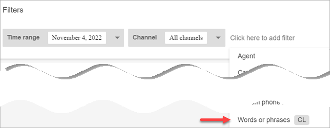
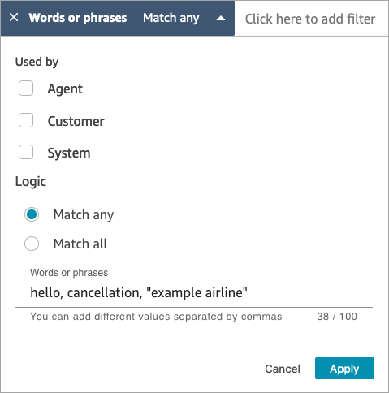
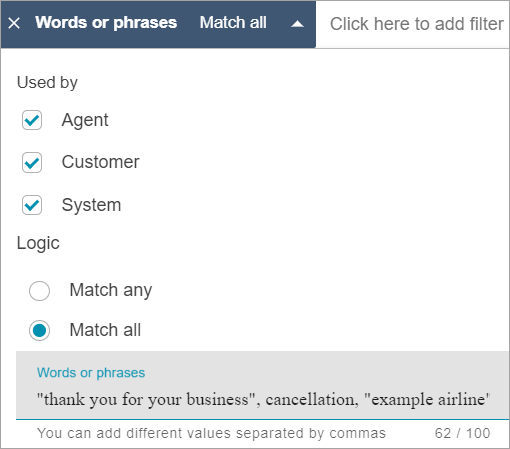
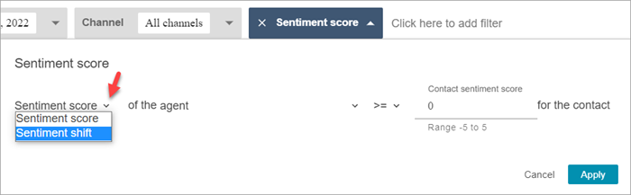
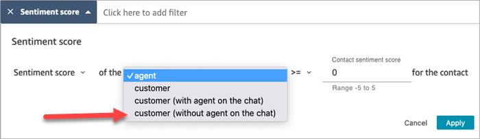
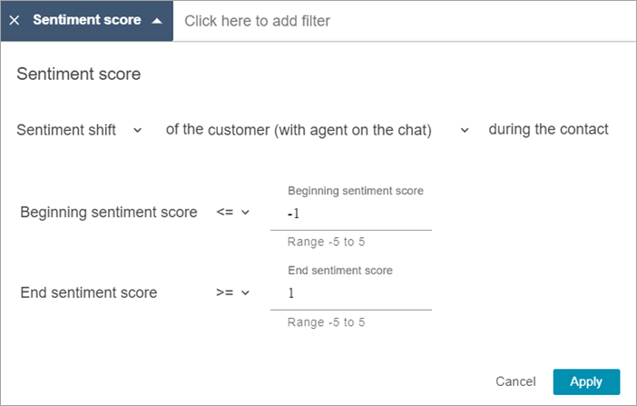
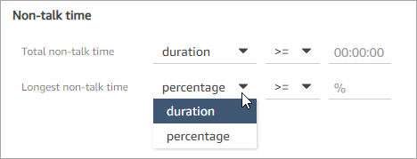
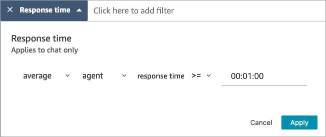
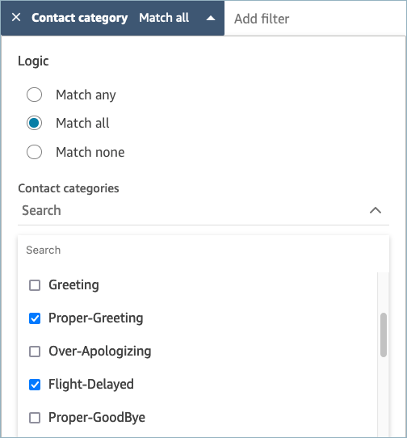

# Search conversations analyzed by

Contact Lens

You can search the analyzed and transcribed recordings based on:

- Speaker (agent or customer)
- Keywords
- Sentiment score
- Non-talk time (for calls only)
- Response time (for chats only)
  In addition, you can search conversations that are in specific contact categories
  (that is, the conversation has been categorized based on uttered keywords and
  phrases).

These criteria are described in the following sections.

###### Important

When a Contact Lens is enabled on a contact, after a call or chat ends
**and** the agent completes After Contact Work
(ACW), Contact Lens analyzes (and for calls, transcribes) the recording
of the customer-agent conversation. The agent must choose **Close
contact** first.

Chat transcripts are indexed for search when Contact Lens is enabled;
they are not indexed for search if Contact Lens is not enabled.

## Required permissions

for searching conversations

Before you can search conversations, you need the following permissions in
your security profile. They allow you to do the type of search you want.

- Enable one of the following permissions to access the
  **Contact Search** page:
  - **Contact search**. Allows you to search for
    all contacts.
  - **View my contacts**: Allows you to search
    for only those contacts that you handled as an agent.

- **Search contacts by conversation characteristics**.
  This includes non-talk time, sentiment score, and contact
  category.
- **Search contacts by keywords**

For more information, see [Assign
permissions](permissions-for-contact-lens.md "permissions-for-contact-lens.md").

## Search for words or phrases

For keyword search, Contact Lens uses the `standard`
analyzer in Amazon OpenSearch Service. This analyzer is not case sensitive. For example, if you
enter _thank you for your business 2 CANCELLED
Flights_, the search looks for:

[thank, you, for, your, business, 2, cancelled, flights]

If you enter _"thank you for your business", two,
"CANCELLED Flights"_, the search looks for:

[thank you for your business, two, cancelled flights]

###### To search conversations for words or phrases

1. In Amazon Connect, log in with a user account that is assigned the
   **CallCenterManager** security profile, or that is
   enabled for the **Search contacts by keywords**
   permission.
2. Choose **Analytics and optimization**,
   **Contact search**.
3. In the **Filter** section, specify the time period
   that you want to search, and specify the channel.

###### Tip

When searching by date, you can search up to 8 weeks at a time. 4. Choose **Click here to add filter**, and in the
dropdown menu, choose **Words or phrases**.

 5. In the **Used by** section, choose whose part of the
conversation you want to search. Note the following:

    * **System** applies to chat, where the
     participant may be a Lex bot or prompt.
    * To search for words or phrases that are used by all
     participants, select **Agent**,
     **Customer**,
     **System**.
    * If no boxes are selected, it means search for words or phrases
     used by any of the participants.

6. In the **Logic** section, choose from the following
   options:
   - Choose **Match any** to return contacts that
     have any of the words present in the transcripts.

   For example, the following query means match (hello OR
   cancellation OR "example airline"). And, because no
   **Used by** boxes are selected, it means
   "find contacts where any of these words were used by any of the
   participants."

   
   - Choose **Match all** to return contacts that
     have all of the words present in the transcripts.

   For example, the following query means match ("thank you for
   your business" AND cancellation AND "example airline"). And,
   because all the participant boxes are selected, it means "find
   contacts where all of these words and phrases were used by all
   of the participants."

   

7. In the **Words or phrases** section, enter the words
   to search, separated by commas. If you enter a phrase, surround it with
   quotation marks.

You can enter up to 128 characters.

## Search for sentiment score or evaluate

sentiment shift

With Contact Lens, you can search conversations for sentiment scores or
sentiment shifts on a scale of -5 (most negative) to +5 (most positive). This
enables you to identify patterns and factors for why calls go well or
poorly.

For example, suppose you want to identify and investigate all the contacts
where the customer sentiment ended negatively. You might search for all contacts
where the sentiment score is **<=** (less than
or equal to) -1.

For more information, see [Investigate sentiment
scores](sentiment-scores.md "sentiment-scores.md").

###### To search for sentiment scores or evaluate sentiment shift

1.  In Amazon Connect, log in with a user account that is assigned the
    **CallCenterManager** security profile, or that is
    enabled for the **Search contacts by conversation
    characteristics** permission.
2.  On the **Contact search** page, specify whether you
    want the sentiment score for words or phrases spoken by the customer or
    agent.
3.  In **Type of score analysis**, specify what type of
    scores to return:
    - **Sentiment score**: This returns the average
      score for the customer or agent's portion of the
      conversation.

    In addition to searching for sentiment scores when the agent
    or customer are on the contact, you can filter the search by
    when the customer is:

        + **With agent on the chat**
        + **Without agent on the chat**: This
         is the time the customer is chatting with a bot,
         prompts, and time in queue.

    
    - **Sentiment shift**: Identify where the
      customer or agent's sentiment changed during the contact.

    For example, the following image shows an example of searching
    for contacts where the customer's sentiment score begins at less
    than or equal to -1 and ends at greater than or equal to +1. In
    addition, the customer is on a chat with the agent
    present.

## Search for non-talk time

To help you identify which calls to investigate, you can search for non-talk
time. For example, you might want to find all calls where the non-talk time is
greater than 20%, and then investigate them.

Non-talk time includes hold time and any silence where both participants
aren't talking for longer than three seconds. This duration can't be
customized.

Use the drop-down arrow to specify whether to search conversations for the
duration or percentage of non-talk time. These options are shown in the
following image.

For information about how to use this metric, see [Investigate non-talk time](non-talk-time.md "non-talk-time.md").

## Search by response time for chat

conversations

You can search by the:

- Average response time of the agent or customer during the chat
- Maximum response time of the agent or customer during the chat

You specify whether the duration is less or greater than or equal to a
specific time. For information about how to use this metric, see [Investigate response time during chats in
Contact Lens](response-time.md "response-time.md").

For the supported minimum and maximum response times, see [Amazon Connect Rules feature
specifications](feature-limits.md#rules-feature-specs "feature-limits.md#rules-feature-specs").

The following image shows a search for contacts where the agent's average
response time was greater than or equal to 1 minute.

## Search a contact category

1.  On the **Contact search** page, choose **Add
    filter**, **Contact category**.
2.  In the **Contact categories** box, use the dropdown
    box to list all the current categories that are available for you to
    search. Or, if you start typing, the input is used to match existing
    categories and to filter those that don't match.

        * **Match any**: Searches for contacts that
         match any of the selected categories.
        * **Match all**: Searches for contacts that
         match all of the selected categories.
        * **Match none**: Searches for contacts that
         did not match any of the selected categories. Note that this
         would only return contacts that were analyzed by
         Contact Lens conversational analytics.

    The following image shows a dropdown menu with all the current
    categories listed.

