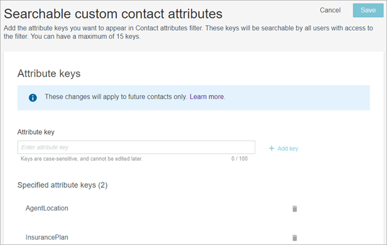
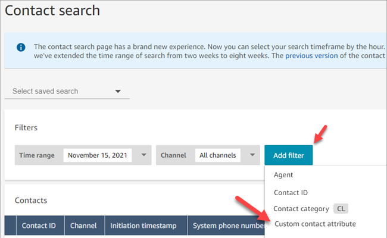
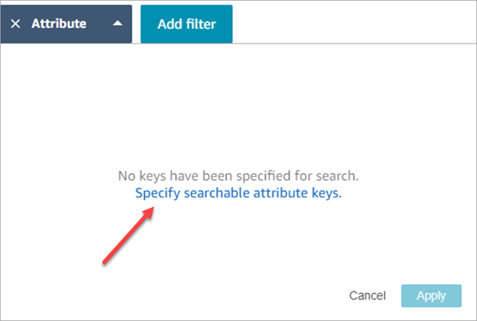
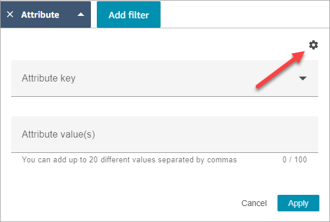
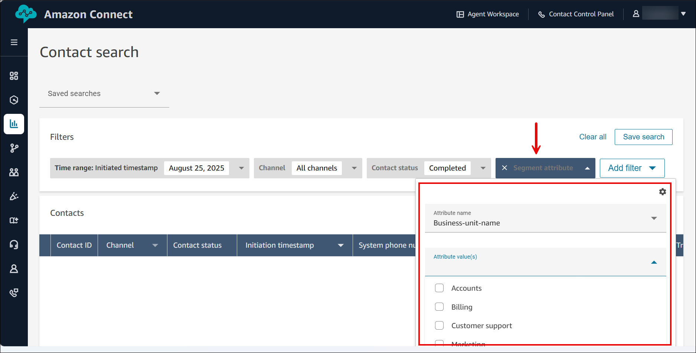

# Search for contacts in Amazon Connect by using custom

contact attributes or contact segment attributes

You can create search filters based on custom contact attributes (also called [user-defined contact attributes](connect-attrib-list.md#user-defined-attributes "connect-attrib-list.md#user-defined-attributes")) or contact
segment attributes.

For example, if you add `AgentLocation` and `InsurancePlanType`
to your contact records as custom attributes, you can search for contacts with specific
values in these attributes, such as calls handled by agents located in Seattle, or calls
made by customers who purchased homeowners insurance.

###### Contents

- [Required permissions to
  configure searchable contact attributes](#permissions-search-custom-attributes "#permissions-search-custom-attributes")
- [Configure searchable custom
  contact attributes](#configure-search-custom-attributes "#configure-search-custom-attributes")
- [Edit, add, or remove contact
  attributes](#edit-add-remove-attribute-keys "#edit-add-remove-attribute-keys")
- [Filter contact search results
  on contact attributes](#howto-search-for-custom-attributes "#howto-search-for-custom-attributes")
- [Filter contact search results on
  contact segment attributes](#filter-contact-search-segment "#filter-contact-search-segment")

## Required permissions to

configure searchable contact attributes

By default, a custom attribute isn't indexed until someone with appropriate
permissions, such as an admin or manager, specifies it should be searchable. You
grant permissions to select users so they can configure which custom contact
attributes can be added as a search filter.

Assign the following permissions to their security profile:

- Enable one of the following permissions to access the **Contact
  Search** page:
  - **Contact search**. Allows you to search for all
    contacts.
  - **View my contacts**: Allows agents to view only
    those contacts that they handled.

- **Contact attributes**: Allows users to view contact
  attributes. Also controls access to the search filters based on contact
  attributes.
- **Configure searchable contact attributes** -
  **All**: People who have this permission determine what
  custom data will be searchable (by people who have the **Contact
  attributes** permission). It allows them to access the
  following configuration page:

## Configure searchable custom

contact attributes

1. On the **Contact search** page, choose **Add
   filter**, **Custom contact attribute**. Only
   people with **Configure searchable contact attributes**
   permissions in their security profile see this option.

 2. The first time you choose **Custom contact attribute**,
the following box appears, indicating no attributes have been configured for
this Amazon Connect instance. Choose **Specify searchable attribute
keys**.

 3. In the **Attribute key** box, type the name of your
custom attribute, and then choose **Add key**.

###### Important

You must type the exact key name. It is case sensitive. 4. When finished, choose **Save**.

Your users will be able to search on these keys for any future contacts.

## Edit, add, or remove contact

attributes

To edit, add, or remove keys, choose **Attribute**,
**Settings**. If you don't see the
**Settings** option, you don't have the required
permissions.

## Filter contact search results

on contact attributes

Users who have the **Contact attributes** permission in their
security profile can find contacts by using the contact attribute filters.

1. On the **Contact search** page, choose **Add
   filter**, **Custom contact attribute**, and
   then choose **Specify searchable attribute keys**.
2. On the **Searchable customer contact attributes** page,
   in the **Attribute key** box, enter the attribute key, and
   choose **+Add key** and then choose
   **Save**.
3. Return to the **Contact search** page. Use **Add
   filter** to choose from the dropdown menu the attribute you
   just added. In the **Attribute value box**, enter the value
   you want to find.

## Filter contact search results on

contact segment attributes

After you create predefined attributes and attached them to a contact segment
(explained in [Use contact segment attributes](use-contact-segment-attributes.md "use-contact-segment-attributes.md")), you can filter contact search
results based on the segment attribute values.

The following image shows the **Contact search** page, and the
option to filter contact search results based on custom segment attribute values.

1. On the **Contact search** page, under the **Add
   filter** drop-down, select **Custom contact segment
   attributes**.
2. Select the predefined attribute you want to apply to filtering criteria.
   For example, the previous images shows Business-unit-name as the
   **Attribute name**.
3. If the selected predefined attribute has established values, they are
   listed under **Attribute value(s)** as a multi-selection
   choice. For example, the previous image shows Accounts, Billing, Customer
   Support, and Marketing as options.
4. Choose **Apply**.
