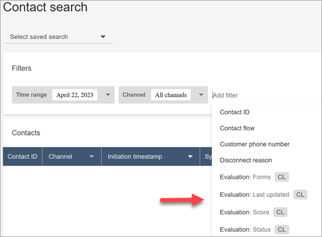

# Search for contacts using evaluation forms in

Amazon Connect

1. Log in to Amazon Connect with a user account that has [permissions to access contact
   records](contact-search.md#required-permissions-search-contacts "contact-search.md#required-permissions-search-contacts") and the **Evaluation forms - perform
   evaluations** permission.
2. In Amazon Connect choose **Analytics and optimization**,
   **Contact search**.
3. Use the filters on the page to narrow your search. For date, you can search up
   to 8 weeks at a time.

