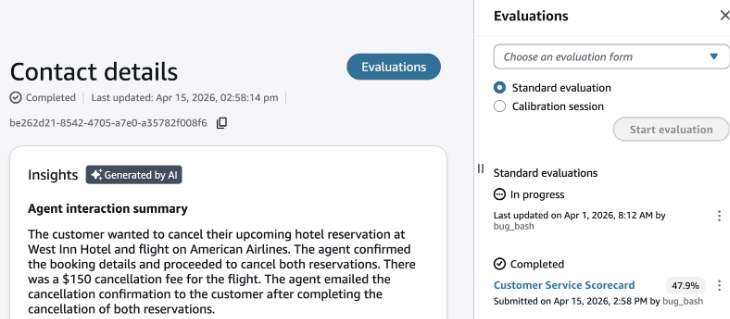
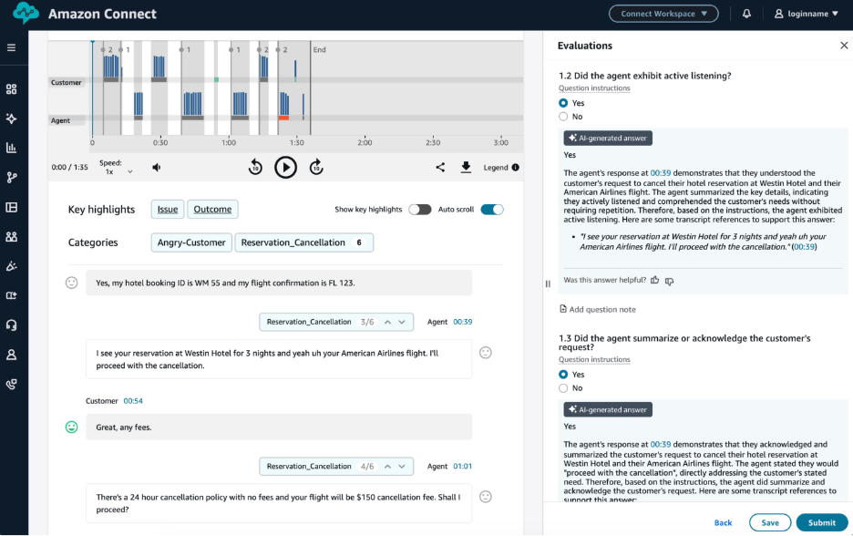

# Search for and view evaluations in Connect Customer

Users can search for evaluated contacts and view evaluations
side-by-side alongside audio or screen recordings, conversation transcripts, summaries and insights.

## Searching for evaluated contacts

1. Log in to Connect Customer with a user account that has [permissions to search for and
   view contacts](contact-search.md#required-permissions-search-contacts "contact-search.md#required-permissions-search-contacts") and either the **Evaluation forms - perform
   evaluations** or **Evaluation forms – view my received
   evaluations** permission.
2. In Connect Customer choose **Analytics and optimization**,
   **Contact search**.
3. Use the filters on the page to narrow your search. For the date selection, you
   can search for up to 8 weeks of contacts at a time. You can review contacts and
   associated evaluations from up to 2 years ago.

 4. Choose on the contact ID in the search results to open a contact and review
associated evaluations.

## View evaluations on the contact details page

1. Choose on **Evaluations** on the top right of the
   page.
2. If the contact has received an evaluation it will show under
   **Completed**.
3. Choose on the evaluation to review the completed evaluation.

###### AI answer details in submitted evaluations

When you view a submitted evaluation that contains answers filled using native
generative AI, you can also view the AI answer details. These details include the
reasoning behind each AI answer and the relevant reference points from the
transcript. AI answer details appear only when the submitted answer matches the
answer that AI provided.
