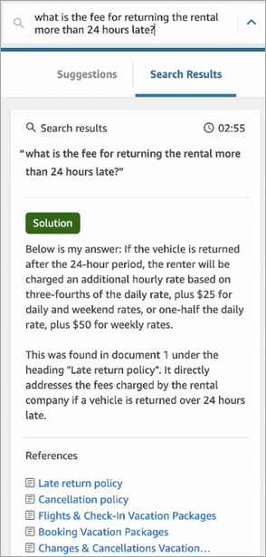
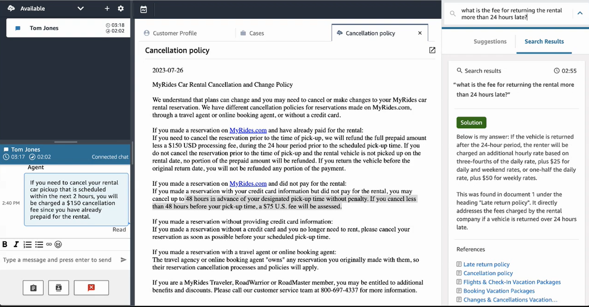

# Search for content using Connect AI agents

|                                                                                                                                                                                                                                                                                                                                                                |
| -------------------------------------------------------------------------------------------------------------------------------------------------------------------------------------------------------------------------------------------------------------------------------------------------------------------------------------------------------------- |
| **Powered by Amazon Bedrock**: Connect AI agents is built on Amazon Bedrock and includes [automated abuse detection](../../../bedrock/latest/userguide/abuse-detection.md "../../../bedrock/latest/userguide/abuse-detection.md") implemented in Amazon Bedrock to enforce safety, security, and the responsible use of artificial intelligence (AI). |

With Connect AI agents agents can use natural language to search across connected knowledge
sources to receive generated recommendations, like actions to take and links to more
information.

For example, you can type questions or phrases in the search box (such as, "how long
after purchase can handbags be exchanged?") without having to guess which keywords will
work. Connect AI agents searches the connected sources, and returns a specific solution generated
from your knowledge content along with links to relevant information.

You can search for content at any time: while on a contact, on After Contact Work, or
between contacts.

###### To search for content

1. In the search box, type words or phrases in natural language.

The following image shows an example of a natural language query and the
solution that is displayed.

 2. If more information is needed, choose the article that you want to view. 3. The article appears in a new tab. For example, the following image shows the
Cancellation policy article.

 4. The list of search results is cleared only after you complete ACW and choose
**Close contact**, or select the **Close**
icon next to the search box.
