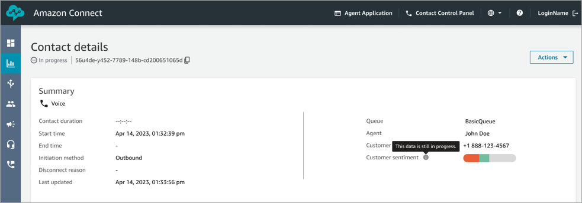
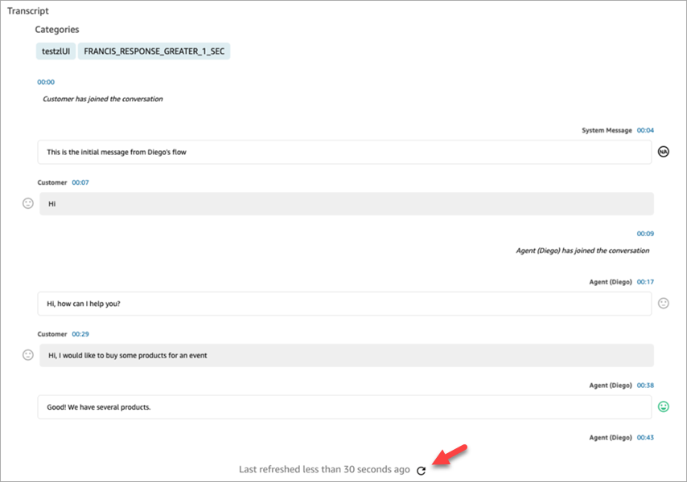

# Search for in-progress contacts in

Amazon Connect

For a contact that is handled by an agent, a contact is considered **In
Progress** until the agent completes After Contact Work. For a contact that
is never handled by an agent, a contact is considered **In Progress**
until the contact is disconnected.

###### Contents

- [Permissions needed to search for
  in-progress contacts](#permissions-inprogress "#permissions-inprogress")
- [Contact states supported by Contact
  search](#contactstates-inprogress "#contactstates-inprogress")
- [How to search for in-progress
  contacts](#howto-search-inprogress "#howto-search-inprogress")
- [Filter contacts by using timestamp
  types](#filter-by-timestamp "#filter-by-timestamp")
- [View in progress contacts](#view-inprogress-contacts "#view-inprogress-contacts")
- [Review real-time transcripts](#review-realtime-transcripts "#review-realtime-transcripts")

## Permissions needed to search for

in-progress contacts

The permissions needed to search for in-progress contacts are the same as those
for searching for completed contacts. For more information, see [Manage who can search for
contacts and access detailed information](contact-search.md#required-permissions-search-contacts "contact-search.md#required-permissions-search-contacts").

## Contact states supported by Contact

search

The ability to search for in-progress contacts varies by channel (see [Contact events data model](contact-events.md#contact-events-data-model "contact-events.md#contact-events-data-model")
for reference):

- **Voice**: You can search for contacts after
  they have been either connected to an agent, or have been disconnected.
  Queued in-progress contacts including queued callbacks are not shown on the
  **Contact search** page.
- **Chat**: You can search for contacts after
  they are connected to system, queued, connected to an agent or
  disconnected.
- **Tasks** and **Email**: You can search for all in-progress after they are
  initiated.

## How to search for in-progress

contacts

1. Log in to Amazon Connect with a user account that has [permissions to access
   contact records](contact-search.md#required-permissions-search-contacts "contact-search.md#required-permissions-search-contacts").
2. In Amazon Connect choose **Analytics and optimization**,
   **Contact search**.
3. Select the **Contact status** filter and change the
   selected value to **In progress**. The default Contact
   status is **Completed**.

## Filter contacts by using timestamp

types

You can search for contacts in a particular contact state using
**Timestamp type** within the **Time range**
filter. For example, you can search for task contacts that are scheduled for the
next day by selecting **Contact status = In progress**,
**Timestamp type = Scheduled** and the appropriate date within
**Time range**.

The following timestamp types are supported: initiated, connected (to agent),
disconnected and scheduled. When you search for contacts using a certain **Timestamp type**, the search results do not contain contacts that do
not have that timestamp populated, e.g. if you search for a contact with
**Timestamp type = Disconnected** and **Contact status
= In progress**, then you will only view contacts that are in After
Contact Work state.

###### Important

- The **Time range** filter on the **Contact
  search** page has **Timestamp type** set
  to **Initiated** by default. Before the Timestamp type
  selection was introduced, the Timestamp type used by the **Time
  range** filter was
  **Disconnected**.
- Saved searches on **Contact search** created before
  to the launch of the ability to search for in-progress contacts
  (launched September 2023) have been updated with the filters
  **Contact status = Completed** and
  **Timestamp type = Disconnected**. These selections
  were implied before the launch of in-progress contacts.

## View in progress contacts

You can click on a Contact ID within the **Contact search**
results to view details of an in-progress contact.

### Important things to

know

- The **Contact details** page for an in-progress
  contact shows data available at the time **Contact
  details** page was opened. It does not automatically
  refresh as the contact progresses. You need to refresh the page manually
  using your browser.
- Certain fields on **Contact search** and
  may have missing or inconsistent information while the contact is in
  progress. After a contact is completed, information is eventually made
  consistent with the underlying contact record, after the page is
  manually refreshed.
- There may be a delay between the contact being
  **Completed** and the contact being marked as
  **Completed** on the contact record.

## Review real-time transcripts

For voice contacts, with real-time call analytics enabled, you can view
transcripts of a contact in real-time on a **Contact details** page
if you have the security profile permission **Contact transcripts
(unredacted) - Access**.

###### Note

Redaction is not supported for in-progress voice contacts. Users with **Contact
transcripts (unredacted) - Access** can not view in-progress voice
contacts.

Choose the refresh icon on the bottom of the transcript to pull the latest
available turns of the conversation. The following image shows the location of the
refresh icon on the page.

