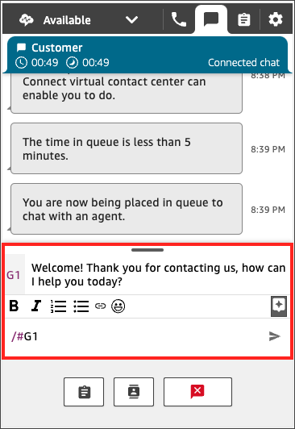

# Search for quick responses to customers in the Contact Control Panel (CCP)

Use any of the following methods to search for quick responses:

- Use `/#{search term}` to search for the quick
  response. For example, enter `/#` in the box used to
  compose messages to bring up the quick response you want.
- Choose the star (

) icon in the rich text toolbar.

###### Note

- The star icon only appears when contact is initiated.
- To see the star icon in CCP, you must have at least 1 activated quick
  response associated with the current agent routing profile.
  The following image shows a quick response found by entering a shortcut
  (`/#G1`) in the agent application.

You can also search for quick responses by typing `/#{`search term`}` in the message input field. With this syntax, you can quickly find responses without needing to remember short codes.

For information about creating, importing, and managing quick responses, including
required permissions, see [Create quick responses for use with chat and email contacts in Connect Customer](create-quick-responses.md "create-quick-responses.md").
