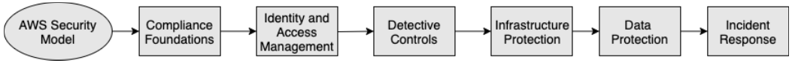
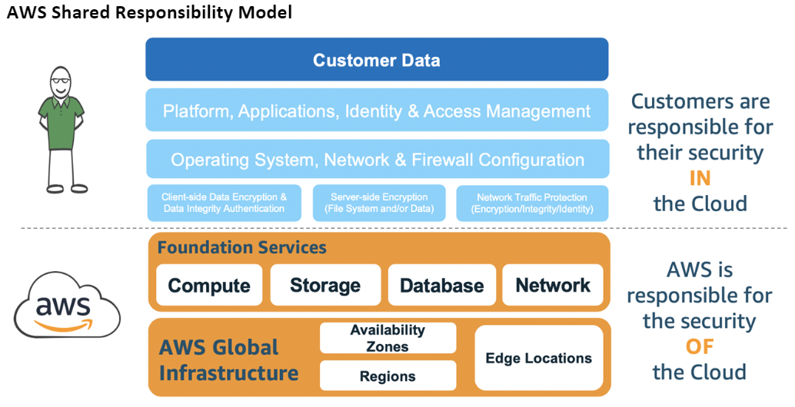
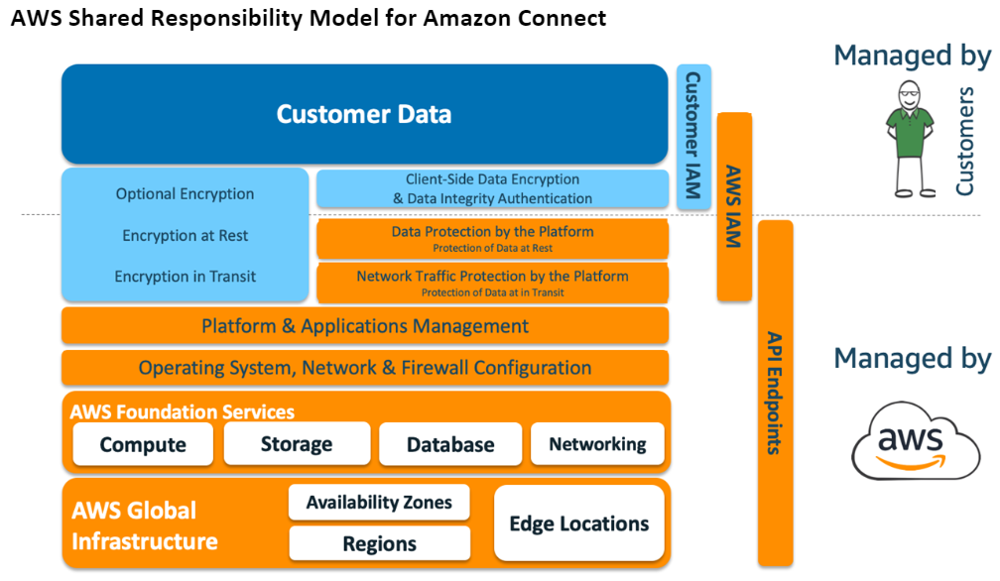
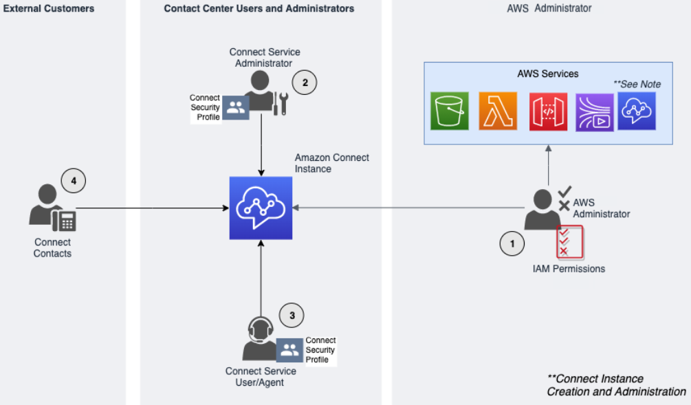
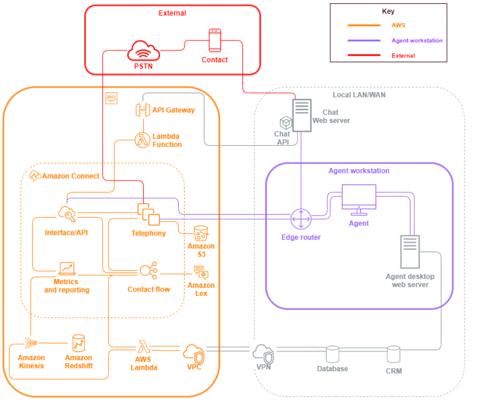

# Design principles for developing a secure contact center

in Amazon Connect

Security includes the ability to protect information, systems, and assets while
delivering business value through risk assessments and mitigation strategies. This
section provides an overview of design principles, best practices, and questions
surrounding security for Amazon Connect workloads.

## Amazon Connect Security Journey

After you’ve made the decision to move your workload to Amazon Connect, in addition to
reviewing [Security in Amazon Connect](security.md "security.md") and [Security Best Practices for Amazon Connect](security-best-practices.md "security-best-practices.md"),
follow these guidelines and steps to understand and implement your security
requirements relative to the following core security areas:

### Understanding the AWS Security

Model

When you move computer systems and data to the cloud, security
responsibilities become shared between you and AWS. AWS is responsible for
securing the underlying infrastructure that supports the cloud, and you’re
responsible for anything you put on the cloud or connect to the cloud.

Which AWS services you use will determine how much configuration work you
have to perform as part of your security responsibilities. When you use Amazon Connect,
the shared model reflects AWS and customer responsibilities at a high-level,
as shown in the following diagram.

### Compliance Foundations

Third-party auditors assess the security and compliance of Amazon Connect as part of
multiple AWS compliance programs. These include [SOC](https://aws.amazon.com/compliance/soc-faqs/ "https://aws.amazon.com/compliance/soc-faqs/"), [PCI](https://aws.amazon.com/compliance/pci-dss-level-1-faqs/ "https://aws.amazon.com/compliance/pci-dss-level-1-faqs/"), [HIPAA](https://aws.amazon.com/compliance/hipaa-compliance/ "https://aws.amazon.com/compliance/hipaa-compliance/"), [C5 (Frankfurt)](https://aws.amazon.com/compliance/bsi-c5/ "https://aws.amazon.com/compliance/bsi-c5/"), and [HITRUST CSF](https://aws.amazon.com/compliance/hitrust/ "https://aws.amazon.com/compliance/hitrust/").

For a list of AWS services in scope of specific compliance programs, see
[AWS Services
in Scope by Compliance Program](https://aws.amazon.com/compliance/services-in-scope/ "https://aws.amazon.com/compliance/services-in-scope/"). For general information, see [AWS Services Compliance
Programs](https://aws.amazon.com/compliance/programs/ "https://aws.amazon.com/compliance/programs/").

### Region selection

Region selection to host the Amazon Connect instance depends on data sovereignty
restrictions and where the contacts and agents are based. After that decision is
made, review network requirements for Amazon Connect and ports and protocols that you
need to allow. Additionally, to reduce the blast radius use the domain allow
list or allowed IP address ranges for your Amazon Connect instance.

For more information, see [Set up your network to use the Amazon Connect Contact Control Panel
(CCP)](ccp-networking.md "ccp-networking.md").

### AWS services integration

We recommend reviewing each AWS service in your solution against the
security requirements of your organization. See the following resources:

- [Security in
  AWS Lambda](../../../lambda/latest/dg/lambda-security.md "../../../lambda/latest/dg/lambda-security.md")
- [Security
  and Compliance in DynamoDB](../../../amazondynamodb/latest/developerguide/security.md "../../../amazondynamodb/latest/developerguide/security.md")
- [Security
  in Amazon Lex](../../../lex/latest/dg/security.md "../../../lex/latest/dg/security.md")

## Data Security in Amazon Connect

During your security journey, your security teams may require a deeper
understanding of how data is handled in Amazon Connect. See the following resources:

- [Detailed network paths for Amazon Connect](detailed-network-paths.md "detailed-network-paths.md")
- [Infrastructure security in Amazon Connect](infrastructure-security.md "infrastructure-security.md")
- [Compliance validation in Amazon Connect](compliance-validation.md "compliance-validation.md")

### Workload diagram

Review your workload diagram and architect an optimum solution on AWS. This
includes analyzing and deciding which additional AWS services should be
included in your solution and any third-party and on-premises applications that
need to be integrated.

## AWS Identity and Access Management (IAM)

### Types of Amazon Connect Personas

There are four types of Amazon Connect personas, based on the activities being
performed.

1. AWS administrator – AWS administrators create or modify Amazon Connect
   resources and may also delegate administrative access to other
   principals by using the AWS Identity and Access Management (IAM) service. The scope of this
   persona is focused on creating and administering your Amazon Connect
   instance.
2. Amazon Connect administrator – Service administrators determine which Amazon Connect
   features and resources employees should access within the Amazon Connect admin website. The
   service administrator assigns security profiles to determine who can
   access the Amazon Connect admin website and what tasks they can perform. The scope of this
   persona is focused on creating and administering your Amazon Connect contact
   center.
3. Amazon Connect agent – Agents interact with Amazon Connect to perform their job duties.
   Service users may be contact center agents or supervisors.
4. Amazon Connect Service contact – The customer who interacts with your Amazon Connect
   contact center.

### IAM Administrator Best Practices

IAM Administrative access should be limited to approved personnel within
your organization. IAM administrators should also understand what IAM
features are available to use with Amazon Connect. For IAM best practices, see [Security best practices in
IAM](../../../IAM/latest/UserGuide/best-practices.md "../../../IAM/latest/UserGuide/best-practices.md") in the _IAM User Guide_. Also see [Amazon Connect identity-based
policy examples](security_iam_id-based-policy-examples.md "security_iam_id-based-policy-examples.md").

### Amazon Connect Service Administrator Best Practices

Service administrators are responsible for managing Amazon Connect users, including
adding users to Amazon Connect give them their credentials, and assign the appropriate
permissions so they can access the features needed to do their job.
Administrators should start with a minimum set of permissions and grant
additional permissions as necessary.

[Security profiles for Amazon Connect and Contact Control
Panel (CCP) access](connect-security-profiles.md "connect-security-profiles.md") help you manage who can access
the Amazon Connect dashboard and Contact Control Panel, and who can perform specific
tasks. Review the granular permissions granted within the default security
profiles available natively. Custom security profiles can be set up to meet
specific requirements. For example, a power agent who can take calls but also
has access to reports. After this is finalized, users should be assigned to the
correct security profiles.

### Multi-Factor Authentication

For extra security, we recommend that you require multi-factor authentication
(MFA) for all IAM users in your account. MFA can be [set
up
through AWS IAM](../../../IAM/latest/UserGuide/id_credentials_mfa.md "../../../IAM/latest/UserGuide/id_credentials_mfa.md") or your SAML 2.0 identity
provider, or Radius server, if that's more applicable for your use case. After
MFA is set up, a third text box becomes visible on the Amazon Connect login page to
provide the second factor.

### Identity Federation

In addition to storing users in Amazon Connect, you can [enable single sign-on (SSO) to Amazon Connect](configure-saml.md "configure-saml.md") by using identity federation.
Federation is a recommended practice to allow for employee lifecycle events to
be reflected in Amazon Connect when they are made in the source identity provider.

### Access to Integrated Applications

Steps within your flows may need credentials to access information in external
applications and systems. To provide credentials to access other AWS services
in a secure way, use IAM roles. An IAM role is an entity that has its own
set of permissions, but that isn't a user or group. Roles also don't have their
own permanent set of credentials and are automatically rotated.

Credentials such as API keys should be stored outside of your flow application
code, where they can be retrieved programmatically. To accomplish this, you can
use AWS Secrets Manager or an existing third-party solution. Secrets Manager enables you to replace
hardcoded credentials in your code, including passwords, with an API call to
Secrets Manager to retrieve the secret programmatically.

## Detective controls

Logging and monitoring are important for the availability, reliability and,
performance of contact center. You should log relevant information from Amazon Connect Flows
to Amazon CloudWatch and build alerts and notifications based on the same.

You should define log retention requirements and lifecycle policies early on, and
plan to move log files to cost-efficient storage locations as soon as practical.
Amazon Connect public APIs log to AWS CloudTrail. You should review and automate actions set up
based on CloudTrail logs.

Amazon S3 is the best choice for long-term retention and archiving of log data,
especially for organizations with compliance programs that require log data to be
auditable in its native format. After log data is in an S3 bucket, define lifecycle
rules to automatically enforce retention policies and move these objects to other,
cost-effective storage classes, such as Amazon S3 Standard - Infrequent Access (Standard

- IA) or Amazon Glacier.

The AWS cloud provides flexible infrastructure and tools to support both
sophisticated in cooperation with offerings and self-managed centralized-logging
solutions. This includes solutions such as Amazon OpenSearch Service and Amazon CloudWatch Logs.

Fraud detection and prevention for incoming contacts can be implemented by
customizing Amazon Connect Flows per the customer requirements. As an example, customers can
check incoming contacts against previous contact activity in DynamoDB, and then take
action, such as disconnecting a contact because they are a blocked contact.

## Infrastructure protection

Although there is no infrastructure to manage in Amazon Connect, there could be scenarios
where your Amazon Connect instance needs to interact with other components or applications
deployed in infrastructure residing on-premises. Consequently, it is important to
ensure that networking boundaries are considered under this assumption. Review and
implement specific Amazon Connect infrastructure security considerations. Also, review
contact center agent and supervisor desktops or VDI solutions for security
considerations.

You can configure a Lambda function to connect to private subnets in a virtual
private cloud (VPC) in your account. Use Amazon Virtual Private Cloud to create a private network for
resources such as databases, cache instances, or internal services. Amazon Connect your
function to the VPC to access private resources during
execution.

## Data protection

Customers should analyze the data traversing through and interacting with the
contact center solution.

- Third party and external data
- On-premises data in hybrid Amazon Connect architectures

After analyzing the scope of the data, data classifications should be performed
paying attention to identifying sensitive data. Amazon Connect conforms to the AWS shared
responsibility model. [Data protection in Amazon Connect](data-protection.md "data-protection.md") includes best practices like using MFA and TLS
and the use of other AWS services, including Amazon Macie.

Amazon Connect [handles variety of data related to
contact centers](data-handled-by-connect.md "data-handled-by-connect.md"). This includes phone call media, call recordings, chat
transcripts, contact metadata as well as flows, routing profiles and queues. Amazon Connect
handles data at rest by segregating data by account ID and instance ID. All data
exchanged with Amazon Connect is protected in transit between the user's web browser and
Amazon Connect using open standard TLS encryption.

You can specify AWS KMS keys to be used for encryption including bring your own key
(BYOK). Additionally, you can use key management options within Amazon S3.

### Protecting Data Using Client-Side

Encryption

Your use case may require encryption of sensitive data that is collected by
flows. For example, to gather appropriate personal information to customize the
customer experience when they interact with your IVR. To do this you can use
public-key cryptography with the [AWS
Encryption SDK](../../../encryption-sdk/latest/developer-guide/introduction.md "../../../encryption-sdk/latest/developer-guide/introduction.md"). The AWS Encryption SDK is a client-side encryption
library designed to make it efficient for everyone to encrypt and decrypt data
using open standards and best practices.

### Input validation

Perform input validation to ensure that only properly formed data is entering
the flow. This should happen as early as possible in the flow. For example, when
prompting a customer to say or enter a telephone number, they may or may not
include the country code.

## Amazon Connect security vectors

Amazon Connect security can be divided into three logical layers as illustrated in the
following diagram:

1. **Agent workstation**. The agent workstation
   layer is not managed by AWS and consists of any physical equipment and
   third-party technologies, services, and endpoints that facilitate your
   agent’s voice, data, and access the Amazon Connect interface layer.

Follow your security best practices for this layer with special attention
to the following:

    * Plan identity management keeping in mind best practices noted in
     [Security Best Practices for Amazon Connect](security-best-practices.md "security-best-practices.md").
    * Mitigate insider threat and compliance risk associated with
     workloads that handle sensitive information, by creating a secure
     IVR solution that enables you to bypass agent access to sensitive
     information. By encrypting contact input in your flows, you’re able
     to capture information securely without exposing it to your agents,
     their workstations, or their operating environments. For more
     information, see [Encrypt sensitive customer input in Amazon Connect](encrypt-data.md "encrypt-data.md").
    * You are responsible for maintaining the allowlist of AWS IP
     addresses, ports, and protocols needed to use Amazon Connect.

2. **AWS**: The AWS layer includes Amazon Connect and
   AWS integrations including AWS Lambda, Amazon DynamoDB, Amazon API Gateway, Amazon S3, and
   other services. Follow the security pillar guidelines for AWS services,
   with special attention to the following:
   - Plan identity management, keeping in mind best practices noted in
     [Security Best Practices for Amazon Connect](security-best-practices.md "security-best-practices.md").
   - Integrations with other AWS services: Identify each AWS
     service in the use case as well as any third-party integration
     points applicable for this use case.
   - Amazon Connect can integrate with AWS Lambda functions that run inside of a
     customer VPC through the [VPC endpoints for
     Lambda](../../../lambda/latest/dg/configuration-vpc.md "../../../lambda/latest/dg/configuration-vpc.md").

3. **External**: The External layer includes
   contact points including chat, click-to-call endpoints, and the PSTN for
   voice calls, integrations you may have with legacy contact center solutions
   in a Hybrid contact center architecture, and integrations you may have with
   other third-party solutions. Any entry point or exit point for a third party
   in your workload is considered the external layer.

This layer also covers integrations customers may have with other
third-party solutions and applications such as CRM systems, work force
management (WFM), and reporting and visualization tools and applications,
such as Tableau and Kibana. You should consider the following areas when
securing the external layer:

    * You can [create contact filters for repeat and fraudulent
     contacts](https://aws.amazon.com/blogs/contact-center/how-to-protect-against-spam-calls-for-click-to-dial/ "https://aws.amazon.com/blogs/contact-center/how-to-protect-against-spam-calls-for-click-to-dial/") using AWS Lambda to write contact details to
     DynamoDB from within your flow, including ANI, IP address for
     click-to-dial and chat endpoints, and any other identifying
     information to track how many contact requests occur during a given
     period of time. This approach allows you to query and add contacts
     to deny lists, automatically disconnecting them if they exceed
     reasonable levels.
    * ANI Fraud detection solutions using [Amazon Connect telephony
     metadata](connect-attrib-list.md#telephony-call-metadata-attributes "connect-attrib-list.md#telephony-call-metadata-attributes") and [partner solutions](https://aws.amazon.com/connect/partners/ "https://aws.amazon.com/connect/partners/") can be used to
     protect against caller ID spoofing.
    * [Amazon Connect Voice ID](voice-id.md "voice-id.md") and other voice
     biometric partner solutions can be used to enhance and streamline
     the authentication process. Active voice biometric authentication
     allows contacts the option to speak specific phrases and use those
     for voice signature authentication. Passive voice biometrics allow
     contacts to register their unique voiceprint and use their
     voiceprint to authenticate with any voice input that meets
     sufficient length requirements for authentication.
    * Maintain the [application
     integration](app-integration.md "app-integration.md") section in the Amazon Connect console for adding any
     third-party application or integration points to your allowlist, and
     remove unused endpoints.
    * Send only the data necessary to meet minimum requirements to
     external systems that handle sensitive data. For example, if you
     have only one business unit using your call recording analytics
     solution, you can set an AWS Lambda
     trigger
     in your S3 bucket to process contact records, check for the business
     unit’s specific queues in the contact record data, and if it is a
     queue that belongs to the unit, send only that call recording to the
     external solution. With this approach, you only send the data
     necessary and avoid the cost and overhead associated with processing
     unnecessary recordings.

    For an integration that enables Amazon Connect to communicate with Amazon Kinesis
     and Amazon Redshift to enable the streaming of contact records, see [Amazon Connect
     integration: Data streaming](https://aws.amazon.com/quickstart/connect/data-streaming/ "https://aws.amazon.com/quickstart/connect/data-streaming/").

## Resources

**Documentation**

- [AWS Cloud Security](https://aws.amazon.com/security/ "https://aws.amazon.com/security/")
- [Security in Amazon Connect](security.md "security.md")
- [IAM Best
  Practices](../../../IAM/latest/UserGuide/best-practices.md "../../../IAM/latest/UserGuide/best-practices.md")
- [AWS Compliance](https://aws.amazon.com/compliance/ "https://aws.amazon.com/compliance/")
- [AWS Security blog](https://aws.amazon.com/blogs/security/ "https://aws.amazon.com/blogs/security/")

**Articles**

- [Security
  Pillar](../../../wellarchitected/latest/security-pillar/welcome.md "../../../wellarchitected/latest/security-pillar/welcome.md")
- [Introduction to AWS Security](../../../whitepapers/latest/introduction-aws-security/introduction-aws-security.md "../../../whitepapers/latest/introduction-aws-security/introduction-aws-security.md")
- [AWS Security Best Practices](https://aws.amazon.com/architecture/security-identity-compliance/ "https://aws.amazon.com/architecture/security-identity-compliance/")

**Videos**

- [AWS Security
  State of the Union](https://www.youtube.com/watch?v=Wvyc-VEUOns "https://www.youtube.com/watch?v=Wvyc-VEUOns")
- [AWS Compliance -
  The Shared Responsibility Model](https://www.youtube.com/watch?v=U632-ND7dKQ "https://www.youtube.com/watch?v=U632-ND7dKQ")
