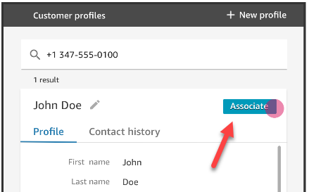

# Update Customer Profiles permissions

for agents

Assign the following **Customer profiles** permissions as needed
to the agent's security profile:

- **View**: Enables agents to see the Customer profiles
  application. They can:
  - View profiles that are autopopulated in the agent app.
  - Search for profiles.
  - View details stored in customer profiles (for example, Name,
    Address).
  - Associate contact records to profiles, as shown in the following
    image.

  

- **Edit**: Enables agents to edit details in the customer
  profile (for example, change address). They inherit
  **View** permissions by default.
- **Create**: Enables agents to create and save a new
  profile. They inherit **View** permissions by default, but
  don't inherit **Edit** permissions.
  For information about how to add more permissions to an existing security profile,
  see [Update security profiles in Amazon Connect](update-security-profiles.md "update-security-profiles.md").

By default, the **Admin** security profile already has
permissions to perform all Customer profiles activities.
