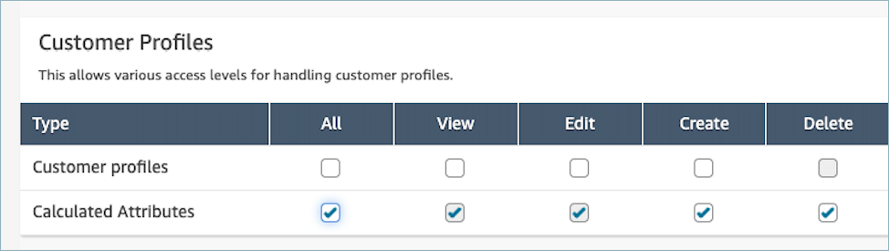

# Update permissions

for calculated attributes in Amazon Connect Customer Profiles

1. Go to the Security profiles page, choose the security profile you would
   like to edit, or choose **Add new security
   profile**.

 2. Select **All** or
**View**,**Edit**,
**Create**, and **Delete** permission
for calculated attributes.

 3. Choose **Save**. You can now navigate to the
**User management** section and provide this security
profile to the users of your choice.
