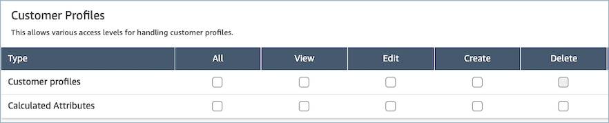
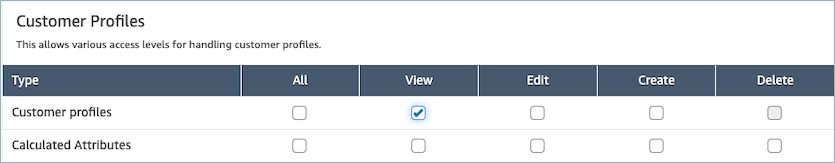

# Update Customer Profiles

permissions for flows

1. Go to the Security profiles page, choose the security profile you would
   like to edit, or choose **Add new security
   profile**.

 2. Select the **View** permission for Customer Profiles.

 3. Choose **Save**. You can now navigate to the
**User management** section and provide this security
profile to the users of your choice.
