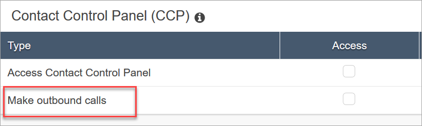

# Security profile permissions for

outbound communications in Amazon Connect

To enable agents to make outbound calls, assign **Make outbound calls**
permissions to the agent's security profile as shown in the following image:

To enable call center managers to create outbound campaigns, assign the following permissions to
their security profile:

- **Routing**, **Queues**, **View**
  permission
- **Outbound campaigns**, **Campaigns**,
  **View** permission
- **Channels and Flows**, **Flows**,
  **View** permission
  For information about how to add more permissions to an existing security profile,
  see [Update security profiles in Amazon Connect](update-security-profiles.md "update-security-profiles.md").

By default, the **Admin** security profile already has permissions to
perform all activities.
