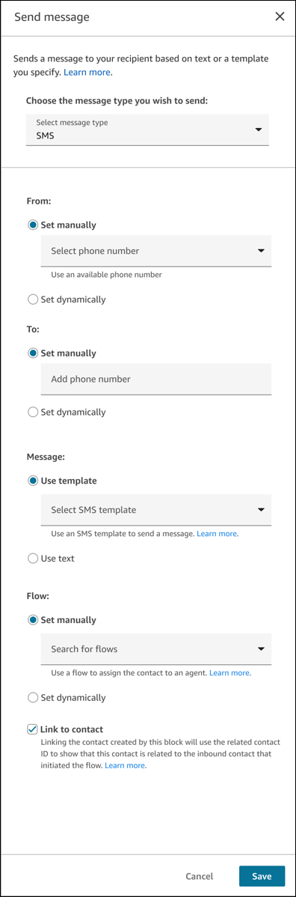
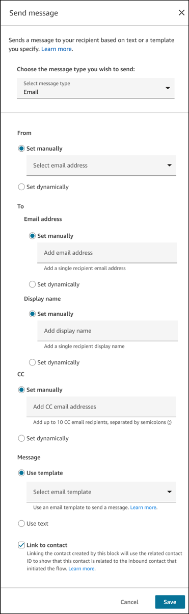
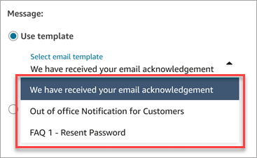
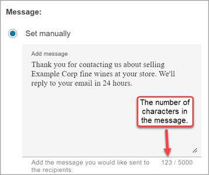

# Flow block in Amazon Connect: Send message

This topic defines the flow block for sending a message to a customer.

###### Important

Before using this block, claim a phone number or originating identity in
AWS End User Messaging SMS and then import the number into Amazon Connect. For instructions, see [Set up SMS messaging](setup-sms-messaging.md "setup-sms-messaging.md").

## Description

- Use this flow block to send a message to your customer based on a template
  or custom message you specify.

## Use cases for this block

This flow block is designed to be used in the following scenarios:

- Send an automatic acknowledgement when you receive a new email or SMS
  contact, for example, "Thank you for your message. We will get back to you
  in 24 hours."
- Send automated email or SMS responses that resolve the contact. For
  example, if a customer sends a text asking "How do I reset my password?" you
  can send a templated or generated email response that provides instructions.
- Send survey emails or SMS messages. For example, "Thank you for your time
  today. How did we do?" Use a Disconnect flow type for this use case.

## Contact types

| Contact type | Supported? |
| ------------ | ---------- |
| Voice        | Yes        |
| Chat         | Yes        |
| Task         | Yes        |
| Email        | Yes        |

## Important information about

using the Send message block in outbound flows

###### Important

When configuring outbound flows in Amazon Connect, especially the [Default outbound flow](default-outbound.md "default-outbound.md"), it is important to
implement safeguards to prevent unintended email loops while using the EMAIL
message type from the **Send message** block.

When outbound email contacts are created by the **Send message
flow** block, they use the **Default outbound flow**
to send the email by default. This can cause an unintended email loop if there is a
**Send message** block configured in the same flow without any
safeguards in place.

Follow these guidelines to ensure your outbound flow configuration operates as
intended:

- Do not use the **Send message** block with the EMAIL
  message type in the **Default outbound flow** or any
  outbound flow type, if possible.
- If you must use the **Send message** block with the EMAIL
  message type in any outbound flow type, make sure your flow logic will not
  cause any email loops.

We recommend implementing the following safeguards while using the **Send
message** block in any outbound flow type:

- Add a [Check contact
  attributes](check-contact-attributes.md "check-contact-attributes.md") block immediately
  before the **Send message** block in your outbound
  flow.
- Configure the **Check contact attributes** block to
  verify that the Channel System attribute (`$.Channel`) is set to
  branch on EMAIL.
- Set the EMAIL branch of the **Check contact attributes**
  block to avoid using the **Send message** block, thus
  preventing any email loops when outbound email contacts use the outbound
  flow.
- Set the **No Match** branch of the **Check
  attribute block** to use the **Send message**
  block. The **No Match** branch should route any VOICE, CHAT
  (including subtypes like SMS), or TASK contacts to the **Send
  message** block as part of the flow.

Implementing these safeguards will help prevent scenarios where outbound email
contacts that use the outbound flow type trigger additional unintended outbound
email contacts to be created by using the same outbound flow, potentially creating
an infinite loop.

## Flow types

You can use this block in the following [flow
types](create-contact-flow.md#contact-flow-types "create-contact-flow.md#contact-flow-types"):

| Flow type              | Supported? |
| ---------------------- | ---------- |
| Inbound flow           | Yes        |
| Customer queue flow    | Yes        |
| Customer hold flow     | Yes        |
| Customer whisper flow  | Yes        |
| Outbound whisper flow  | Yes        |
| Agent hold flow        | Yes        |
| Agent whisper flow     | Yes        |
| Transfer to agent flow | Yes        |
| Transfer to queue flow | Yes        |
| Disconnect flow        | Yes        |

## Required permissions

To configure this block to send SMS or email messages, you need the following
permissions on your security profile:

- **Channels and flows > Phone numbers > View**: To view
  the drop-down menu of phone numbers.
- **Email addresses** - **View**: To view
  the dropdown menu of From email addresses.
- **Content Management** - **Message
  templates** - **View**: To view the dropdown
  menu of message templates that are available for SMS messages and emails.

If you don't have these permissions, you can still set the properties dynamically.
For example, if a phone number has been set manually already on the block, and you
view the block without the **View** permission, you'll still be
able to see that resource, just not the list of resources in the dropdown
menu.

## How to configure this block

You can configure the **Send message** block by using the Amazon Connect admin website
or by using the [StartOutboundChatContact](../APIReference/contact-actions-startoutboundchatcontact.md "../APIReference/contact-actions-startoutboundchatcontact.md") action in the Amazon Connect Flow language.

###### Configuration sections

- [Send an SMS (text message)](#sendmessage-block-sms "#sendmessage-block-sms")
- [Send an email](#sendmessage-block-email "#sendmessage-block-email")
- [About using
  templates](#sendmessage-block-email "#sendmessage-block-email")
- [About creating text
  messages](#sendmessage-block-text "#sendmessage-block-text")

### Send an SMS (text message)

The following image shows the **Send message** properties
page when it's configured to send an SMS message.

Configure the following properties on the page to send an SMS message:

- **From**: The phone number that the message is to be
  sent from. The dropdown menu shows a list of phone numbers that are
  claimed for your Amazon Connect instance.
  - **Set manually**: Use the dropdown menu to
    search for a phone number that has been claimed to your Amazon Connect
    instance.

  You must have the [required permission](#sendmessage-block-perms "#sendmessage-block-perms") in your security profile to view
  the dropdown list of templates.
  - **Set dynamically**: Accepts an attribute
    based on a **Namespace** and
    **Key** that points to an ARN of a phone
    number that has been claimed by your Amazon Connect
    instance.

- **To**: The phone number that the message is to be
  sent to.
  - **Set manually**: Enter the customer's phone
    number. This is where the SMS message will be sent. You can
    enter only one phone number. This is useful for testing the
    block.
  - **Set dynamically**: Accepts an attribute
    based on a **Namespace** and
    **Key** that is a phone number string the
    SMS is sent to. This must be in E.164 format.

- **Message**: The message that will be sent to the
  customer.
  - **Use template**: Use the dropdown menu to
    choose from a list of SMS templates. You can choose one template
    to be sent to the customer.

  An SMS template is a complete SMS message structure that
  contains only plain text. It provides the entire response or
  notification to the customer.

  You must have the [required permission](#sendmessage-block-perms "#sendmessage-block-perms") in your security profile to view
  the dropdown list of templates.
  - **Use text**: Send a plain text message
    either **Set manually** by typing one in or
    **Set dynamically** by adding an attribute
    based on a **Namespace** and
    **Key**.

  ###### Note

  **Message** accepts plain text (including
  links and emojis), up to 1024 characters, including
  spaces.

- **Flow**: The Amazon Connect flow that will
  handle the outbound contact created. This flow can be used to assign the
  outbound contact to an agent to respond to the customer.
  - **Set manually**: Use the drop-down menu to
    choose from a list of published flows.
  - **Set dynamically**: Accepts an attribute
    based on a **Namespace** and
    **Key** that points to a flow ARN.

- **Link to contact**: This property gives you the
  option to link the outbound contact that is created to the inbound
  contact that initiated the flow. In some situations, you may not want to
  link the outbound contact that is created to avoid repetitive contact
  associations.
  - This property gives you the option to link the outbound SMS
    contact to the inbound contact that initiated the flow.

  In some situations, you may not want to link the contact to
  avoid sending repetitive outbound SMS messages. For example, if
  the flow is configured to send the customer the message
  _Thank you for your message! We will get back to
  you within 24 hours._ every time you receive a
  contact.

### Send an email

The following image shows the **Send message** properties
page when it's configured to send an email.

Configure the following properties on the **Send message**
properties page to send an email message:

- **From**: Use the dropdown menu to choose the email
  address the message is to be sent from. The menu shows a list of email
  addresses configured for your Amazon Connect instance.

You must have the [required
permission](#sendmessage-block-perms "#sendmessage-block-perms") in your security profile to view the dropdown list
of emails.

    + **Set manually**: Use the dropdown menu to
     search for an email address that has been configured for your
     Amazon Connect instance.
    + **Set dynamically**: Choose the Namespace and
     Key from the dropdown menus. For example, if you want the From
     email address to be the same as the one the customer sent the
     email to, choose **Namespace** =**System**,**Key** =
     **System email address**.

- **To**: The email address email message is sent
  to.
  - **Set manually**: Enter a single email
    address in the following format:
    *customer@example.com*.
  - **Set dynamically**: Choose the Namespace and
    Key from the dropdown menus. For example, to send an email reply
    to the customer's email address, choose
    **Namespace** =
    **System**, **Key** =
    **Customer endpoint address**.

- **CC**: The email address to go on the cc line of the
  email.

###### Important

You can enter only one email address on the cc line.

    + **Set manually**: Use the text box to enter a
     list of email addresses, separated by a semicolon (;). These are
     the email addresses the message will be sent to.
    + **Set dynamically**: Enter an attribute based
     on a **Namespace** and **Key**
     For example, to send an email reply that is cc'ed to the same
     email addresses on that were cc'ed on the customer's original
     email to you, choose **Namespace** =
     **System**, **Key** =
     **CC Email Address List**.

- **Message**:
  - **Use template**: Use the dropdown menu to
    choose from a list of email templates that have been created for
    your contact center. You can choose one template to be sent to
    the customer.
  - **Use text**: Enter a plain text
    message.
    - **Subject**: To enter the Subject
      dynamically, for example, to use the same subject that
      was in the customer's original email to you, choose
      **Namespace** = **Segment
      attribute**, **Key** =
      **Email Subject**.
    - **Message**: To enter the Message
      dynamically, choose a **User-defined**
      attribute.

- **Link to contact**:
  - This property gives you the option to link the outbound email
    contact to the inbound contact that initiated the flow.

  In some situations, you may not want to link the contact to
  avoid sending repetitive outbound email messages. For example,
  if the flow is configured to send the customer the message
  _Thank you for your message! We will get back to
  you within X hours._ every time you receive a
  contact.

### About using templates in the

block

An email template is a complete email message that contains plain or rich text
content. It serves as a pattern for part or all of an email message. An email
template can be used by:

- A flow to send acknowledgements or automated responses to an end
  customer without agent involvement.
- A contact center manager to define the structure or outline of every
  agent response to ensure details such as signature, header/footer
  branding, and disclaimers are always included in the response to the
  customer.

The following image shows an example dropdown menu with a list of available
email templates.

The email template contains the subject and body of an email message to be
sent to a customer.

###### Note

The subject from the template is not included when the **Send
message** block is being used to Reply or Reply all to an
inbound email contact.

### About creating email and text messages

in the block

In the case of email, when you use a message created in the **Send
message** block, you need to enter a **Subject**
and **Message** for the email.

- **Subject**: You can enter up to 998 characters,
  including spaces.
- **Message**: Enter plain text, up to 5000 characters,
  including spaces. The message can be set manually by typing in a message
  or dynamically by a **User-defined** attribute set
  within the flow. The following image shows the character count for an
  email message.

In the case of SMS, when you use a message created in the **Send
message** block, you need to enter only a
**Message**, no subject.

- **Message**: Enter plain text, up to 1024 characters,
  including spaces. Or, set the message dynamically by using a
  user-defined attribute set within the flow.

## Error scenarios

A contact is routed down the **Error** branch in the following
situations:

- Incorrect information passed to the block, such as a system email address
  that does not exist for the **From** field.
- Email sending service failure.
- Some attributes of the email template could not be populated before
  sending.
