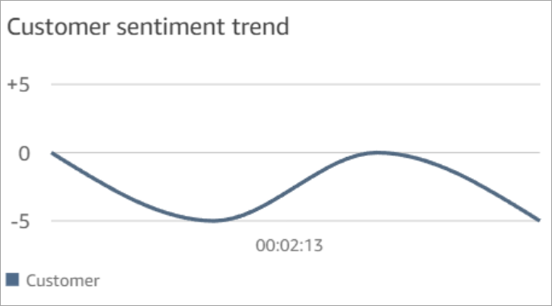

# Investigate sentiment scores during contact

conversations using Contact Lens

## What are sentiment scores?

A sentiment score is an analysis of text, and a rating of whether it includes
mostly positive, negative, or neutral language. Supervisors can use sentiment
scores to search conversations and identify contacts that are associated with
varying degrees of customer experiences, positive or negative. It helps them
identify which of their contacts to investigate.

You can view a sentiment score for the entire conversation, as well as
sentiment trend across whole contact.

## How to investigate sentiment

scores

When working to improve your contact center, you may want to focus on the
following:

- Contacts that start with a positive sentiment score but end with a
  negative score.

If you want to focus on a limited set of contacts to sample for
quality assurance, for example, you can look at contacts where you know
the customer had a positive sentiment at the start but ended with a
negative sentiment. That shows you they left the conversation unhappy
about something.

- Contacts that start with a negative sentiment score but end
  positive.

Analyzing these contacts will help you identify what experiences you
can recreate in your contact center. You can share successful techniques
with other agents.

An additional way of looking at sentiment progression is to check the
sentiment trendline. You can see the variation in the customer's sentiment as
the contact progresses. For example, the following image shows a conversation
with a very low sentiment score in the beginning of the conversation, it goes
up, and then back down at the end.

For more information, see [Search for sentiment score or evaluate
sentiment shift](search-conversations.md#sentiment-search "search-conversations.md#sentiment-search").

## How sentiment scores are

determined

Amazon Connect Contact Lens analyzes the sentiment of each speaker turn in a
conversation as positive, negative, or neutral. It then considers two factors
for each participant turn to assign a score that ranges from -5 to +5 for each
period of the call:

- Frequency. The number of times the sentiment is positive, negative or
  neutral.
- Sentiment streaks. The consecutive turns with same sentiment.

The overall sentiment score is the average of the scores assigned during each
portion of the call.
