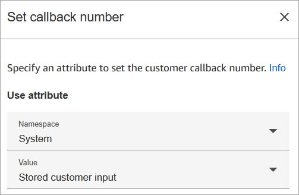
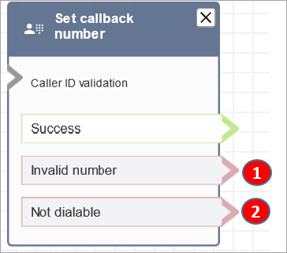

# Flow block in Connect Customer: Set callback number

This topic defines the flow block for setting the number to call back the
customer.

## Description

- Specify the attribute to set the callback number.

## Supported channels

The following table lists how this block routes a contact who is using the
specified channel.

| Channel | Supported?                    |
| ------- | ----------------------------- |
| Voice   | Yes                           |
| Chat    | No • Invalid number branch |
| Task    | No • Invalid number branch |
| Email   | No • Invalid number branch |

## Flow types

You can use this block in the following [flow
types](create-contact-flow.md#contact-flow-types "create-contact-flow.md#contact-flow-types"):

- Inbound flow
- Customer Queue flow
- Transfer to Agent flow
- Transfer to Queue flow

## Properties

The following image shows the **Properties** page of the
**Set callback number** block.

## Configuration tips

- The [Store customer input](store-customer-input.md "store-customer-input.md") block often comes before
  this block. It stores the customer's callback number.
- For international phone numbers in E.164 format, the `+`
  country code prefix is automatically prepended by Connect Customer. You do not need to
  include it when passing the number as an attribute.

## Configured block

The following image shows an example of what this block looks like when it is
configured. It has the following branches: **Success**,
**Invalid number**, and **Not
dialable**.

1. **Invalid number**: The customer entered phone number
   that is not valid.
2. **Not dialable**: Connect Customer is unable to dial that number.
   For example, if your instance is not allowed to make calls to +447 prefix
   phone numbers, and the customer requested callback to a +447 prefix number.
   Even though number is valid, Connect Customer cannot call it.

## Sample flows

Connect Customer includes a set of sample flows. For instructions that explain how to access the sample flows in the flow designer, see
[Sample flows in Connect Customer](contact-flow-samples.md "contact-flow-samples.md"). Following are topics
that describe the sample flows which include this block.

- [Sample queue configurations flow in Connect Customer](sample-queue-configurations.md "sample-queue-configurations.md")
- [Sample queued callback flow in Connect Customer](sample-queued-callback.md "sample-queued-callback.md"): this sample only applies to
  previous instances of Connect Customer.

## Scenarios

See these topics for scenarios that use this block:

- [Set up queued callback by creating flows, queues, and routing profiles in Connect Customer](setup-queued-cb.md "setup-queued-cb.md")
- [Queued callbacks in real-time metrics in Connect Customer](about-queued-callbacks.md "about-queued-callbacks.md")
