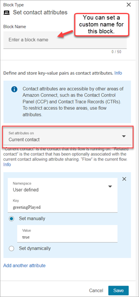
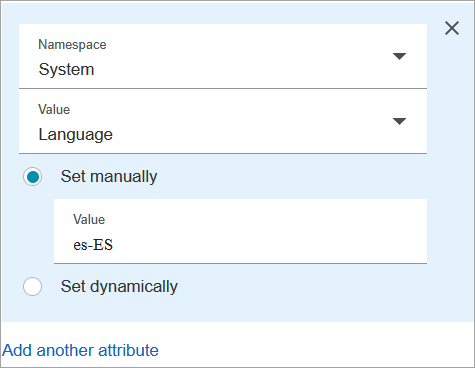
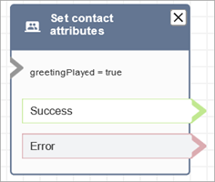

# Flow block in Amazon Connect: Set contact

attributes

This topic defines the flow block for storing key-value pairs as contact attributes,
and then setting a value that is later referenced in a flow.

## Description

Stores key-value pairs as contact attributes. You set a value that is later
referenced in a flow.

For example, create a personalized greeting for customers routed to a queue based
on the type of customer account. You could also define an attribute for a company
name or line of business to include in the text to speech strings said to a
customer.

The **Set contact attributes** block is useful, for example, for
copying attributes retrieved from external sources to user-defined
attributes.

For more information about contact attributes, see [Use Amazon Connect contact attributes](connect-contact-attributes.md "connect-contact-attributes.md").

## Supported channels

The following table lists how this block routes a contact who is using the
specified channel.

| Channel | Supported? |
| ------- | ---------- | ------------------------------------------------------------------------------------------------------------------------------------------------------------------------------------------------------------------------------------------------------------------------------------------------------------------------------------------------------------------------------------------------------------------------------------------------------------------------------------------------------------------------------------------------------------------------------------------------------------------------------------------------------------------------------------------------------------------------------------------------------------------------------------------------------------------------------------------------------------------------------------------------------------------------------------------------------------------------------------------------------------------------------------------------------------------------------------------------------------------------------------------------------------------------------------------------------------------------------------------------------------------------------------------------------------------------------------------------------------------------------------------------------------------------------------------------------------------------------------------------------------------------------------------------------------------------------------------------------------------------------------------------------------------------------------------------------------------------------------------------------------------------------------------------------------------------------------------------------------------------------------------------------------------------------------------------------------------------------------------------------------------------------------------------------------------------------------------------------------------------------------------------------------------------------------------------------------------------------------------------------------------------------------------------------------------------------------------------------------------------------------------------------------------------------------------------------------------------------------------------------------------------------------------------------------------------------------------------------------------------------------------------------------------------------------------------------------------------------------------------------------------------------------------------------------------------------------------------------------------------------------------------------------------------------------------------------------------------------------------------------------------------------------------------------------------------------------------------------------------------------------------------------------------------------------------------------------------------------------------------------------------------------------------------------------------------------------------------------------------------------------------------------------------------------------------------------------------------------------------------------------------------------------------------------------------------------------------------------------------------------------------------------------------------------------------------------------------------------------------------------------------------------------------------------------------------------------------------------------------------------------------------------------------------------------------------------------------------------------------------------------------------------------------------------------------------------------------------------------------------------------------------------------------------------------------------------------------------------------------------------------------------------------------------------------------------------------------------------------------------------------------------------------------------------------------------------------------------------------------------------------------------------------------------------------------------------------------------------------------------------------------------------------------------------------------------------------------------------------------------------------------------------------------------------------------------------------------------------------------------------------------------------------------------------------------------------------------------------------------------------------------------------------------------------------------------------------------------------------------------------------------------------------------------------------------------------------------------------------------------------------------------------------------------------------------------------------------------------------------------------------------------------------------------------------------------------------------------------------------------------------------------------------------------------------------------------------------------------------------------------------------------------------------------------------------------------------------------------------------------------------------------------------------------------------------------------------------------------------------------------------------------------------------------------------------------------------------------------------------------------------------------------------------------------------------------------------------------------------------------------------------------------------------------------------------------------------------------------------------------------------------------------------------------------------------------------------------------------------------------------------------------------------------------------------------------------------------------------- |
| Voice   | Yes        |
| Chat    | Yes        |
| Task    | Yes        |
| Email   | Yes        | ## Flow types You can use this block in the following [flow types](create-contact-flow.md#contact-flow-types "create-contact-flow.md#contact-flow-types"):  • All flows ## Properties The following image shows the **Properties** page of the **Set contact attributes** block. It is configured to set a user-defined attribute on the **Current contact** with the key **greetingPlayed** and the value **true**.  You can choose to set attributes on:  • **Current contact**: The attributes are set on the contact that this flow is running on. The attributes are accessible by other areas of Amazon Connect, such as other flows, modules, Lambdas, contact records, and the GetMetricDataV2 API.  • **Related contact**: The attributes are associated with a new contact that contains a copy of the original contact properties. In the contact record, this is the **RelatedContactId**.  • **Flow**: The attributes are restricted to the flow in which they are configured. Flow attributes are useful in situations where you don't want to persist the data throughout the contact, such as when you need to use sensitive information like the customer's credit card number to do a Lambda data dip. + Flow attributes are temporary variables stored locally and only used in the flow. They aren't visible anywhere outside the flow, not even when the contact is transferred to another flow. + They can be up to 32 KB (the maximum size of the contact record attributes section). + They aren't passed to a Lambda unless they are explicitly configured as parameters: in the **Invoke AWS Lambda function** block, choose **Add a parameter**. + They aren't passed to modules. You can set a flow attribute within a module, but it won't be passed out of the module. + They don't appear in the contact record. + They don't appear to the agent in the CCP. + The `GetContactAttributes` API can't expose them. + If you have logging enabled on the flow, the key and value appear in the Cloudwatch log. ## How to reference attributes  • For the JSON syntax for each attribute, see [List of available contact attributes in Amazon Connect and their JSONPath references](connect-attrib-list.md "connect-attrib-list.md").  • To reference attributes that contain special characters in their name, such as spaces, place brackets and single quotations around the attribute name. For example: `$.Attributes.['user attribute name']`.  • To reference attributes in the same namespace, such as a system attribute, you use the attribute name, or the name you specified as the **Destination key**.  • To reference values in a different namespace, such as referencing an external attribute, you specify the JSONPath syntax to the attribute.  • To use contact attributes to access other resources, set a user-defined attribute in your flow and use the Amazon Resource Name (ARN) of the resource you want to access as the value for the attribute. ### Lambda examples  • To reference a customer name from a Lambda function lookup, use $.External.AttributeKey, replacing AttributeKey with the key (or name) of the attribute returned from the Lambda function.  • To use an Amazon Connect prompt in a Lambda function, set a user-defined attribute to the ARN for the prompt, and then access that attribute from the Lambda function. ### Amazon Lex examples  • To reference an attribute from an Amazon Lex bot, you use the format $.Lex. and then include the part of the Amazon Lex bot to reference, such as $.Lex.IntentName.  • To reference the customer input to an Amazon Lex bot slot, use $.Lex.Slots.*slotName*, replacing *slotName* with the name of the slot in the bot. ## What happens when attributes exceed 32 KB Attributes can be up to 32 KB, which is the maximum size of the contact record attributes section. When the attributes for a contact exceed 32 KB, the contact is routed down the **Error** branch. As a mitigation, consider the following options:  • Remove unnecessary attributes by setting their values to empty.  • If the attributes are only used in one flow and don't need to be referred to outside of that flow (for example, by a Lambda or another flow), then use flow attributes. This way you aren't needlessly persisting the 32 KB of information from one flow to another. ## Configuration tips  • When using a user-defined destination key, you can name it anything you want but don't include the **$** and **.** (period) characters. They are not allowed because they are both used in defining the attribute paths in JSONPath.  • You can use the **Set contact attribute** block to set the language attribute required for an Amazon Lex V2 bot. (Your language attribute in Amazon Connect must match the language model used to build your Amazon Lex V2 bot.) The following image shows a language attribute set to Spanish.  Or, you can use the [Set voice](set-voice.md "set-voice.md") block to set the language required for an Amazon Lex V2 bot. For more information about how to use contact attributes, see [Use Amazon Connect contact attributes](connect-contact-attributes.md "connect-contact-attributes.md"). ## Configured block The following image shows an example of what this block looks like when it is configured. It has two branches: **Success** and **Error\*\*.  ## Sample flows Amazon Connect includes a set of sample flows. For instructions that explain how to access the sample flows in the flow designer, see [Sample flows in Amazon Connect](contact-flow-samples.md "contact-flow-samples.md"). Following are topics that describe the sample flows which include this block.  • [Sample inbound flow in Amazon Connect for the first contact experience](sample-inbound-flow.md "sample-inbound-flow.md") ## Scenarios See these topics for scenarios that use this block:  • [How to reference contact attributes in Amazon Connect](how-to-reference-attributes.md "how-to-reference-attributes.md") |
