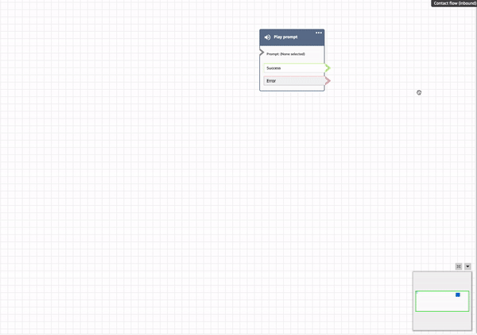

# Customize the name of a flow block in

Amazon Connect

To help you distinguish blocks in a flow, you can customize the names of blocks. For
example, when there are multiple **Play prompt** blocks, and you want
to distinguish between them at a glance you can assign each block their own name.

Custom flow block names appear in CloudWatch logs under the `Identifier` field.
This makes it easier for you to review the logs to diagnose issues.

###### Important

- The following characters are not allowed in the block name or
  `Identifier` field: (% : ( \ / ) = $ , ; [ ] { })
- The following strings are not allowed in the block name or
  `Identifier` field: \_\_proto\_\_, constructor, \_\_defineGetter\_\_,
  \_\_defineSetter\_\_, toString, hasOwnProperty, isPrototypeOf,
  propertyIsEnumerable, toLocaleString, and valueOf.
  There are two ways you can specify a custom block name:

- On the block, choose **...**, and then choose **Add
  block name**, as shown in the following GIF.

- You can also customize the name of the block on the
  **Property** page, as shown in the following GIF.

