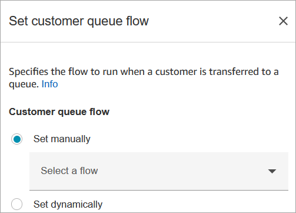
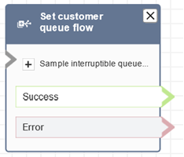

# Flow block in Amazon Connect: Set customer queue

flow

This topic defines the flow block for specifying the flow to invoke when a customer is
transferred to a queue.

## Description

- Specifies the flow to invoke when a customer is transferred to a
  queue.

## Supported channels

The following table lists how this block routes a contact who is using the
specified channel.

| Channel | Supported? |
| ------- | ---------- |
| Voice   | Yes        |
| Chat    | Yes        |
| Task    | Yes        |
| Email   | Yes        |

## Flow types

You can use this block in the following [flow
types](create-contact-flow.md#contact-flow-types "create-contact-flow.md#contact-flow-types"):

- Inbound flow
- Transfer to Agent flow
- Transfer to Queue flow

## Properties

The following image shows the **Properties** page of the
**Set customer queue flow** block.

For information about using attributes, see [Use Amazon Connect contact attributes](connect-contact-attributes.md "connect-contact-attributes.md").

## Configured block

The following image shows an example of what this block looks like when it is
configured. It has the following branches: **Success** and
**Error**.

## Sample flows

Amazon Connect includes a set of sample flows. For instructions that explain how to access the sample flows in the flow designer, see
[Sample flows in Amazon Connect](contact-flow-samples.md "contact-flow-samples.md"). Following are topics
that describe the sample flows which include this block.

- [Sample queued callback flow in Amazon Connect](sample-queued-callback.md "sample-queued-callback.md")
