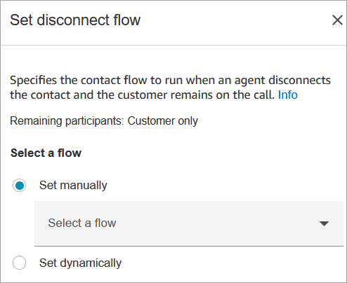
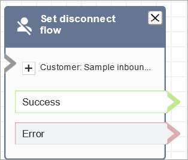

# Flow block in Amazon Connect: Set disconnect flow

This topic defines the flow block for specifying which flow to run when a call is
disconnected during a contact.

## Description

- Specifies which flow to run after a disconnect event during a contact.

A disconnect event is when:

    + A chat, or task is disconnected.
    + A task is disconnected as a result of a flow action.
    + A task expires. The task is automatically disconnected when it completes its expiry timer.
     The default is 7 days and task expiry is configurable up to 90 days.

When the disconnect event occurs, the corresponding flow runs.

- Here are examples of when you might use this block:
  - Run post-contact surveys. For example, the agent asks the customer
    to remain on the line for a post-call survey. The agent hangs up and
    a disconnect flow is run. In the disconnect flow, the customer is
    asked a set of questions using the [Get customer input](get-customer-input.md "get-customer-input.md") block. Their answers
    are uploaded using an [AWS Lambda
    function](invoke-lambda-function-block.md "invoke-lambda-function-block.md") block to an
    external customer feedback database. The customer is thanked and
    disconnected.

  For more information about creating post-contact surveys, see this
  blog: [Easily create and visualize post chat surveys with Amazon Connect and
  Amazon Lex](https://aws.amazon.com/blogs/contact-center/easily-create-and-visualize-post-chat-surveys-with-amazon-connect-and-amazon-lex/ "https://aws.amazon.com/blogs/contact-center/easily-create-and-visualize-post-chat-surveys-with-amazon-connect-and-amazon-lex/"). And check out this workshop: [Building a contact survey solution for Amazon Connect](https://catalog.workshops.aws/amazon-connect-contact-survey/en-US "https://catalog.workshops.aws/amazon-connect-contact-survey/en-US").
  - In a chat scenario, if a customer stops responding to the chat,
    use this block to decide whether to run the disconnect flow and call
    a [Wait](wait.md "wait.md") block, or end
    the conversation.
  - In task scenarios where a task may not be completed in 7 days, use
    this block to run a disconnect flow to determine whether the task
    should be re-queued, or completed/[disconnected](disconnect-hang-up.md "disconnect-hang-up.md") by a flow action.

###### Tip

It's not possible to play a audio prompt to the agent or invoke a flow when
the customer disconnects. After the customer disconnects, the flow ends and the
agents starts After Call Work (ACW) for that contact.

## Supported channels

The following table lists how this block routes a contact who is using the
specified channel.

| Channel | Supported? |
| ------- | ---------- |
| Voice   | Yes        |
| Chat    | Yes        |
| Task    | Yes        |
| Email   | Yes        |

## Flow types

You can use this block in the following [flow
types](create-contact-flow.md#contact-flow-types "create-contact-flow.md#contact-flow-types"):

- All flows

## Properties

The following image shows the **Properties** page of the
**Set disconnect flow** block.

## Configured block

The following image shows an example of what this block looks like when it is
configured. It has the following branches: **Success** and
**Error**.

## Sample flows

Amazon Connect includes a set of sample flows. For instructions that explain how to access the sample flows in the flow designer, see
[Sample flows in Amazon Connect](contact-flow-samples.md "contact-flow-samples.md"). Following are topics
that describe the sample flows which include this block.

- [Sample inbound flow in Amazon Connect for the first contact
  experience](sample-inbound-flow.md "sample-inbound-flow.md")

## Scenarios

See these topics for scenarios that use this block:

- [Example chat scenario](web-and-mobile-chat.md#example-chat-scenario "web-and-mobile-chat.md#example-chat-scenario")
- [Easily create and visualize post chat surveys with Amazon Connect and
  Amazon Lex](https://aws.amazon.com/blogs/contact-center/easily-create-and-visualize-post-chat-surveys-with-amazon-connect-and-amazon-lex/ "https://aws.amazon.com/blogs/contact-center/easily-create-and-visualize-post-chat-surveys-with-amazon-connect-and-amazon-lex/")
- [Building a contact survey solution for Amazon Connect](https://catalog.workshops.aws/amazon-connect-contact-survey/en-US "https://catalog.workshops.aws/amazon-connect-contact-survey/en-US")
