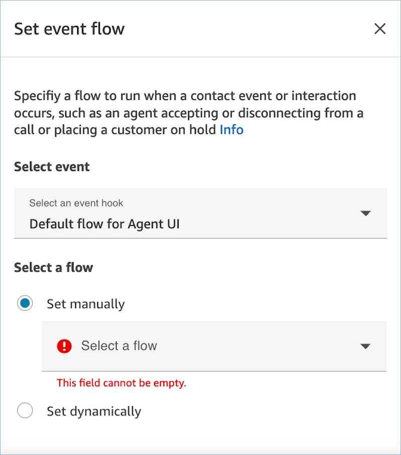
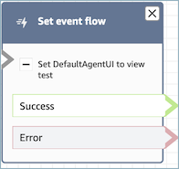

# Flow block in Amazon Connect: Set event flow

This topic defines the flow block for specifying a flow to run during an interaction
with a contact.

## Description

- Specifies which flow to run during a contact event.
- The following events are supported:
  - **Default flow for agent UI**:
    specifies the flow to be invoked when a contact comes into the Agent
    Workspace. You can use this event to set up a [step-by-step](step-by-step-guided-experiences.md "step-by-step-guided-experiences.md")
    guide to be played to the agent in this scenario.
  - **Disconnect flow for agent UI**:
    specifies the flow to be invoked when a contact that is open in the
    Agent Workspace ends. You can use this event to set up a [step-by-step](step-by-step-guided-experiences.md "step-by-step-guided-experiences.md")
    guide to be played to the agent in this scenario.
  - **Flow at contact pause**: Specifies
    the flow to be invoked when a contact comes to paused state. For
    more information, see [Pause and resume tasks in Amazon Connect
    Tasks](concepts-pause-and-resume-tasks.md "concepts-pause-and-resume-tasks.md").
  - **Flow at contact resume**: Specifies
    the flow to be invoked when a contact comes to resume from paused
    state. For more information, see [Pause and resume tasks in Amazon Connect
    Tasks](concepts-pause-and-resume-tasks.md "concepts-pause-and-resume-tasks.md").

## Supported channels

The following table lists how this block routes a contact who is using the
specified channel.

| Channel | Supported? |
| ------- | ---------- | ---------------------------------------------------------------------------------------------------------------------------------------------------------------------------------------------------------------------------------------------------------------------------------------------------------------------------------------------------------------------------------------------------------------------------------------------------------------------------------------------------------------------------------------------------------------------------------------------------------------------------------------------------------------------------------------------------------------------------------------------------------------------------------------------------------------------- |
| Voice   | Yes        |
| Chat    | Yes        |
| Task    | Yes        |
| Email   | Yes        | ## Flow types You can use this block in the following [flow types](create-contact-flow.md#contact-flow-types "create-contact-flow.md#contact-flow-types"):  • All flows ## Properties The following image shows the **Properties** page of the **Set event flow** block.  ## Configured block The following image shows an example of what this block looks like when it is configured. It has the following branches: **Success** and **Error**.  ## Scenarios See these topics for scenarios that use this block:  • [Invoke a guide at the start of a contact in Amazon Connect](how-to-invoke-a-flow-sg.md "how-to-invoke-a-flow-sg.md") |
