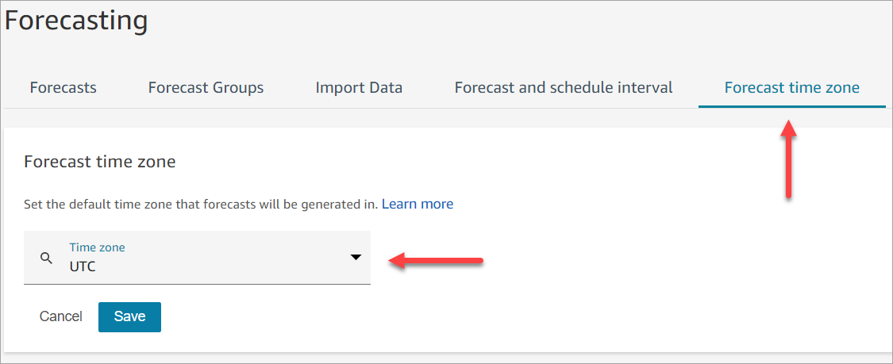

# Set the forecast time zone

On the **Forecasting** page, you set the time zone for your
forecasts. The following image shows the **Forecast time zone**
tab, and the dropdown menu where you choose the time zone.

## Important things to

know

- To edit the forecast time zone, you must have security profile
  permissions for **Analytics, Forecast and schedule interval -
  Edit**. For more information, see [Assign
  permissions](required-optimization-permissions.md "required-optimization-permissions.md").
- The default value for the forecast time zone is UTC.
- When you change the forecast time zone, Amazon Connect regenerates both the
  short-term and long-term forecasts.
  - Updated forecasts in the selected time zone are available
    within 24 hours.
  - The forecasts are automatically adjusted for daylight savings
    if the selected time zone observes daylight savings.

## Forecast time zones on the Amazon Connect admin website and in

downloads

- **Short-term forecasts**: You can view
  short-term forecasts in the selected time zone after updating the time
  zone configuration.
- Downloads are in the time zone that the forecast was computed in. For
  example:
  - Let's say today is May 1st, and the forecast time zone is
    currently set to UTC.
  - The latest computed forecast generated on May 1st is in
    UTC.
  - Later that day (at 1PM) you change forecast time zone to
    US/Pacific.
  - The forecast computed on May 2nd is in US/Pacific time
    zone.

- **Long-term forecasts**: You will
  continue to view and download long-term forecasts in the time zone they
  were computed in. Long-term forecasts that are computed after updating
  the time zone configuration. You can view and download forecasts in the
  selected time zone.

## Forecast overrides

- **Short-term forecasts**: When overriding
  a short-term forecast, the timestamp column must be in the ISO8601
  format. You can use UTC values or time zones with the appropriate
  offset.

For example, if you are overriding the forecast for the May 30th 8AM -
8:15AM interval and you've configured the time zone as US/Pacific, you
can use either of the following values:

    + 2024-05-30T15:00:00Z
    + 2024-05-30T08:00:00-07:00

- **Long-term forecasts**: When overriding
  a long-term forecast, the timestamp column must be in the ISO8601 format
  and the time value must be midnight in the configured time zone.

For example, if you are overriding the forecast for May 30th and you
have configured the time zone as US/Pacific, then the following are
acceptable values for the timestamp:

    + 2024-05-30T07:00:00Z
    + 2024-05-30T00:00:00-07:00

###### Note

Long-term forecast overrides are not available while the forecasts are
being computed in the updated time zone.

## Historical data upload

- **Interval data**: When uploading
  interval (15min/30min) level historical data, the timestamp column must
  be in the ISO8601 format. The time value can be in UTC or in the
  configured time zone with the appropriate offset.

For example, if you are uploading the forecast for the May 30th 8AM -
8:15AM interval and you have configured the time zone as US/Pacific,
then the following are acceptable values for the timestamp:

    + 2024-05-30T15:00:00Z
    + 2024-05-30T08:00:00-07:00

- **Daily data**: When uploading daily
  aggregated historical data for long-term forecasting, the timestamp
  column must be in the ISO8601 format and the time value must be midnight
  in the configured time zone.

For example, if you are uploading the forecast for May 30th and you
have configured the time zone as US/Pacific, then the following are
acceptable values for the timestamp:

    + 2024-05-30T07:00:00Z
    + 2024-05-30T00:00:00-07:00
