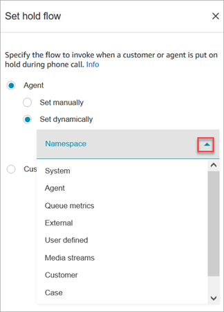
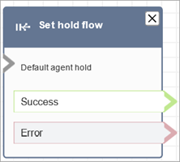

# Flow block in Amazon Connect: Set hold flow

This topic defines the flow block for specifying the flow to invoke when a customer or
agent is put on hold.

## Description

- Links from one flow type to another.
- Specifies the flow to invoke when a customer or agent is put on
  hold.

If this block is triggered during a chat conversation, the contact is
routed down the **Error** branch.

## Supported channels

The following table lists how this block routes a contact who is using the
specified channel.

| Channel | Supported?           |
| ------- | -------------------- |
| Voice   | Yes                  |
| Chat    | No • Error branch |
| Task    | No • Error branch |
| Email   | No • Error branch |

## Flow types

You can use this block in the following [flow
types](create-contact-flow.md#contact-flow-types "create-contact-flow.md#contact-flow-types"):

- Inbound flow
- Customer Queue flow
- Outbound whisper flow
- Transfer to Agent flow
- Transfer to Queue flow

## Properties

The following image shows the **Properties** page of the
**Set hold flow** block. It shows the dropdown list of
namespaces that you can use to set the hold flow dynamically.

For information about using attributes, see [Use Amazon Connect contact attributes](connect-contact-attributes.md "connect-contact-attributes.md").

## Configured block

The following image shows an example of what this block looks like when it is
configured. It has the following branches: **Success** and
**Error**.

