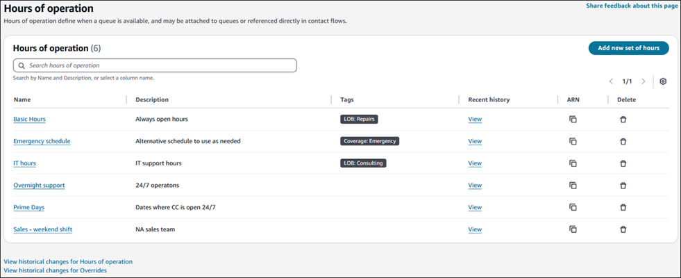
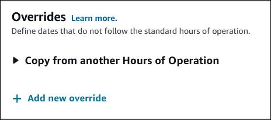
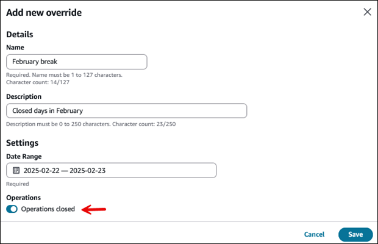
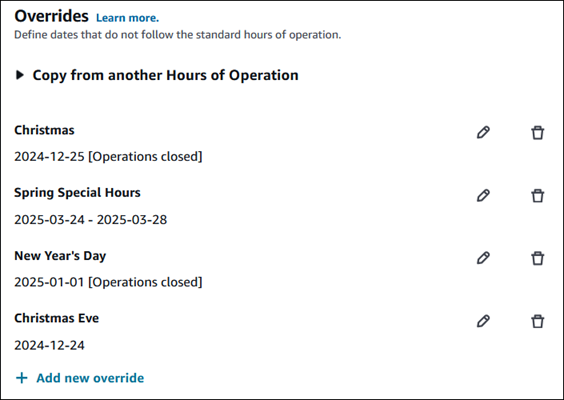
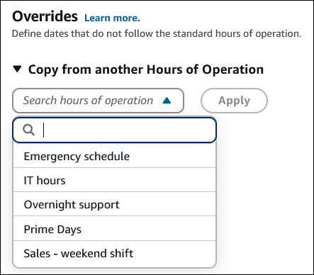
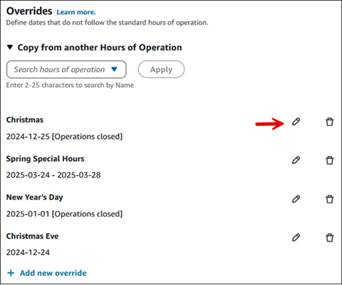
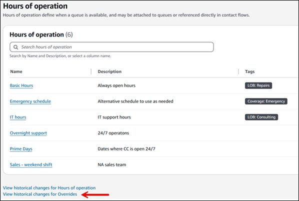
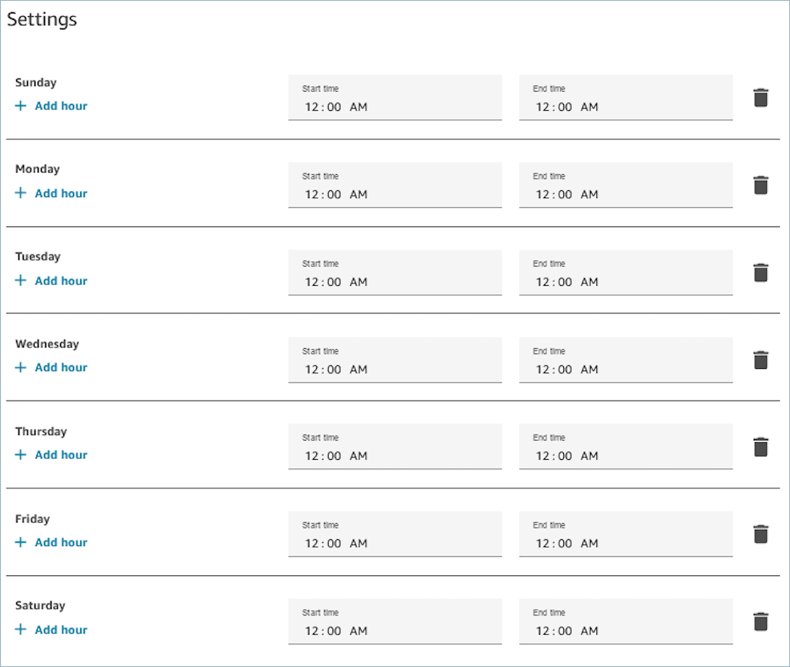
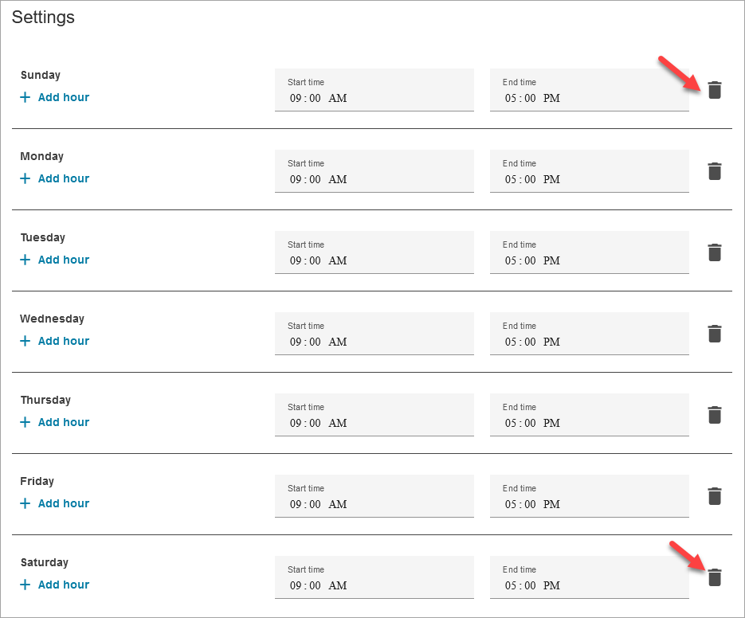
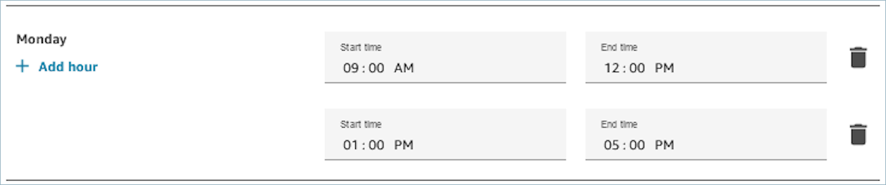

# Set the hours of operation and time zone for a

queue using Amazon Connect

This topic explains how to set hours of operating by using the Amazon Connect admin website. To set hours
programmatically, see [APIs for creating and managing
hours of operation](#hours-operation-apis "#hours-operation-apis").

The first thing you need to do when you set up a queue is to specify the hours of
operation and timezone. The hours may be referenced in flows. For example, when routing
contacts to agents, you might use the [Check hours of
operation](check-hours-of-operation.md "check-hours-of-operation.md") block first, and then route the
contact to the appropriate queue.

You can also set up overrides for reduced or extended hours. For example, at the
beginning of the year you may want to enter all the days to that your business is closed
for holidays, or if open, during which hours.

The following image shows a sample hours of operation page where overrides are
specified. The following hours of operation are overrides: Emergency schedule, IT hours,
Overnight support, Prime Days, and Sales - weekend shift.

###### Contents

- [How many hours of operation and
  overrides can I create?](#howmany-hours "#howmany-hours")
- [Set the hours of operation](#set-hoop "#set-hoop")
- [Set overrides for extended, reduced, and holiday
  hours](#set-holiday-hours "#set-holiday-hours")
- [View an audit history of overrides](#audit-history-hoop "#audit-history-hoop")
- [How to specify midnight](#set-hours-operation-midnight "#set-hours-operation-midnight")
- [Examples](#set-hours-operation-examples "#set-hours-operation-examples")
- [Add lunch and other breaks](#add-lunch-breaks "#add-lunch-breaks")
- [Daylight saving
  time](#daylight-savings-time "#daylight-savings-time")
- [Use the Check Hours of
  Operation block](#use-check-hours-of-operation-block "#use-check-hours-of-operation-block")
- [APIs for creating and managing
  hours of operation](#hours-operation-apis "#hours-operation-apis")

## How many hours of operation and overrides can I

create?

- To view your quota of **Hours of operation per
  instance**, open the Service Quotas console at [https://console.aws.amazon.com/servicequotas/](https://console.aws.amazon.com/servicequotas/ "https://console.aws.amazon.com/servicequotas/").
- You can create up to 50 overrides per hours of operation. This is quota is
  not adjustable.

## Set the hours of operation

1. Log in to the Amazon Connect admin website with an Admin account or an account that has
   **Routing - Hours of operation - Create** security
   profile permission.
2. On the navigation menu, choose **Routing**,
   **Hours of operation**.
3. To create a template, choose **Add new set of hours** and
   enter a name and a description.
4. Choose **Time zone** and select a value.
5. Choose **Settings** to set new hours.
6. Optionally, in the **Tags** section, add tags to
   identify, organize, search for, or filter who can access this hours of
   operation record. For more information, see [Add tags to resources in Amazon Connect](tagging.md "tagging.md").
7. Choose **Save**.
8. Now you can specify these the hours of operation when you [create a queue](create-queue.md "create-queue.md"), and check them in the
   [Check hours of
   operation](check-hours-of-operation.md "check-hours-of-operation.md") block.

## Set overrides for extended, reduced, and holiday

hours

You can set overrides for when your contact center will be closed, or will have
extended or reduced hours. For example, you can indicate that you are closed on New
Years Day, have reduced hours on New Year's Eve, and extended hours on Boxing Day.
You can also set up overrides for a range of dates to support scenarios such as
special summer hours.

When you choose to add overrides, you have the option to add them manually or to
copy them from another hours of operation record, as shown in the following image.

Both options are explained next.

### Add overrides manually

1. On the **Add overrides to hours of operation** page,
   choose whether the override applies to a single date or a date range.
2. Complete the page as prompted. Note the following:
   - Dates/ranges cannot overlap. For example, if you have reduced
     hours during the summer, and July 4th is closed, you must set up
     a range for before July 4, then July 4, and a range
     afterwards.
   - When an override with a date range has operating hours, more
     configuration is required to account for variations in the days
     of the week. A date range can have different hours per day as
     long as the day or week pattern is consistent week over week.
     This allows you to set up seasonal hours, such as reduced hours
     most of the week and Friday is closed.
   - Date ranges cannot overlap so if this pattern breaks, you need
     to set up a different override range. For example, reduced
     summer hours before and after the July 4th holiday, when
     operations are closed.
   - Overrides cannot be reused or set up as recurring each
     year.

The following image shows an example of a contact center that is going to be
closed for two days in February.

The following image shows an example of holiday overrides for the
**Basic Hours** record.

### Copy overrides to another hours of operation

record

If you have many similar hours of operation records (for example, different
hours for different teams or channels), you can set up a hours of operation for
one then copy it to others. You can:

- Copy the overrides from another hours of operation record. For
  example, to save time you can create a source hours of operation with a
  main list.
- Copy more than one list into an hours of operation record.
- Copy a list in addition to manually adding overrides.

The following image shows an example of a dropdown list of overrides that you
can to another hours of operation record.

After copying, you can remove or edit rows in that list. For example, you can
change the length of time the contact center is open on Christmas for a certain
line of business. Or after copying US overrides to a Canadian record, you can
omit July 4 and other US-based holidays, and then add dates that are specific to
Canada.

The following image shows the location of the edit and delete options on the
**Overrides** page.

###### Tip

You can view and copy the overrides for past dates. You may want to delete
older overrides if you near the limit of 50 overrides per hours of
operation. This limit is not adjustable.

## View an audit history of overrides

An audit history of overrides appears on the **Hours of
operation** page, distinct from the standard hours of operations audit
history. Each audit record refers to the ID of the hours of operation record. By
viewing the audit history you can differentiate between overrides with the same name
that are used in multiple hours of operation overrides.

The following image shows the location of the link to view historical changes for
overrides.

###### Note

AWS CloudTrail tracks the history of all resource changes. For more information, see
[Log Amazon Connect API calls with AWS CloudTrail](logging-using-cloudtrail.md "logging-using-cloudtrail.md").

## How to specify midnight

To specify midnight, enter 12:00AM.

For example, if you want to set your hours to 10:00AM to midnight, you would
enter: 10:00AM to 12:00AM. Your call center would be open for 14 hours. Here's the
math:

- 10:00AM-12:00PM = 2 hours
- 12:00PM-12:00AM = 12 hours
- Total = 14 hours

## Examples

**Schedule for 24x7**

**Schedule for Monday to Friday 9:00 AM to 5:00
PM**

Remove Sunday and Saturday from the schedule.

## Add lunch and other breaks

If your entire contact center were to close for lunch from 12-1, for example, then
you'd enter hours to specify that, as in the following image:

In most contact centers breaks are staggered. While some agents are at lunch, for
example, others are still available to handle contacts. Instead of specifying this
in the hours of operation, you [add custom agent
statuses](agent-custom.md "agent-custom.md") that appear in the agent's Contact Control Panel (CCP).

For example, you might create a custom status named **Lunch**.
When the agent goes to lunch, they change their status in the CCP from
**Available** to **Lunch**. During this time,
no contacts are routed to them. When they return from lunch and are ready to take
contacts again, they change their status back to **Available**.

Supervisors can change an agent's status using the real-time metrics
report.

For more information, see these topics:

- [Add a custom agent status to the Amazon Connect Contact Control
  Panel (CCP)](agent-custom.md "agent-custom.md")
- [Agent status in the Contact Control Panel
  (CCP)](metrics-agent-status.md "metrics-agent-status.md")
- [Change the "Agent activity" status
  in a metrics report in the Contact Control Panel (CCP)](rtm-change-agent-activity-state.md "rtm-change-agent-activity-state.md")

## What happens during daylight saving

time

Amazon Connect uses the timezone to determine whether daylight saving time is in effect for
the queues, and **adjusts automatically** for all
timezones that observe daylight saving time. When a contact comes in, Amazon Connect looks at
the hours and timezone of your contact center to determine whether the contact can
be routed to the given queue.

###### Important

Amazon Connect provides options for EST5EDT, PST8PDT, CST6CDT, and more.
For example, EST5EDT is defined as:

[Eastern Standard
Time (EST)](https://en.wikipedia.org/wiki/Eastern_Time_Zone "https://en.wikipedia.org/wiki/Eastern_Time_Zone") is used when observing standard time. It is five hours
behind Coordinated Universal Time (UTC).

[Eastern Daylight
Time (EDT)](https://en.wikipedia.org/wiki/Eastern_Time_Zone "https://en.wikipedia.org/wiki/Eastern_Time_Zone") is used when observing daylight saving time. It is four
hours behind Coordinated Universal Time (UTC).

We recommend researching your choice of timezone to ensure you understand
it.

### Example

1. A person initiates a call or chat with your contact center.
2. Amazon Connect looks at the hours of operation for your call center right
   now.
   - The contact is from timezone A.
   - Your call center's hours are 9 AM - 5 PM in timezone B.
   - If the current time in timezone B is 2 PM then the call or
     chat is queued.
   - If the current time in timezone B is 7 AM then the call or
     chat is not queued.

## Use the Check Hours of

Operation block

At the start of your flows, use the [Check hours of
operation](check-hours-of-operation.md "check-hours-of-operation.md") block to determine whether your
contact center is open, and to branch accordingly.

## APIs for creating and managing hours of

operation

Use the following APIs to create and manage hours of operation
programmatically:

- [CreateHoursOfOperation](../APIReference/API_CreateHoursOfOperation.md "../APIReference/API_CreateHoursOfOperation.md")
- [DescribeHoursOfOperation](../APIReference/API_DescribeHoursOfOperation.md "../APIReference/API_DescribeHoursOfOperation.md")
- [DeleteHoursOfOperation](../APIReference/API_DeleteHoursOfOperation.md "../APIReference/API_DeleteHoursOfOperation.md")
- [ListHoursOfOperations](../APIReference/API_ListHoursOfOperations.md "../APIReference/API_ListHoursOfOperations.md")
- [SearchHoursOfOperations](../APIReference/API_SearchHoursOfOperations.md "../APIReference/API_SearchHoursOfOperations.md")
- [UpdateHoursOfOperation](../APIReference/API_UpdateHoursOfOperation.md "../APIReference/API_UpdateHoursOfOperation.md")

Use the following APIs to create and manage overrides programmatically:

- [CreateHoursOfOperationOverride](../APIReference/API_CreateHoursOfOperationOverride.md "../APIReference/API_CreateHoursOfOperationOverride.md")
- [DescribeHoursOfOperationOverride](../APIReference/API_DescribeHoursOfOperationOverride.md "../APIReference/API_DescribeHoursOfOperationOverride.md")
- [DeleteHoursOfOperationOverride](../APIReference/API_DeleteHoursOfOperationOverride.md "../APIReference/API_DeleteHoursOfOperationOverride.md")
- [GetEffectiveHoursOfOperations](../APIReference/API_GetEffectiveHoursOfOperations.md "../APIReference/API_GetEffectiveHoursOfOperations.md")
- [ListHoursOfOperationOverrides](../APIReference/API_ListHoursOfOperationOverrides.md "../APIReference/API_ListHoursOfOperationOverrides.md")
- [SearchHoursOfOperationOverrides](../APIReference/API_SearchHoursOfOperationOverrides.md "../APIReference/API_SearchHoursOfOperationOverrides.md")
- [UpdateHoursOfOperationOverride](../APIReference/API_UpdateHoursOfOperationOverride.md "../APIReference/API_UpdateHoursOfOperationOverride.md")
