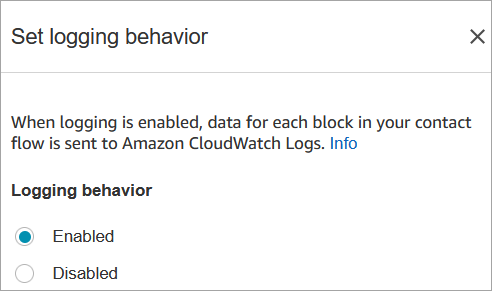

# Flow block in Amazon Connect: Set logging behavior

This topic defines the flow block for enabling flow logs to track events as contacts
interact with flows.

## Description

- Enables flow logs so you can track events as contacts interact with
  flows.
- Flow logs are stored in Amazon CloudWatch. For more information, see
  [Flow logs stored in an Amazon CloudWatch log group](contact-flow-logs-stored-in-cloudwatch.md "contact-flow-logs-stored-in-cloudwatch.md").

## Supported channels

The following table lists how this block routes a contact who is using the
specified channel.

| Channel | Supported? |
| ------- | ---------- | ---------------------------------------------------------------------------------------------------------------------------------------------------------------------------------------------------------------------------------------------------------------------------------------------------------------------------------------------------------------------------------------------------------------------------------------------------------------------------------------------------------------------------------------------------------------------------------------------------------------------------------------------- |
| Voice   | Yes        |
| Chat    | Yes        |
| Task    | Yes        |
| Email   | Yes        | ## Flow types You can use this block in the following [flow types](create-contact-flow.md#contact-flow-types "create-contact-flow.md#contact-flow-types"):  • All flows ## Properties The following image shows the **Properties** page of the **Set logging behavior** block. It has two options: enable logging behavior, or disable it.  ## Scenarios See these topics for more information about flow logs:  • [Use flow logs to track events in Amazon Connect flows](about-contact-flow-logs.md "about-contact-flow-logs.md") |
