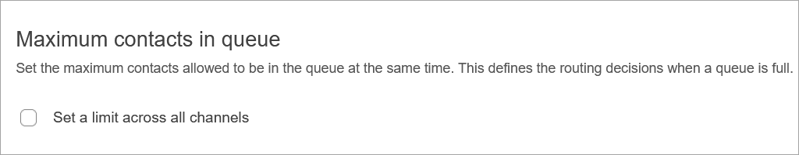
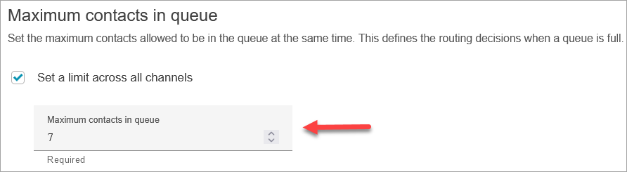

# Set the limit of maximum contacts in a queue

using Amazon Connect

By default a queue can contain up to your [service quota](amazon-connect-service-limits.md "amazon-connect-service-limits.md") for voice, chat, tasks,
and email:

- **Concurrent active calls per instance**
- **Concurrent active chats per instance (includes
  SMS)**
- **Concurrent active tasks per instance**
- **Concurrent active emails per instance**
  To increase one of these quotas, you must request a quota increase. For more
  information, see [Amazon Connect service quotas](amazon-connect-service-limits.md "amazon-connect-service-limits.md").

There may be situations where you want a specific queue to allow fewer contacts than
the allowed quota. For example:

- You have a queue that is dedicated to calls about complicated issues that take
  an average of 15 minutes to resolve, you may want to limit the number of calls
  allowed in the queue to be less than **Concurrent active calls per
  instance**. This prevents customers from waiting for hours.
- You may have a queue dedicated to chats. Your service quota is 100 but you
  want only up to 20 chats at a time. You can set that value so Amazon Connect limits the
  number of active chats routed to that queue.
- You have a queue that combines more than one channel, and you set a custom
  value. Note that the queue stops accepting new contacts after that number is
  reached, regardless of the distribution of contacts. For example, if you set the
  value to 50, and the first 50 contacts are chats, then voice calls are not
  routed to this queue.
  This topic explains how to reduce the allowed number of contacts in a queue for these
  situations.

## Reduce the number of contacts allowed in a queue

To reduce the number of contacts allowed in a [standard queue](concepts-queues-standard-and-agent.md "concepts-queues-standard-and-agent.md") at the same
time, you set the **Maximum contacts in queue** limit for the
standard queue. This setting does not apply to [agent queues](concepts-queues-standard-and-agent.md "concepts-queues-standard-and-agent.md").

When you enter a number in **Maximum contacts in queue**, Amazon Connect
validates that the number is less than the sum of your concurrent active contacts
service quotas: **Concurrent calls per instance** +
**Concurrent active chats per instance** + **Concurrent
active tasks per instance** + **Concurrent active emails per
instance**.

###### Important

- You must set **Maximum contacts in queue** to be less
  than the sum of the following quotas combined: **Concurrent
  calls per instance** + **Concurrent active chats
  per instance** + **Concurrent active tasks per
  instance** + **Concurrent active emails per
  instance**.
- Incoming calls and queued callbacks count towards the queue size
  limit.
  For information about default service quotas and how to request an increase,
  see [Amazon Connect service quotas](amazon-connect-service-limits.md "amazon-connect-service-limits.md").

###### To reduce the number of contacts allowed in a specific queue

1. On the navigation menu, choose **Routing**,
   **Queues**, **Add new queue**. Or,
   edit an existing queue.
2. In **Maximum contacts in queue**, choose **Set a
   limit across all channels**. If the queue is also used for
   chats, tasks, and email, then all channels will be capped at the same
   maximum.
3. In the box, specify how many contacts can be in the queue before it's
   considered full. The value cannot exceed the sum of **Concurrent
   active calls per instance** + **Concurrent active chats
   per instance** + **Concurrent active tasks per
   instance** +**Concurrent active emails per
   instance**.

## What happens to calls when a queue is full

- Incoming calls: Ideally you've [set up
  queued callback](setup-queued-cb.md "setup-queued-cb.md"), or have another contingency implemented. If not,
  the next incoming call gets a reorder tone (also known as a fast busy tone),
  which indicates no transmission path to the called number is
  available.
- Queued callbacks: The next queued callback is routed down the error
  branch.

## What happens if Maximum contacts in queue is set

to 0

If you set **Maximum contacts in queue** to 0 it renders the
queue unusable. The behavior is the same as when a queue is full.

## Queue maximum limit

exceptions

There are times when you can add more contacts to a queue than the set
**Maximum contacts in queue** limit.

- There
  may be a slight delay between the time that a queue reaches its capacity
  limit and when this limit is enforced in the flow. This delay could cause
  incoming contacts to be queued during that time, particularly during bursts
  of traffic.

Additionally, Amazon Connect includes a 20 percent buffer to the queue capacity for the
following exceptional scenarios:

- A contact was transformed into a Queued Callback, scheduled to be added to
  the queue at X time using the **Initial delay** setting in
  the flow. However, when the scheduled time arrived, the target queue had
  reached its **Maximum capacity in queue** limit. In this
  scenario, Amazon Connect allows the Queued Callback to be enqueued up to a 20 percent
  buffer of the **Maximum capacity in queue** limit for the
  queue.
- A contact, previously queued in Queue1, is now being transferred to Queue2
  through the flow. However, when the transfer is attempted, Queue2 has
  already reached its **Maximum capacity in queue** limit. In
  this scenario, Amazon Connect allows the transfer to proceed, up to a 20 percent
  buffer of the **Maximum capacity in queue** limit for
  Queue2.
- An agent initiates a manual transfer of a contact into a queue through
  quick connects. However, when the transfer is attempted, the queue has
  already reached its **Maximum capacity in queue** limit. In
  this scenario, Amazon Connect allows the transfer to proceed, up to a 20 percent
  buffer of the **Maximum capacity in queue** limit.
