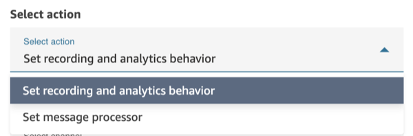
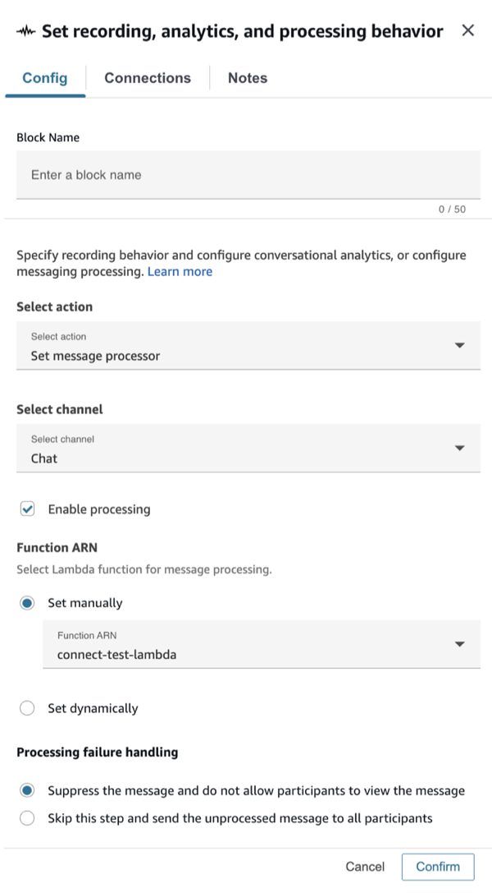
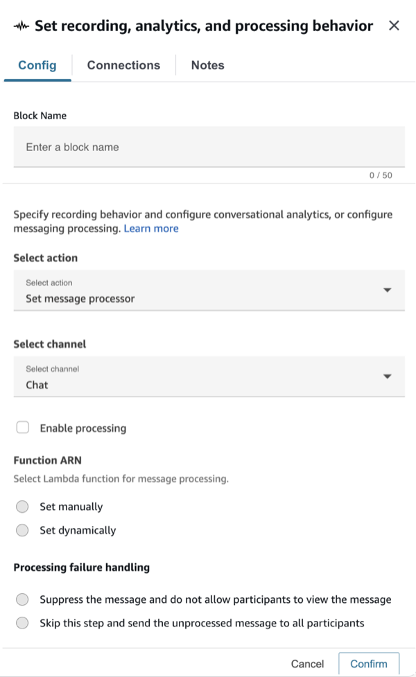
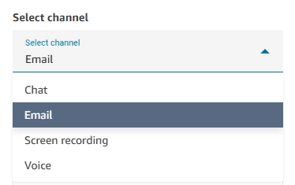
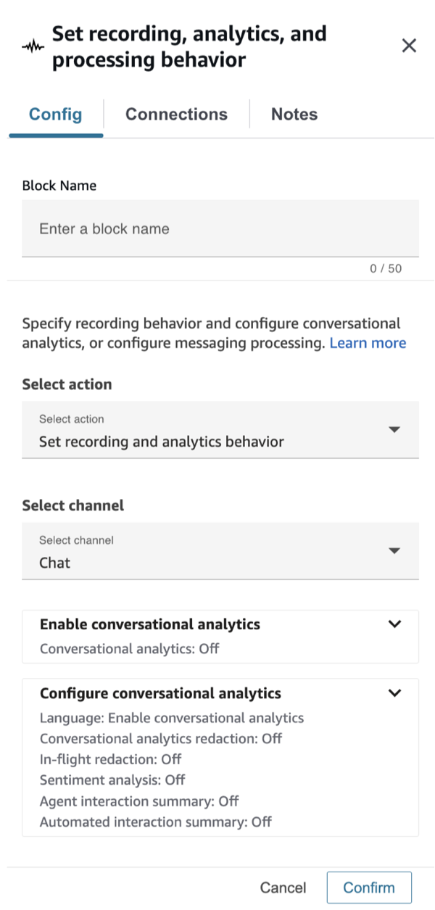
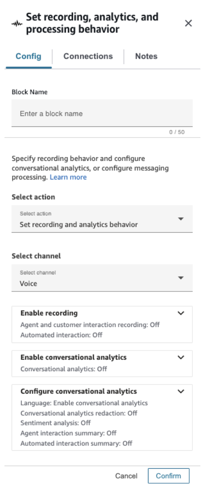
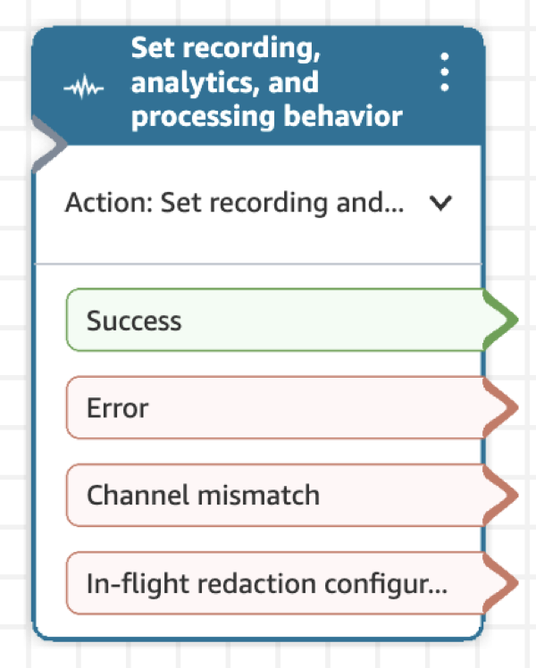
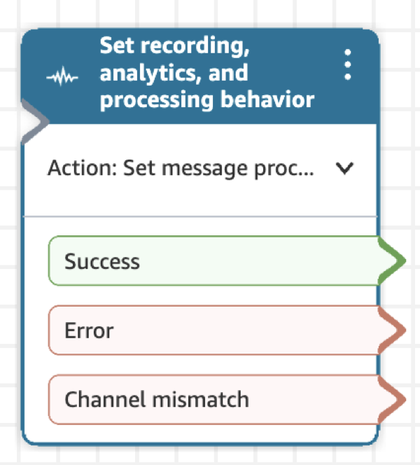

# Flow block in Amazon Connect: Set recording, analytics and processing behavior

This topic defines the flow block for setting options to configure recording behavior for agent and customer, enable automated interaction, enable screen recording, set analytics behavior for contacts, and set custom processing behavior.

## Description

There are two actions supported as part of this block:

- **Set message processor**\* - this allows customers to configure their own lambda processor, which will be applied to in-flight messages
- **Set recording and analytics behavior** - this allows customers to configure recording and analytics behavior for voice and chat contacts, along with screen recording behavior.

\*Unavailable in PDT

The above screenshot shows the two actions in the block's "Select action" dropdown.

Once you select an action, you can select a channel to configure those settings for. Here are the supported channels for each action:

|                                      | Chat supported? | Email supported? | Tasks supported?                         | Voice supported? |
| ------------------------------------ | --------------- | ---------------- | ---------------------------------------- | ---------------- |
| Set message processing               | Yes             | No               | No                                       | No               |
| Set recording and analytics behavior | Yes             | No               | Yes (only for screen recording behavior) | Yes              |

## Flow types

This block is supported for all flow types except journey flows.

###### Tip

We recommend using the **Set recording** portion of this block in an inbound or outbound whisper flow for the most accurate behavior.

Using this block in other flow types does not always guarantee that calls are recorded. This is because the block might run after the contact is joined to the agent.

## How to configure this block

You can configure the **Set recording, analytics and processing behavior** block by using the Amazon Connect admin website. This guide will walk through how to configure each action in this block.

### Set message processing

The following image shows a picture of the **Set message processor** action set in the block. This action currently only supports Chat channel type, which is selected in the next dropdown. The dropdown is followed by several settings to configure a custom lambda processor:

1. **Enable processing** - control whether you want to start or stop chat message processing.
2. **Function ARN** - define a lambda function that will perform the message processing. This function should be integrated with custom message processing. You can do so through the **CreateIntegrationAssociation** public API, using the MESSAGE_PROCESSOR IntegrationType. View documentation [here](../APIReference/API_CreateIntegrationAssociation.md "../APIReference/API_CreateIntegrationAssociation.md").
3. **Processing failure handling** - select whether you would like the original, unprocessed message to be delivered or not in case processing fails.

The below screenshot shows the block settings when processing is disabled:

### Set recording and analytics behavior

The following guide will discuss the **Set recording and analytics** action in the block. There are multiple configurations in this part of the block:

- You configure what part of the call can be recorded be it either agent, customer or both. No additional charges apply.
- You can enable automated interaction call recording to hear how a customer is interacting with your IVR or conversational AI bot. No additional charges apply.
- You can enable screen recording of agents, if agent screen recording has been set up as described in [Enable screen recording](enable-sr.md "enable-sr.md"). For pricing information, see [Amazon Connect Pricing](https://aws.amazon.com/connect/pricing/ "https://aws.amazon.com/connect/pricing/").
- You can configure Contact Lens analytics settings for chat and voice contacts. For pricing information, see [Amazon Connect Pricing](https://aws.amazon.com/connect/pricing/ "https://aws.amazon.com/connect/pricing/"). This includes:
  - Language in which customers and agents will interact (to improve the speech to text transcript generation).
  - Redaction of sensitive data.
  - Additional Contact Lens Generative AI capabilities.

This action enables Contact Lens conversational analytics on a contact. For more information, see [Analyze conversations using
conversational analytics](analyze-conversations.md "analyze-conversations.md"). This action currently supports Chat, Voice and Tasks media channel types. However, for tasks, you are only able to configure screen recording behavior. Therefore, in the channel dropdown for this action, you will see the following three options:

###### Note

To configure both screen recording and channel recording or analytics, use two separate Set recording, analytics, and processing behavior blocks in sequence: one for screen recording and one for audio recording. Each block should be configured for only one recording type to avoid unexpected behavior.

Let's walk through what each channel's configuration looks like:

#### Chat

As shown in the following image, the chat settings are split into two sections: **Enable** and **configure** conversational analytics.

Once conversational analytics is enabled, you can configure settings such as language, redaction, and AI features (sentiment analysis, interaction summaries).

- **Language**: You can dynamically enable the redaction of the output files based on the language of the customer. For instructions, see [Dynamically enable redaction based on the customer's language](enable-analytics.md#dynamically-enable-analytics-contact-flow "enable-analytics.md#dynamically-enable-analytics-contact-flow").
- **Conversational Analytics Redaction**: Choose whether to redact sensitive data. For more information, see [Enable redaction of sensitive data](enable-analytics.md#enable-redaction "enable-analytics.md#enable-redaction").
- **In-flight Redaction**: Choose whether to redact sensitive data from messages in-flight. For more information, see [Enable in-flight sensitive data redaction and message processing](redaction-message-processing.md "redaction-message-processing.md").
- **Sentiment**: Choose whether to enable sentiment analysis.
- **Contact Lens Generative AI capabilities**: For more information, see [View generative AI-powered post-contact summaries](view-generative-ai-contact-summaries.md "view-generative-ai-contact-summaries.md")

#### Voice

As shown in the following image, the voice settings are split into three sections: **Enable** recording, and **Enable** and **configure** conversational analytics.

**Recording settings:**

- **Agent and customer voice recording**: Choose who you want to record.
- **Contact Lens speech analytics**: Choose whether to use speech analytics on agent and customer recordings.
- **Automated interaction call recording**: Choose whether to enable voice recording when the customer is interacting with bots and other automation.

**Configuration:**

- **Language**: You can dynamically enable the redaction of the output files based on the language of the customer. For instructions, see [Dynamically enable redaction based on the customer's language](enable-analytics.md#dynamically-enable-analytics-contact-flow "enable-analytics.md#dynamically-enable-analytics-contact-flow").
- **Conversational Analytics Redaction**: Choose whether to redact sensitive data. For more information, see [Enable redaction of sensitive data](enable-analytics.md#enable-redaction "enable-analytics.md#enable-redaction").
- **Sentiment**: Choose whether to enable sentiment analysis.
- **Contact Lens Generative AI capabilities**: For more information, see [View generative AI-powered post-contact summaries](view-generative-ai-contact-summaries.md "view-generative-ai-contact-summaries.md")

###### Note

To include Lex bot transcripts and analytics as a part of your **Contact Details** page and Amazon Connect analytics dashboards:

1. In the Amazon Connect console, choose the name of your instance. For instructions, see [Find your Amazon Connect instance name](find-instance-name.md "find-instance-name.md").
2. On the navigation pane choose **Flows**, and then choose **Enable Bot Analytics and Transcripts in Amazon Connect**.

#### Screen recording

Though not a media channel, you can find this in the media channel dropdown of the block. You can configure this to enable or disable recording of the agent's screen. For more information, see [Set up and review agent screen recordings in Amazon Connect Contact Lens](agent-screen-recording.md "agent-screen-recording.md").

## Configuration tips

- You can change call recording behavior in a flow, for example, change from "Agent and customer" to "Agent only." Perform the following steps:
  - Add a second **Set recording, analytics and processing behavior** block to the flow.
  - Configure the second block to set agent and customer voice recording to **Off**.
  - Add another **Set recording, analytics and processing behavior** block.
  - Configure the third block to the new recording behavior you want, such as **Agent only**.

###### Note

The settings in the **Analytics** section are overwritten by each subsequent **Set recording and analytics behavior** block in the flow.

- **For calls**: Unselecting **Enable speech analytics on agent and customer voice recordings** disables Contact Lens conversational analytics.

For example, let's say you have two **Set recording, analytics and processing behavior** blocks in your flow.

    + The first block has enabled real-time speech analytics on agent and customer voice recordings selected.
    + The second block later in the flow has it unselected.

In this case, the analytics appear only during the time analytics was enabled.

Another example: let's say you have two **Set recording, analytics and processing behavior** blocks in your flow.

    + The first block has **Enabled post-call speech analytics on agent and customer voice recordings** selected.
    + The second block later in the flow has it unselected.

In this case, since post call happens at end of call and the latest configuration doesn't have analytics enabled, no post-call analytics will be available.

- **For automated interaction call recording**: Recording starts as soon as it is set to **On**. Later in the flow, if it is set to **Off** in a second block, recording is paused and can be turned on later to resume the recording.

###### Note

When a call is transferred by using the [Transfer to phone number](transfer-to-phone-number.md "transfer-to-phone-number.md") block, the recording continues.

- **For chat**: Real-time chat starts analysis as soon as any block in the flow enables it. No block later in the flow disables the real time chat settings.
- If an agent puts a customer on hold, the agent is still recorded, but the customer is not.
- If you want to transfer a contact to another agent or queue, and you want to continue using Contact Lens conversational analytics to collect data, you need to add to the flow another **Set recording, analytics and processing behavior** block with **Enable analytics** turned on. This is because a transfer generates a second contact ID and contact record. Contact Lens conversational analytics needs to run on that contact record as well.
- **When** you enable conversational analytics, the type of flow that the block is in, and where it is placed in the flow, determine **whether** agents receive the key highlights transcript, and **when** they receive it.

For more information and example use cases that explain how the block affects the agent's experience with key highlights, see [Design a flow for key highlights](enable-analytics.md#call-summarization-agent "enable-analytics.md#call-summarization-agent").

## Configured block

This block has three branches: **Success**, **Error** and **Channel mismatch**

The channel mismatch branch is taken if the media channel that begins the contact is not the same as the media channel selected in the block. In the case of screen recording, this branch is taken when the contact is not a voice contact.

In the case where **Set recording and analytics behavior** is selected as the action and **Chat** is selected as the media channel, there will be an additional branch called **In-flight redaction configuration failed**. This branch is taken if in-flight redaction fails to stop or start, but all other configurations are updated correctly.

When the **Set message processor** action is selected, the block shows three branches: **Success**, **Error** and **Channel mismatch**:

