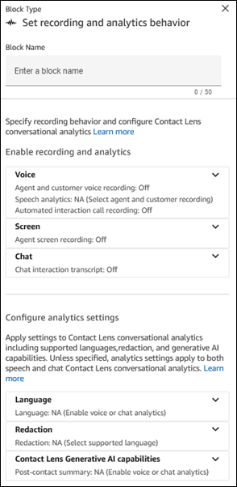
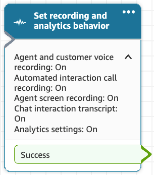

# Flow block in Amazon Connect: Set recording and

analytics behavior

This topic defines the flow block for setting options to record or monitor voice for
agent and customer, enable automated interaction, enable screen recording, and to set
analytics behavior for contacts.

## Description

There is a lot of functionality in this block:

- You configure what part of the call can be recorded be it either agent,
  customer or both. No additional charges apply.
- You can enable automated interaction call recording to hear how a customer
  is interacting with your IVR or conversational AI bot. No additional charges
  apply.
- You can enable screen recording of agents, if agent screen recording has
  been set up as described in [Enable screen recording](enable-sr.md "enable-sr.md"). For pricing information, see [Amazon Connect
  Pricing](https://aws.amazon.com/connect/pricing/ "https://aws.amazon.com/connect/pricing/").
- You can configure Contact Lens analytics settings for chat and
  voice contacts. For pricing information, see [Amazon Connect Pricing](https://aws.amazon.com/connect/pricing/ "https://aws.amazon.com/connect/pricing/").
  This includes:
  - Language in which customers and agents will interact (to improve
    the speech to text transcript generation)
  - Redaction of sensitive data
  - Additional Contact Lens Generative AI capabilities

- It enables Contact Lens conversational analytics on a contact. For
  more information, see [Analyze conversations using
  conversational analytics](analyze-conversations.md "analyze-conversations.md").

## Contact types

| Channel                | Supported?        |
| ---------------------- | ----------------- | -------------------------------------------------------------------------------------------------------------------------------------------------------------------------------------------------------------------------------------------------------------------------------------------------------------------------------------------------------------------------------------------------------------------------------------------------------------------------------------------------------------------------------------------------------------------------------------------------------------------------------------------------------------------------------------------------------------------------------------------------------------------------------------------------------------------------------------------------------------------------------------------------------------------------------------------------------------------------------------------------------------------------------------------------------------------------------------------------------------------------------------------------------------------------------------------------------------------------------------------------------------------------------------------------------------------------------------------------------------------------------------------------------------------------------------------------------------------------------------------------------------------------------------------------------------------------------------------------------------------------------------------------------------------------------------------------------------------------------------------------------------------------------------------------------------------------------------------------------------------------------------------------------------------------------------------------------------------------------------------------------------------------------------------------------------------------------------------------------------------------------------------------------------------------------------------------------------------------------------------------------------------------------------------------------------------------------------------------------------------------------------------------------------------------------------------------------------------------------------------------------------------------------------------------------------------------------------------------------------------------------------------------------------------------------------------------------------------------------------------------------------------------------------------------------------------------------------------------------------------------------------------------------------------------------------------------------------------------------------------------------------------------------------------------------------------------------------------------------------------------------------------------------------------------------------------------------------------------------------------------------------------------------------------------------------------------------------------------------------------------------------------------------------------------------------------------------------------------------------------------------------------------------------------------------------------------------------------------------------------------------------------------------------------------------------------------------------------------------------------------------------------------------------------------------------------------------------------------------------------------------------------------------------------------------------------------------------------------------------------------------------------------------------------------------------------------------------------------------------------------------------------------------------------------------------------------------------------------------------------------------------------------------------------------------------------------------------------------------------------------------------------------------------------------------------------------------------------------------------------------------------------------------------------------------------------------------------------------------------------------------------------------------------------------------------------------------------------------------------------------------------------------------------------------------------------------------------------------------------------------------------------------------------------------------------------------------------------------------------------------------------------------------------------------------------------------------------------------------------------------------------------------------------------------------------------------------------------------------------------------------------------------------------------------------------------------------------------------------------------------------------------------------------------------------------------------------------------------------------------------------------------------------------------------------------------------------------------------------------------------------------------------------------------------------------------------------------------------------------------------------------------------------------------------------------------------------------------------------------------------------------------------------------------------------------------------------------------------------------------------------------------------------------------------------------------------------------------------------------------------------------------------------------------------------------------------------------------------------------------------------------------------------------------------------------------------------------------------------------------------------------------------------------------------------------------------------------------------------------------------------------------------------------------------------------------------------------------------------------------------------------------------------------------------------------------------------------------------------------------------------------------------------------------------------------------------------------------------------------------------------------------------------------------------------------------------------------------------------------------------------------------------------------------------------------------------------------------------------------------------------------------------------------------------------------------------------------------------------------------------------------------------------------------------------------------------------------------------------------------------------------------------------------------------------------------------------------------------------------------------------------------------------------------------------------------------------------------------------------------------------------------------------------------------------------------------------------------------------------------------------------------------------------------------------------------------------------------------------------------------------------------------------------------------------------------------------------------------------------------------------------------------------------------------------------------------------------------------------------------------------------------------------------------------------------------------------------------------------------------------------------------------------------------------------------------------------------------------------------------------------------------------------------------------------------------------------------------------------------------------------------------------------------------------------------------------------------------------------------------------------------------------------------------------------------------------------------------------------------------------------------------------------------------------------------- |
| Voice                  | Yes               |
| Chat                   | Yes               |
| Task                   | No - Error branch |
| Email                  | No - Error branch | ## Flow types You can use this block in the following [flow types](create-contact-flow.md#contact-flow-types "create-contact-flow.md#contact-flow-types"):                                                                                                                                                                                                                                                                                                                                                                                                                                                                                                                                                                                                                                                                                                                                                                                                                                                                                                                                                                                                                                                                                                                                                                                                                                                                                                                                                                                                                                                                                                                                                                                                                                                                                                                                                                                                                                                                                                                                                                                                                                                                                                                                                                                                                                                                                                                                                                                                                                                                                                                                                                                                                                                                                                                                                                                                                                                                                                                                                                                                                                                                                                                                                                                                                                                                                                                                                                                                                                                                                                                                                                                                                                                                                                                                                                                                                                                                                                                                                                                                                                                                                                                                                                                                                                                                                                                                                                                                                                                                                                                                                                                                                                                                                                                                                                                                                                                                                                                                                                                                                                                                                                                                                                                                                                                                                                                                                                                                                                                                                                                                                                                                                                                                                                                                                                                                                                                                                                                                                                                                                                                                                                                                                                                                                                                                                                                                                                                                                                                                                                                                                                                                                                                                                                                                                                                                                                                                                                                                                                                                                                                                                                                                                                                                                                                                                                                                                                                                                                                                                                                                                                                                                                                                                                                                                                                                                                                                                                                                                                                                                                                                                                                                                                                                                                                                                                                                                                                                                                                                                                                                                                                                                                                     |
| Flow type              | Supported?        |
| ---                    | ---               |
| Inbound flow           | Yes               |
| Customer hold flow     | No                |
| Customer queue flow    | Yes               |
| Customer whisper flow  | No                |
| Outbound whisper flow  | Yes               |
| Agent hold flow        | No                |
| Agent whisper flow     | No                |
| Transfer to agent flow | Yes               |
| Transfer to queue flow | Yes               | ###### Tip We recommend using the **Set recording behavior** block in an inbound or outbound whisper flow for the most accurate behavior. Using this block in a queue flow does not always guarantee that calls are recorded. This is because the block might run after the contact is joined to the agent. ## How to configure this block You can configure the **Set recording and analytics behavior** block by using the Amazon Connect admin website or by using the [UpdateContactRecordingBehavior](../APIReference/contact-actions-updatecontactrecordingbehavior.md "../APIReference/contact-actions-updatecontactrecordingbehavior.md") action in the Amazon Connect Flow language. The following image shows the **Set recording and analytics behavior** properties page in the Amazon Connect admin website. It is divided two sections: Enable recording and analytics, and Configure analytics settings. These sections are divided in subsections. Each subsection can be expanded and collapsed and summary is displayed in its header.  ### Enable recording and analytics In this section of the Properties page you configure recording and related analytics settings.  • **Voice**: + **Agent and customer voice recording**: Choose who you want to record. + **Contact Lens speech analytics**: Choose whether to use speech analytics on agent and customer recordings. + **Automated interaction call recording**: Choose whether to enable voice recording when the customer is interacting with bots and other automation. ###### Note To include Lex bot transcripts and analytics as a part of your **Contact details** page and Amazon Connect analytics dashboards: 1. In the Amazon Connect console, choose the name of your instance. For instructions, see [Find your Amazon Connect instance name](find-instance-name.md "find-instance-name.md"). 2. On the navigation pane choose **Flows**, and then choose **Enable Bot Analytics and Transcripts in Amazon Connect**.  • **Screen**: Use to enable or disable recording of the agent's screen. For more information, see [Set up and review agent screen recordings in Amazon Connect Contact Lens](agent-screen-recording.md "agent-screen-recording.md").  • **Chat**: Use this option to enable chat analytics, a feature in Contact Lens. For more information, see [Enable conversational analytics in Amazon Connect Contact Lens](enable-analytics.md "enable-analytics.md"). ### Configure analytics settings This section of the properties page applies to Contact Lens conversational analytics. You specify supported languages, redaction, and generative AI capabilities. Unless specified otherwise, analytics settings apply to both speech and chat Contact Lens conversational analytics.  • **Language**: You can dynamically enable the redaction of the output files based on the language of the customer. For instructions, see [Dynamically enable redaction based on the customer's language](enable-analytics.md#dynamically-enable-analytics-contact-flow "enable-analytics.md#dynamically-enable-analytics-contact-flow").  • **Redaction**: Choose whether to redact sensitive data. For more information, see [Enable redaction of sensitive data](enable-analytics.md#enable-redaction "enable-analytics.md#enable-redaction").  • **Sentiment**: Choose whether to enable sentiment analysis.  • **Contact Lens Generative AI capabilities**: For more information, see [View generative AI-powered post-contact summaries](view-generative-ai-contact-summaries.md "view-generative-ai-contact-summaries.md") ## Configuration tips  • You can change call recording behavior in a flow, for example, change from "Agent and customer" to "Agent only." Perform the following steps: 1. Add a second **Set recording and analytics behavior** block to the flow. 2. Configure the second block to set agent and customer voice recording to **Off**. 3. Add another **Set recording and analytics behavior** block. 4. Configure the third block to the new recording behavior you want, such as **Agent only**. ###### Note The settings in the **Analytics** section are overwritten by each subsequent **Set recording and analytics behavior** block in the flow.  • **For calls**: Unselecting **Enable speech analytics on agent and customer voice recordings** disables Contact Lens conversational analytics. For example, let's say you have two **Set recording and analytics behavior** blocks in your flow. + The first block has enabled real-time speech analytics on agent and customer voice recordings selected. + The second block later in the flow has it unselected. In this case, the analytics appear only during the time analytics was enabled. Another example: let's say you have two **Set recording and analytics behavior** blocks in your flow. + The first block has **Enabled post-call speech analytics on agent and customer voice recordings** selected. + The second block later in the flow has it unselected. In this case, since post call happens at end of call and the latest configuration doesn't have analytics enabled, no post-call analytics will be available.  • **For automated interaction call recording**: Recording starts as soon as it is set to On. Later in the flow, if it is set to off in a second block, recording is paused and can be turned on later to resume the recording. ###### Note When a call is transferred by using the [Transfer to phone number](transfer-to-phone-number.md "transfer-to-phone-number.md") block, the recording continues.  • **For chat**: Real-time chat starts analysis as soon as any block in the flow enables it. No block later in the flow disables the real time chat settings.  • If an agent puts a customer on hold, the agent is still recorded, but the customer is not.  • If you want to transfer a contact to another agent or queue, and you want to continue using Contact Lens conversational analytics to collect data, you need to add to the flow another **Set recording behavior** block with **Enable analytics** turn on. This is because a transfer generates a second contact ID and contact record. Contact Lens conversational analytics needs to run on that contact record as well.  • When you enable conversational analytics, the type of flow that the block is in, and where it is placed in the flow, determine **whether** agents receive the key highlights transcript, and **when** they receive it. For more information and example use cases that explain how the block affects the agents experience with key highlights, see [Design a flow for key highlights](enable-analytics.md#call-summarization-agent "enable-analytics.md#call-summarization-agent"). ## Configured block This block supports one output branch: **Success**. The following image shows what a **Set recording and analytics behavior** block looks like when it's configured for both voice and automated interaction recording, along with speech analytics and screen recording enabled.  ## Sample flows Amazon Connect includes a set of sample flows. For instructions that explain how to access the sample flows in the flow designer, see [Sample flows in Amazon Connect](contact-flow-samples.md "contact-flow-samples.md"). Following are topics that describe the sample flows which include this block.  • [Sample inbound flow in Amazon Connect for the first contact experience](sample-inbound-flow.md "sample-inbound-flow.md") ## Scenarios See these topics for scenarios that use this block:  • [When, what, and where for contact recordings in Amazon Connect](about-recording-behavior.md "about-recording-behavior.md")  • [Enable contact recording](set-up-recordings.md "set-up-recordings.md")  • [Enable enhanced multi-party contact monitoring in Amazon Connect](monitor-conversations.md "monitor-conversations.md")  • [Review recorded conversations between agents and customers using Amazon Connect](review-recorded-conversations.md "review-recorded-conversations.md")  • [Assign permissions to review past contact center conversations in Amazon Connect](assign-permissions-to-review-recordings.md "assign-permissions-to-review-recordings.md")  • [Analyze conversations using conversational analytics in Amazon Connect Contact Lens](analyze-conversations.md "analyze-conversations.md") |
