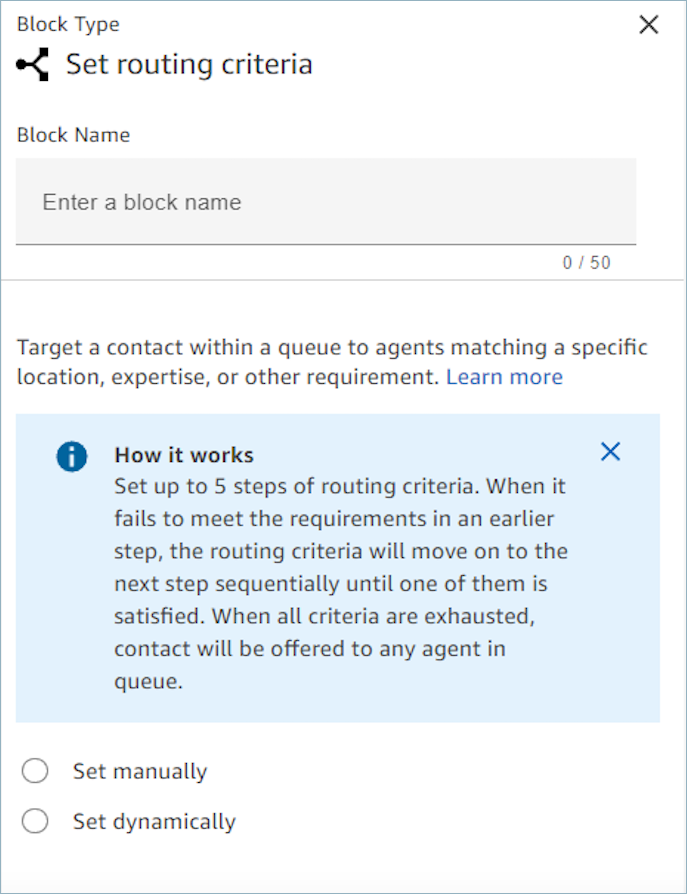
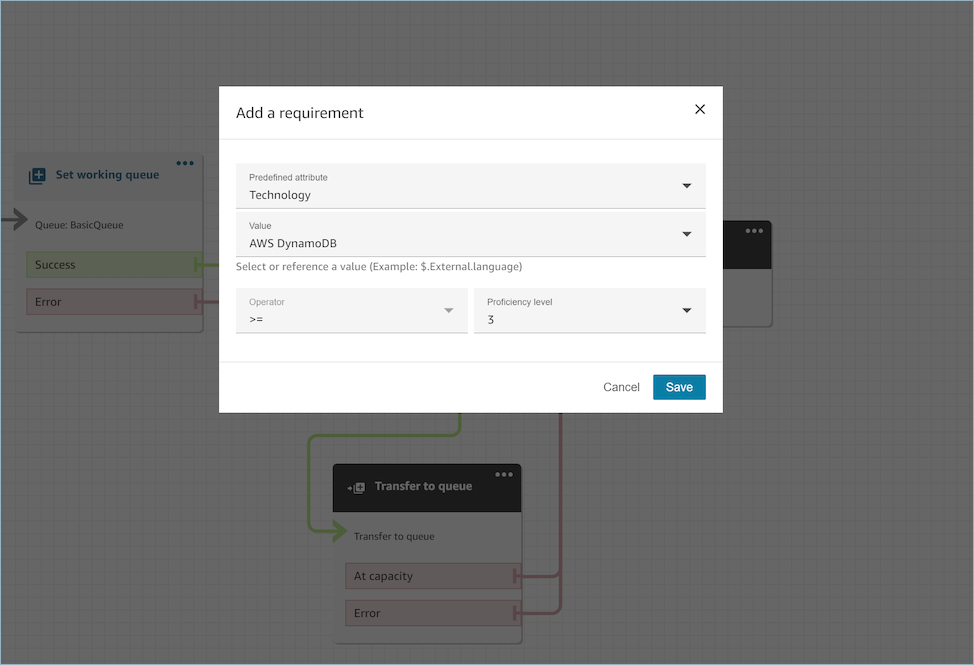

# Flow block in Amazon Connect: Set routing criteria

This topic defines the flow block for routing a contact in any channel to the
appropriate queue.

## Description

Sets routing criteria on a contact.

- Routing criteria can be set on contacts of any channel, such as vice,
  chat, task, and email, to define how the contact should be routed within its
  queue. A routing criteria is a sequence of one or more routing steps.
- A routing step is a combination of one or more requirements that must be
  met in order for this contact to be routed to an agent. You can set an
  optional expiration duration for each routing step. For example, you could
  create a routing step with a requirement to only offer this contact to a
  specific agent based on user ID, for a certain expiration duration. As
  another example, you could create a non-expiring routing step with the
  requirements: **Language:English >= 4** AND
  **Technology:AWS Kinesis >= 2**.
- A requirement is a condition created using a predefined attribute name,
  it’s value, comparison operator and proficiency level. For example,
  **Technology:AWS Kinesis >= 2**.
- Use the **Set routing criteria** block with the
  **Transfer to queue** block, as the latter transfers
  the contact to the Amazon Connect queue and activate the routing criteria specified
  on the contact.
- Routing criteria set on the contact does not take effect if the contact is
  transferred into an agent queue. For more information, see [Set up routing in Amazon Connect based on agent
  proficiencies](proficiency-routing.md "proficiency-routing.md").
- When the expiration time (DurationInSeconds) is set too short, it can
  prevent the Amazon Connect from properly routing contacts to the next most proficient
  agent when the first agent misses the call. The default queue-based routing
  can compete with proficiency-based routing, leading to inconsistent routing
  behavior between these two methods.

## Supported channels

The following table lists how this block routes a contact who is using the
specified channel.

| Channel | Supported? |
| ------- | ---------- | --------------------------------------------------------------------------------------------------------------------------------------------------------------------------------------------------------------------------------------------------------------------------------------------------------------------------------------------------------------------------------------------------------------------------------------------------------------------------------------------------------------------------------------------------------------------------------------------------------------------------------------------------------------------------------------------------------------------------------------------------------------------------------------------------------------------------------------------------------------------------------------------------------------------------------------------------------------------------------------------------------------------------------------------------------------------------------------------------------------------------------------------------------------------------------------------------------------------------------------------------------------------------------------------------------------------------------------------------------------------------------------------------------------------------------------------------------------------------------------------------------------------------------------------------------------------------------------------------------------------------------------------------------------------------------------------------------------------------------------------------------------------------------------------------------------------------------------------------------------------------------------------------------------------------------------------------------------------------------------------------------------------------------------------------------------------------------------------------------------------------------------------------------------------------------------------------------------------------------------------------------------------------------------------------------------------------------------------------------------------------------------------------------------------------------------------------------------------------------------------------------------------------------------------------------------------------------------------------------------------------------------------------------------------------------------------------------------------------------------------------------------------------------------------------------------------------------------------------------------------------------------------------------------------------------------------------------------------------------------------------------------------------------------------------------------------------------------------------------------------------------------------------------------------------------------------------------------------------------------------------------------------------------------------------------------------------------------------------------------------------------------------------------------------------------------------------------------------------------------------------------------------------------------------------------------------------------------------------------------------------------------------------------------------------------------------------------------------------------------------------------------------------------------------------------------------------------------------------------------------------------------------------------------------------------------------------------------------------------------------------------------------------------------------------------------------------------------------------------------------------------------------------------------------------------------------------------------------------------------------------------------------------------------------------------------------------------------------------------------------------------------------------------------------------------------------------------------------------------------------------------------------------------------------------------------------------------------------------------------------------------------------------------------------------------------------------------------------------------------------------------------------------------------------------------------------------------------------------------------------------------------------------------------------------------------------------------------------------------------------------------------------------------------------------------------------------------------------------------------------------------------------------------------------------------------------------------------------------------------------------------------------------------------------------------------------------------------------------------------------------------------------------------------------------------------------------------------------------------------------------------------------------------------------------------------------------------------------------------------------------------------------------------------------------------------------------------------------------------------------------------------------------------------------------------------------------------------------------------------------------------------------------------------------------------------------------------------------------------------------------------------------------------------------------------------------------------------------------------------------------------------------------------------------------------------------------------------------------------------------------------------------------------------------------------------------------------------------------------------------------------------------------------------------------------------------------------------------------------------------------------------------------------------------------------------------------------------------------------------------------------------------------------------------------------------------------------------------------------------------------------------------------------------------------------------------------------------------------------------------------------------------------------------------------------------------------------------------------------------------------------------------------------------------------------------------------------------------------------------------------------------------------------------------------------------------------------------------------------------------------------------------------------------------------------------------------------------------------------------------------------------------------------------------------------------------------------------------------------------------------------------------------------------------------------------------------------------------------------------------------------------------------------------------------------------------------------------------------------------------------------------------------------------------------------------------------------------------------------------------------------------------------------------------------------------------------------------------------------------------------------------------------------------------------------------------------------------------------------------------------------------------------------------------------------------------------------------------------------------------------------------------------------------------------------------------------------------------------------------------------------------------------------------------------------------------------------------------------------------------------------------------------------------------------------------------------------------------------------------------------------------------------------------------------------------------------------------------------------------------------------------------------------------------------------------------------------------------------------------------------------------------------------------------------------------------------------------------------------------------------------------------------------------------------------------------------------------------------------------------------------------------------------------------------------------------------------------------------------------------------------------------------------------------------------------------------------------------------------------------------------------------------------------------------------------------------------------------------------------------------------------------------------------------------------------------------------------------------------------------------------------------------------------------------------------------------------------------------------------------------------------------------------------------------------------------------------------------------------------------------------------------------------------------------------------------------------------------------------------------------------------------------------------------------------------------------------------------------------------------------------------------------------------------------------------------------------------------------------------------------------------------------------------------------------------------------------------------------------------------------------------------------------------------------------------------------------------------------------------------------------------------------------------------------------------------------------------------------------------------------------------------------------------------------------------------------------------------------------------------------------------------------------------------------------------------------------------------------------------------------------------------------------------------------------------------------------------------------------------------------------------------------------------------------------------------------------------------------------------------------------------------------------------------------------------------------------------------------------------------------------------------------------------------------------------------------------------------------------------------------------------------------------------------------------------------------------------------------------------------------------------------------------------------------------------------------------------------------------------------------------------------------------------------------------------------------------------------------------------------------------------------------------------------------------------------------------------------------------------------------------------------------------------------------------------------------------------------------------------------------------------------------------------------------------------------------------------------------------------------------------------------------------------------------------------------------------------------------------------------------------------------------------------------------------------------------------------------------------------------------------------------------------------------------------------------------------------------------------------------------------------------------------------------------------------------------------------------------------------------------------------------------------------------------------------------------------------------------------------------------------------------------------------------------------------------------------------------------------------------------------------------------------------------------------------------------------------------------------------------------------------------------------------------------------------------------------------------------------------------------------------------------------------------------------------------------------------------------------------------------------------------------------------------------------------------------------------------------------------------------------------------------------------------------------------------------------------------------------------------------------------------------------------------------------------------------------------------------------------------------------------------------------------------------------------------------------------------------------------------------------------------------------------------------------------------------------------------------------------------------------------------------------------------------------------------------------------------------------------------------------------------------------------------------------------------------------------------------------------------------------------------------------------------------------------------------------------------------------------------------------------------------------------------------------------------------- |
| Voice   | Yes        |
| Chat    | Yes        |
| Task    | Yes        |
| Email   | Yes        | ## Flow types You can use this block in the following [flow types](create-contact-flow.md#contact-flow-types "create-contact-flow.md#contact-flow-types"):  • Inbound flow  • Customer queue flow  • Transfer to Agent flow  • Transfer to Queue flow ## Prerequisites for setting routing criteria using predefined attributes Before setting the routing criteria on a contact, you must complete the following steps: 1. Create [Create predefined attributes for routing contacts to agents](predefined-attributes.md "predefined-attributes.md"). 2. [Assign proficiencies to agents in your Amazon Connect instance](assign-proficiencies-to-agents.md "assign-proficiencies-to-agents.md") using predefined attributes that were previously created ## When to use the Set routing criteria block There are two ways to route contacts directly to an agent:  • **Option 1: Use the **Set routing criteria** block to specify routing criteria to prefer an agent**. This option is better when: + You want the ability to target multiple agents simultaneously. For example, a four-person support team that is primarily supporting a customer. + You want the option to fallback to a broader pool of agents in the queue if the preferred agent(s) are not available. + You want the contact to be reported within the standard queue's metrics. An advantage of choosing this option is that it uses the agent's userID (such as janedoe) so it's easier to configure than Option 2, which uses the ARN. The main downside of routing criteria is that it impacts queue metrics (SLA, queue time, and more). If a contact in QueueA is waiting specifically for Agent12, then it won't get picked up by other agents that are available. It may breach your defined SLAs. The way you'd see this occurring is by looking at the real-time metrics report; see [Use one-click drill-downs](one-click-drill-downs.md "one-click-drill-downs.md"). ###### Note When you set up routing and specify your timeout configurations, keep this scenario in mind to accommodate these impacts.  • **Option 2: Use the agent's queue**. This option is usually better when: + The contact is intended for **only** that specific agent and no one else. + You don't want the contact to be reported under a standard queue. For information about standard queues and agent queues, see [Queues: standard and agent](concepts-queues-standard-and-agent.md "concepts-queues-standard-and-agent.md"). For instructions about setting up this option, see [Transfer contacts to agent queue](transfer-to-agent.md "transfer-to-agent.md"). ## How routing criteria works When a contact is transferred to a standard queue, Amazon Connect activates the first step specified in the routing criteria of the contact. 1. An agent is joined to the contact only when it meets the requirements specified in the active routing step of the contact. 2. If no such agent is found till the expiration duration of the step, then Amazon Connect moves to the next step specified in the routing criteria until one of them is satisfied. 3. When all steps have expired, the contact is offered to the longest available agent who has the queue in their routing profile. ###### Note If an expiration duration is not specified on the routing step, the routing step never expires. ###### You can use the following items in a routing criteria:  • Choose from the following: + One or more preferred agents, based on user ID or username. + Up to eight attributes using the `AND` condition. + Up to three OR conditions in a routing step. Each requirement separated by an OR can have up to eight attributes.  • You can only use OR when setting attributes dynamically. For more information, see [How to set routing criteria](#set-routing-criteria-using-the-flow-block "#set-routing-criteria-using-the-flow-block"). + NOT operator to exclude a proficiency by chosen levels. You can only use NOT when setting attributes dynamically. For more information, see [How to set routing criteria](#set-routing-criteria-using-the-flow-block "#set-routing-criteria-using-the-flow-block"). ###### Note Nested expressions are supported but OR expressions must be at the top level. You can place an AND inside an OR, but not the other way around. In addition, attributes and routing criteria must have the following;  • Each attribute must have an associated proficiency level.  • Each proficiency level must use the “>=” comparison operator or a range of proficiency levels from 1 to 5.  • Each step of the criteria must have a timed expiration timer.  • The last step of the criteria can have a timed or non-expiring expiration timer. ## How to set routing criteria You can set the desired routing criteria either manually in the flow block UI or dynamically based on the output from the [AWS Lambda function](invoke-lambda-function-block.md "invoke-lambda-function-block.md") block.  ### Set routing criteria manually Using this option, you can set routing criteria on contacts as specified in the **Set routing criteria** block manually. See the example of a flow below to where the predefined attribute is added to a routing step manually by picking the attribute and value from a dropdown list.  As needed, you can configure predefined attribute value dynamically using JSONPath reference even in this option. For example, you can specify `$.External.language` JSONPath reference instead of hard coding a `AWS DynamoDB` value on the `Technology` requirement of all of the contacts. For more information about JSONPath reference, see [List of available contact attributes in Amazon Connect and their JSONPath references](connect-attrib-list.md "connect-attrib-list.md"). ### Set routing criteria dynamically You can set routing criteria on a contact dynamically based on the output from the **Invoke AWS Lambda function** block.  • In the [AWS Lambda function](invoke-lambda-function-block.md "invoke-lambda-function-block.md") block, configure the Lambda function to return the routing criteria in JSON format and set the response validation as JSON. For more information about using the **Invoke AWS Lambda function**, see the [Grant Amazon Connect access to your AWS Lambda functions](connect-lambda-functions.md "connect-lambda-functions.md") documentation.  • In the `Set routing criteria` block, choose **Set dynamically** option with the above Lambda attributes - **Namespace** as `External` and **Key** as specified in above Lambda response. For example, the key would be `MyRoutingCriteria` as it points to the routing criteria in the sample Lambda response in the following section. ### Sample Lambda function for setting routing criteria The following Lambda example uses `AndExpression` to return routing criteria: `export const handler = async(event) => { return { "MyRoutingCriteria": { "Steps": [ { "Expression": { "AndExpression": [ { "AttributeCondition": { "Name": "Language", "Value": "English", "ProficiencyLevel": 4, "ComparisonOperator": "NumberGreaterOrEqualTo" } }, { "AttributeCondition": { "Name": "Technology", "Value": "AWS Kinesis", "ProficiencyLevel": 2, "ComparisonOperator": "NumberGreaterOrEqualTo" } } ] }, "Expiry": { "DurationInSeconds": 30 } }, { "Expression": { "AttributeCondition": { "Name": "Language", "Value": "English", "ProficiencyLevel": 1, "ComparisonOperator": "NumberGreaterOrEqualTo" } } } ] } } };` The following Lambda example uses `OrExpression` to return routing criteria: `export const handler = async(event) => { return { "MyRoutingCriteria": { "Steps": [ { "Expression": { "OrExpression": [ { "AttributeCondition": { "Name": "Technology", "Value": "AWS Kinesis Firehose", "ProficiencyLevel": 2, "ComparisonOperator": "NumberGreaterOrEqualTo" } }, { "AttributeCondition": { "Name": "Technology", "Value": "AWS Kinesis", "ProficiencyLevel": 2, "ComparisonOperator": "NumberGreaterOrEqualTo" } } ] }, "Expiry": { "DurationInSeconds": 30 } } ] } } };` The following Lambda example uses `NOTAttributeCondidtion` and a range of proficiency levels to return routing criteria: `export const handler = async(event) => { const response = { "MyRoutingCriteria": { "Steps": [ { "Expression": { "NotAttributeCondition": { "Name" : "Language", "Value" : "English", "ComparisonOperator": "Range", "Range" : { "MinProficiencyLevel": 4.0, "MaxProficiencyLevel": 5.0 } } }, "Expiry" : { "DurationInSeconds": 30 } } ] } } return response; };` ## What are the statuses of a routing step and why are they needed? 1. **Inactive:** When the routing criteria is activated the first step immediately becomes Inactive. The routing engine executes the criteria one step at a time as per the expiration timer. 1. Every step starts as Inactive Until the previous step expires. 2. **Active:** When a step is actively being executed for a match the status is set to Active. 3. **Expired:** When Amazon Connect does not find an agent during the duration of a step and the timer expires, the routing engine moves on to the next step. The previous step is considered Expired. 4. **Joined:** Whenever an agent is successfully matched with a contact for a particular step, the step status will be set as Joined. 5. **Interrupted:** If a contact has been waiting for too long or an operations leader may decide to interrupt the flow and change the routing criteria. This can be done while a particular step is active, for example, a task has been waiting for 24 hours and a manager wants to change the criteria. The step status will then be set to Interrupted. 6. **Deactivated:** When a customer drops a call or a connection is dropped, routing will stop. ## Use routing criteria to target a specific preferred agent You can also use routing criteria to restrict a contact in a queue to a specific preferred agent or set of preferred agents, based on user ID instead of predefined attributes. For example, if you have identified that a specific customer recently contacted your contact center about the same topic, you might want to try routing that customer to the same agent who handled their issue last time. To do so, you can set a routing step to target that specific agent for a certain amount of time before the routing step expires. Following are frequently asked questions about how this functionality works. **Can I use this feature together with Customer Profiles Last agent identifier to route a customer to the last agent who handled their issue?** Amazon Connect Customer Profiles provides seven out-of-the box default attributes based on contact records, including the Last agent identifier attribute, which identify the last agent the customer connected with. You can use this data to route new contacts from a given customer to the same agent who handled their contact previously. To do so, first use the Customer Profiles flow block to retrieve a customer profile using at least one search identifier, such as `Phone = $.CustomerEndpoint.Address`. For more information, see [Properties: Get profile](customer-profiles-block.md#customer-profiles-block-properties-get-profile "customer-profiles-block.md#customer-profiles-block-properties-get-profile"). You can then use the **Set manually** option in the **Set routing criteria** block to specify that each contact should be routed to `$.Customer.CalculatedAttributes._last_agent_id` (a JSONPath reference) instead of hard coding a specific user ID, and set an expiration timer for how long to restrict each contact to route to the last agent. For more information on JSONPath reference, see [List of available contact attributes in Amazon Connect and their JSONPath references](connect-attrib-list.md "connect-attrib-list.md"). For more information about the default attributes available through Amazon Connect Customer Profiles, see [Default calculated attributes in Amazon Connect Customer Profiles](customerprofiles-default-calculated-attributes.md "customerprofiles-default-calculated-attributes.md"). **If the preferred agent is not available, what happens?** If you have a routing step set targeting a specific preferred agent, the contact will be restricted to that agent until such time that the routing step expires. This is regardless of the following: 1. Agent is online or not 2. Agent is online but busy with other contacts and cannot be routed an additional contact right now 3. Agent is online but in a custom nonproductive status 4. Agent was deleted from instance (their userID is still considered valid) For example, imagine you have restricted a particular contact to target agent Jane Doe with expiry of 30 seconds, but Jane Doe is currently offline. The contact will nonetheless be restricted to Jane Doe for 30 seconds, after which the routing step will expire and contact can be offered to another available agent in queue. **What is the maximum number of agents can I target within a single preferred agent step?** You can target up to 10 agents. **Can I create a routing criteria that includes both routing steps based on preferred agent, and routing steps based on predefined attributes?** Yes. For example, you could create a two-step routing criteria, where step 1 targets the contact to a specific preferred agent by user ID based on the agent predicted as the best-fit agent by your custom matching learning model with a given expiry, and then step 2 targets the contact based on predefined attributes such requiring a minimum proficiency level in Spanish. ## Scenarios See these topics for scenarios that use this block:  • [How to reference contact attributes in Amazon Connect](how-to-reference-attributes.md "how-to-reference-attributes.md") |
