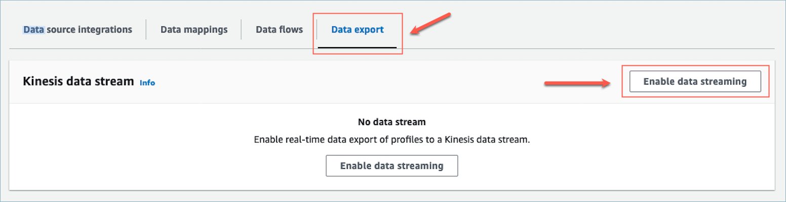
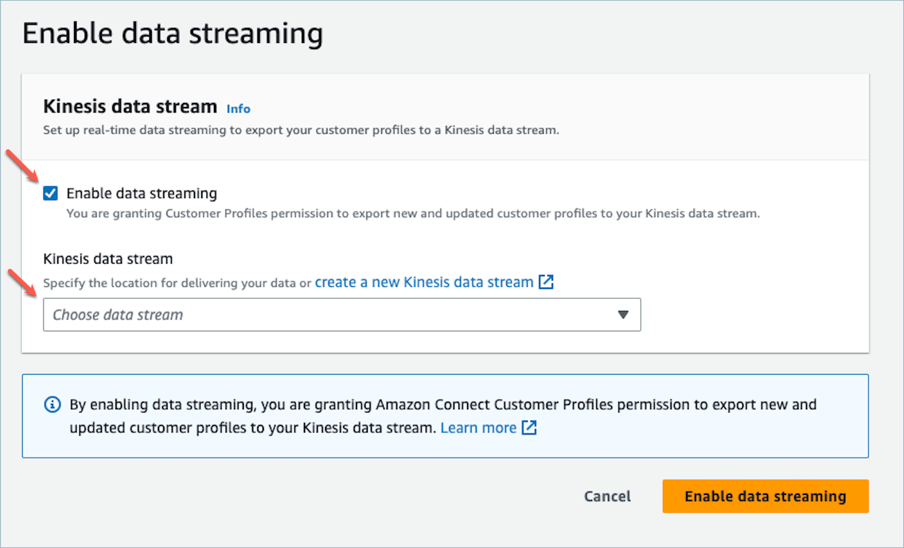
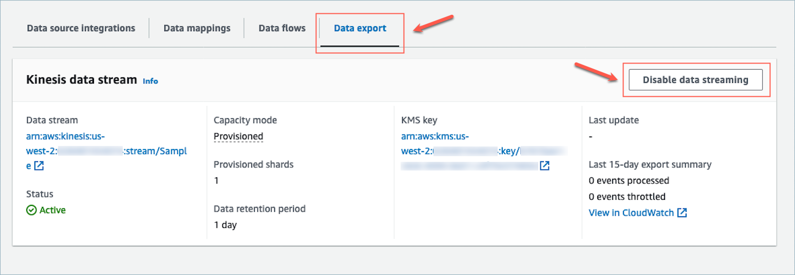

# Export your unified customer profile

data

Amazon Connect Customer Profiles provides real-time data export of unified customer profiles to
an Amazon Kinesis Data Stream. You can enable data streaming and automatically receive
data for new profiles and updates to existing profiles into your Amazon Kinesis Data
Stream.

You can keep your source systems data, such as CRMs and marketing automation tools,
up-to-date with the latest information from Amazon Connect Customer Profiles. For example, when a
customer calls your contact center to update their address, an agent can make the change
to add the new customer address, and the updated profile information is sent to a
Kinesis Data Stream in real-time.

To set this up, you need to enable **Data export** in the Customer Profiles
console.

## Enable real-time export

**To enable data streaming for your domain**

1. Open the Amazon Connect Customer Profiles console.
2. Select the **Data export** tab and choose
   **Enable data streaming**

 3. Choose **Enable data streaming** and select an existing
Kinesis data stream from the drop-down menu, or choose **create a
new Kinesis data stream** to open the Kinesis console and
create the stream. For more information, see [Creating and Managing
Streams](../../../streams/latest/dev/working-with-streams.md "../../../streams/latest/dev/working-with-streams.md").

 4. Choose the **Enable data streaming** button to save your
settings.

## Disable real-time export

**To disable data streaming for your domain**

1. Open the Amazon Connect Customer Profiles console.
2. Select the **Data export** tab and choose
   **Disable data streaming**.



## Real-time export Kinesis

payload

**Sample output event in JSON**

```

{
    "SchemaVersion": 0,
    "EventId": "eventId",
    "EventTimestamp": "2020-01-01T00:00:00Z",
    "EventType": "CREATED",
    "DomainName": "domainName",
    "ObjectTypeName": "objectTypeName",
    "AssociatedProfileId": "associatedProfileId",
    "ProfileObjectUniqueKey": "profileObjectUniqueKey",
    "Object": {
        "map": {
            "k1": [
                "a",
                "b",
                "c"
            ]
        }
    },
    "IsMessageRealTime": true
}

```

**SchemaVersion**

The current version of the schema.

**EventId**

The unique event ID.

**EventTimestamp**

Timestamp of the event using the ISO8601 standard.

**EventType**

The type of event exported.

Values: CREATED, UPDATED, HEALTH_CHECK

- CREATED: The export event was for CreateProfile.
- UPDATED: The export event was for a UpdateProfile.
- HEALTH_CHECK: The export event was for a HealthCheck event to
  make sure Customer Profiles could successfully
  `putEvent` in Kinesis Stream.

**DomainName**

The domain the event belongs to. `/Domain` of the
event

**ObjectTypeName**

Object type of the event

Values: `_profile`, `_asset`,
`_order`, `_case`. You can also use predefined
template name such as `Salesforce-Account` or a custom
defined object name that you can create using the [PutProfileObjectType](../../../customerprofiles/latest/APIReference/API_PutProfileObjectType.md "../../../customerprofiles/latest/APIReference/API_PutProfileObjectType.md") API.

**AssociatedProfileId**

ID of the Standard Profile that the Object is associated to. It is
only present if the object type is not `_profile`

**ProfileObjectUniqueKey**

The unique identifier of the ProfileObject generated by the
service.

Type: String

**Object**

The Standard Profile or Standard Profile Object itself.

**IsMessageRealTime**

Flag to inform if the message is real-time or was re-driven.

**Sample payload in JSON**

```

{
    "SchemaVersion": 0,
    "EventId": "6049bf39-0000-0000-0000-b75656dd51a8",
    "EventTimestamp": "2023-02-24T07:17:05.356Z",
    "EventType": "UPDATED",
    "DomainName": "SampleDomain",
    "ObjectTypeName": "Salesforce-Account",
    "AssociatedProfileId": "5ffcee99ab0000000000b3ae01225e40",
    "ProfileObjectUniqueKey": "cNo77ZI0000000000pCPB7RQcqfeBaRfBwrzW2MMbws=",
    "Object": {
        "Id": "0012v00002kVKVuAAO",
        "IsDeleted": false,
        "Name": "Company A",
        "Phone": "+12065551234",
        "PhotoUrl": "/services/images/photo/0012v00002kVKVuAAO",
        "OwnerId": "0052v00000fmQ7sAAE",
        "CreatedDate": "2019-12-13T07:56:04.000+0000",
        "CreatedById": "0052v00000fmQ7sAAE",
        "LastModifiedDate": "2023-02-22T20:29:43.000+0000",
        "LastModifiedById": "0052v00000fmQ7sAAE",
        "SystemModstamp": "2023-02-22T20:29:43.000+0000",
        "LastActivityDate": "2020-03-18",
        "LastViewedDate": "2023-02-23T00:09:49.000+0000",
        "LastReferencedDate": "2023-02-23T00:09:49.000+0000",
        "CleanStatus": "Pending"
    },
    "IsMessageRealTime": true
}

```
