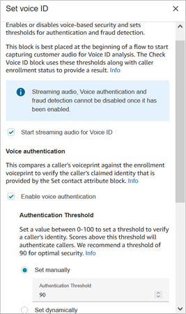
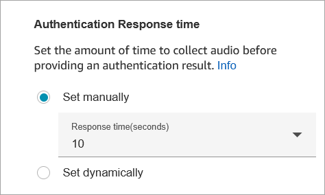
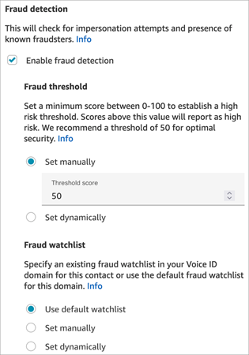
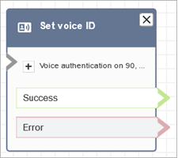

# Flow block in Amazon Connect: Set Voice ID

###### Note

End of support notice: On May 20, 2026, AWS will end support for Amazon Connect
Voice ID. After May 20, 2026, you will no longer be able to access Voice ID on the
Amazon Connect console, access Voice ID features on the Amazon Connect admin website or Contact Control Panel, or access Voice ID
resources. For more information, visit [Amazon Connect
Voice ID end of support](amazonconnect-voiceid-end-of-support.md "amazonconnect-voiceid-end-of-support.md").

This topic defines the flow block to enable audio streaming and set thresholds for
voice authentication and fraud detection.

## Description

- Enables audio streaming and sets thresholds for voice authentication and
  detection of fraudsters in a watchlist. For more information about this feature, see [Voice ID](voice-id.md "voice-id.md").
- Sends audio to Amazon Connect Voice ID to verify the caller's identity and match
  against fraudsters in watch list, as soon as the call is connected to a
  flow.
- Use a [Play prompt](play.md "play.md") block before
  **Set Voice ID** to stream audio properly. You can
  edit it to include a simple message such as "Welcome."
- Use a [Set contact
  attributes](set-contact-attributes.md "set-contact-attributes.md") block after **Set
  Voice ID** to set the customer ID for the caller.

The `CustomerId` may be a customer number from your CRM, for
example. You can create a Lambda function to pull the unique customer ID of
the caller from your CRM system. Voice ID uses this attribute as the
`CustomerSpeakerId` for the caller.

`CustomerId` can be an alphanumeric value. It supports only \_
and - (underscore and hyphen) special characters. It does not need to be
UUID. For more information, see `CustomerSpeakerId` in the [Speaker](../../../voiceid/latest/APIReference/API_Speaker.md "../../../voiceid/latest/APIReference/API_Speaker.md") data type.

- Use a [Check Voice ID](check-voice-id.md "check-voice-id.md") block after **Set Voice ID** to branch based on the
  results of the enrollment check, authentication, or fraud detection.
- For information about how to use **Set Voice ID** in a
  flow, along with [Check Voice ID](check-voice-id.md "check-voice-id.md") and [Set contact
  attributes](set-contact-attributes.md "set-contact-attributes.md"), see [Step 2: Create a new Voice ID domain and
  encryption key](enable-voiceid.md#enable-voiceid-step2 "enable-voiceid.md#enable-voiceid-step2") in
  [Get started enabling Voice ID in Amazon Connect](enable-voiceid.md "enable-voiceid.md").

## Supported channels

The following table lists how this block routes a contact who is using the
specified channel.

| Channel | Supported?        |
| ------- | ----------------- | --------------------------------------------------------------------------------------------------------------------------------------------------------------------------------------------------------------------------------------------------------------------------------------------------------------------------------------------------------------------------------------------------------------------------------------------------------------------------------------------------------------------------------------------------------------------------------------------------------------------------------------------------------------------------------------------------------------------------------------------------------------------------------------------------------------------------------------------------------------------------------------------------------------------------------------------------------------------------------------------------------------------------------------------------------------------------------------------------------------------------------------------------------------------------------------------------------------------------------------------------------------------------------------------------------------------------------------------------------------------------------------------------------------------------------------------------------------------------------------------------------------------------------------------------------------------------------------------------------------------------------------------------------------------------------------------------------------------------------------------------------------------------------------------------------------------------------------------------------------------------------------------------------------------------------------------------------------------------------------------------------------------------------------------------------------------------------------------------------------------------------------------------------------------------------------------------------------------------------------------------------------------------------------------------------------------------------------------------------------------------------------------------------------------------------------------------------------------------------------------------------------------------------------------------------------------------------------------------------------------------------------------------------------------------------------------------------------------------------------------------------------------------------------------------------------------------------------------------------------------------------------------------------------------------------------------------------------------------------------------------------------------------------------------------------------------------------------------------------------------------------------------------------------------------------------------------------------------------------------------------------------------------------------------------------------------------------------------------------------------------------------------------------------------------------------------------------------------------------------------------------------------------------------------------------------------------------------------------------------------------------------------------------------------------------------------------------------------------------------------------------------------------------------------------------------------------------------------------------------------------------------------------------------------------------------------------------------------------------------------------------------------------------------------------------------------------------------------------------------------------------------------------------------------------------------------------------------------------------------------------------------------------------------------------------------------------------------------------------------------------------------------------------------------------------------------------------------------------------------------------------------------------------------------------------------------------------------------------------------------------------------------------------------------------------------------------------------------------------------------------------------------------------------------------------------------------------------------------------------------------------------------------------------------------------------------------------------------------------------------------------------------------------------------------------------------------------------------------------------------------------------------------------------------------------------------------------------------------------------------------------------------------------------------------------------------------------------------------------------------------------------------------------------------------------------------------------------------------------------------------------------------------------------------------------------------------------------------------------------------------------------------------------------------------------------------------------------------------------------------------------------------------------------------------------------------------------------------------------------------------------------------------------------------------------------------------------------------------------------------------------------------------------------------------------------------------------------------------------------------------------------------------------------------------------------------------------------------------------------------------------------------------------------------------------------------------------------------------------------------------------------------------------------------------------------------------------------------------------------------------------------------------------------------------------------------------------------------------------------------------------------------- |
| Voice   | Yes               |
| Chat    | No - Error branch |
| Task    | No - Error branch |
| Email   | No - Error branch | ## Flow types You can use this block in the following [flow types](create-contact-flow.md#contact-flow-types "create-contact-flow.md#contact-flow-types"):  • Inbound flow  • Customer queue flow  • Customer whisper flow  • Outbound whisper flow  • Agent whisper flow  • Transfer to Agent flow  • Transfer to Queue flow ## Properties The following image shows the **Properties** page of the **Set Voice ID** block. It shows the **Voice authentication** section. In this example, the **Authentication Threshold** is set to 90. This is the recommended threshold.  ### Start streaming audio for Voice ID When this option is selected, Amazon Connect begins streaming audio from the customer's channel to Voice ID. You can add this block several places in a flow, but after **Start streaming audio** is selected, it cannot be disabled, even if later in the flow there are other **Set Voice ID** blocks that do not have it enabled. ### Voice authentication **Authentication threshold**: When Voice ID compares the voiceprint of the caller to the enrolled voiceprint of the claimed identity, it generates an authentication score between 0-100. This score indicates the confidence of a match. You can configure a threshold for the score which indicates whether the caller is authenticated. The default threshold of 90 provides high security for most cases.  • If the authentication score is below the configured threshold, Voice ID treats the call as not authenticated.  • If the authentication score is above the configured threshold, Voice ID treats the call as authenticated. For example, if the person is sick and calling from a mobile device in their car, the authentication score is going to be slightly lower than when the person is well and calling from a quiet room. If an imposter is calling, the authentication score is much lower. ### Authentication response time You can set the authentication response time between 5 and 10 seconds, which determines how quickly you want Voice ID authentication analysis to complete. Lowering it makes the response time faster at the tradeoff of lower accuracy. When you're using self-service IVR options where callers do not talk a lot, you may want to reduce this time. You can then increase the time if the call needs to be transferred to an agent. The following image shows the Authentication Response time section of the block. The response time is set manually to 10 seconds.  Choose **Set dynamically** to set the authentication threshold based on certain criteria. For example, you may want to raise the threshold based on the membership level of the customer, or the type of transaction or information they are calling about. ### Fraud detection The threshold you set for fraud detection is used to measure risk. Scores higher than the threshold are reported as higher risk. Scores lower than the threshold are reported as lower risk. Raising the threshold lowers false positive rates (makes result more certain), but raises false negative rates Choose **Set dynamically** to set the fraud threshold based on certain criteria. For example, you may want to lower the threshold for high wealth customers, or the type of transaction or information they are calling about.  The watch list you select is used when evaluating the voice session. Choose **Use default watch list** to use your domain's default watch list. For **Set manually**, the watch list ID must be 22 alphanumeric characters. Similarly for the watch list, choose **Set dynamically** to set the watch list based on criteria given. For example, you may want to use a stricter watch list given the type of transaction or information they are calling about. ## Configuration tips  • For the **Authentication threshold**, we recommend that you start with the default of 90 and adjust until you find a good balance for your business. Every time you increase the value of the **Authentication threshold** beyond the default of 90, there's a tradeoff: + The higher the threshold, the greater the false reject rate (FRR), that is, the likelihood that an agent will need to verify the customer's identity. For example, if you set it too high, such as greater than 95, agents will need to verify every customer's identity. + The lower the threshold, the greater the false acceptance rate (FAR), that is, the likelihood that Voice ID will incorrectly accept an access attempt by an unauthorized caller.  • When Voice ID verifies that the voice belongs to the enrolled customer, it returns a status of **Authenticated**. Add a [Check Voice ID](check-voice-id.md "check-voice-id.md") block to you flow branch based on the returned status.  • For the **Fraud threshold**, we recommend that you start with the default of 50 and adjust until you find a good balance for your business. If the caller's score is above the threshold, it indicates there's a higher risk for fraud in that call.  • For the **Fraud watch list**, the format is validated when the flow is published. + If a watch list is dynamically set and the format is not valid, the contact is routed down the **Error** branch of the **Set Voice ID** block. + If a watch list ID is set manually or dynamically with a valid format but the watch list is not available in the Voice ID domain of the instance, the contact is routed down the **Error** branch of [Check Voice ID](check-voice-id.md "check-voice-id.md") block when the **Check Voice ID** block is used later in the flow. ## Configured block The following image shows an example of what this block looks like when it is configured. It has the following branches: **Success** and **Error**.  ## More information See the following topic for more information about this block:  • [Use real-time caller authentication with Voice ID in Amazon Connect](voice-id.md "voice-id.md")  • [Flow block in Amazon Connect: Check Voice ID](check-voice-id.md "check-voice-id.md")  • [Enroll callers in Voice ID in the Contact Control Panel (CCP)](use-voiceid.md "use-voiceid.md") |
