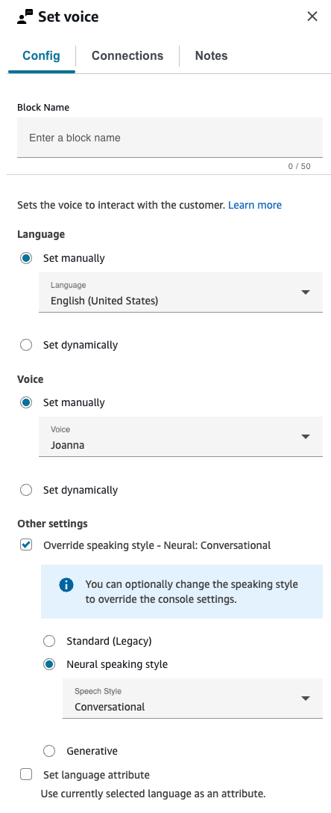
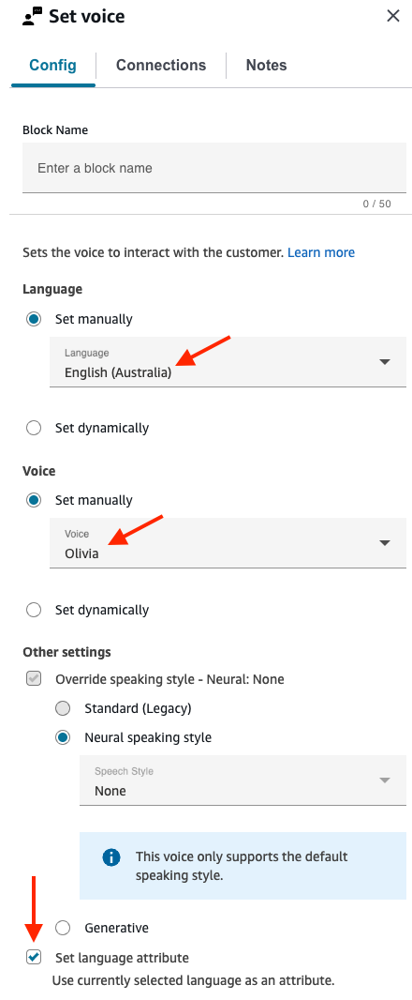
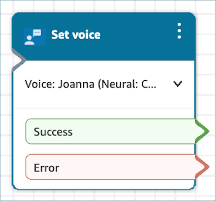

# Flow block in Amazon Connect: Set voice

This topic defines the flow block for setting the text-to-speech (TTS) language and
voice to use for the contact flow.

## Description

- Sets the text-to-speech (TTS) language and voice to use for the contact
  flow.
- The default voice is configured to Joanna (Conversational speaking style).
- You can choose **Override speaking style** to make it and
  other voices [Neural Voices](../../../polly/latest/dg/neural-voices.md "../../../polly/latest/dg/neural-voices.md") or [Generative Voices](../../../polly/latest/dg/generative-voices.md "../../../polly/latest/dg/generative-voices.md").
  - Neural voices make automated conversations sound more lifelike by
    improving the pitch, inflection, intonation, and tempo.
  - For a list of supported neural voices, see [Neural
    Voices](../../../polly/latest/dg/neural-voices.md#neural-voicelist "../../../polly/latest/dg/neural-voices.md#neural-voicelist") in the
    _Amazon Polly Developer Guide_.
  - Generative voices are the most human-like, emotionally engaged,
    and adaptive conversational voices available for the use via Amazon
    Polly
  - For a list of supported generative voices, see [Generative Voices](../../../polly/latest/dg/generative-voices.md#generative-voicelist "../../../polly/latest/dg/generative-voices.md#generative-voicelist") in the _Amazon Polly
    Developer Guide_.

- After this block is run, any TTS invocation resolves to theneural,
  standard or generative voice selected.
- If this block is triggered during a chat conversation, the contact goes
  down the **Success** branch. It has no effect on the chat
  experience.
- You will be charged for using the Generative voices. For more details on
  pricing, see the [Amazon
  Polly Pricing Details](https://aws.amazon.com/polly/pricing/ "https://aws.amazon.com/polly/pricing/")
- If you are onboarded to [Next Gen Amazon Connect](enable-nextgeneration-amazonconnect.md "enable-nextgeneration-amazonconnect.md"), the Generative voices are included as
  part of the Next Gen Amazon Connect pricing.

###### Note

If your instance was created before October 2018 and you have since migrated
to a Service Linked Role (SLR), you need to add the following custom permissions
to your Service Role (SR) to access the Generative engines.

```

{
   "Sid": "AllowPollyActions",
   "Effect": "Allow",
   "Action": [
       "polly:SynthesizeSpeech"
   ],
   "Resource": [
       "*"
   ]
}

```

## Supported channels

The following table lists how this block routes a contact who is using the
specified channel.

| Channel | Supported?             |
| ------- | ---------------------- |
| Voice   | Yes                    |
| Chat    | No<br>• Success branch |
| Task    | No<br>• Success branch |
| Email   | No<br>• Success branch |

## Flow types

You can use this block in the following [flow
types](create-contact-flow.md#contact-flow-types "create-contact-flow.md#contact-flow-types"):

- All flows

## Properties

The following image shows the **Properties** page of the
**Set voice** block. It is configured for English, the voice is
Joanna, and the speech style is Conversational.



###### Tip

For voices that support only neural speaking styles but not standard, the
**Override speaking style** is automatically selected. You
do not have the option to clear it.

You can also set language, voice, engine and style dynamically. There are a
few configurations that must be followed when modifying the block:

- If the language is selected dynamically, the voice must also be
  selected dynamically.
- If the voice is selected dynamically and the speaking style is
  overridden, then the engine and style must be selected
  dynamically.
- If the voice or engine are invalid, or the selected voice doesn’t
  support the selected engine, the error branch will be taken.

###### Note

    + Language code is only passed into a flow action if
     **Set language attribute** is selected.
     Therefore, invalid language codes will not take the error
     branch in this block but they may result in erroneous
     behavior when used with Lex V2 bots.
    + If a play prompt is added after the Error branch, the
     voice used for it will default to Joanna/standard.
    + If the defined speaking style is not supported by the
     defined voice, the **None** speaking style
     will be used.

## Configuration

For a list of valid language codes, voices, and supported engines, see [Available
voices](../../../polly/latest/dg/available-voices.md "../../../polly/latest/dg/available-voices.md") in the Amazon Polly Developer Guide .

###### Note

Amazon Connect supports standard, neural, and generative engines, so you
can pass either standard, neural, or generative as values into the engine
parameter.

To set the language attribute, pass in the specific language code into the
parameter (for example, en-US or ar-AE). For the voice, simply pass the name of the
voice (for example, Joanna or Hala).

Amazon Connect also supports speaking styles, which can be defined as None,
Conversational, or Newscaster. The Newscaster and Conversational styles are both
available for the following voices in the neural engine:

- Matthew (en-US)
- Joanna (en-US)
- Lupe (es-US)
- Amy (en-GB)

###### Note

If you don't specify an engine, the standard engine is used by default.
However, some voices, such as Ruth (en-US), don't support the standard engine.
For these voices, you must specify a supported engine. If you don't, the
operation fails because Ruth doesn't support the standard engine.

The following table contains some examples on configurations and their
results:

| Configuration Examples | Language Code | Voice  | Engine         | Speaking style                                                                                                                                                                                                                         | Result + Reasoning |
| ---------------------- | ------------- | ------ | -------------- | -------------------------------------------------------------------------------------------------------------------------------------------------------------------------------------------------------------------------------------- | ------------------ |
| en-US                  | Ruth          | N/D    | N/D            | \*_Error branch:_<br>• engine is not<br>specified, thus it defaults to standard. Ruth does not support<br>standard engine, which results in error branch being taken.                                                                  |
| en-US                  | Ruth          | neural | none           | \*_Success branch:_<br>• Ruth supports<br>neural engine                                                                                                                                                                                |
| en-US                  | Ruth          | neural | conversational | \*_Success branch:_<br>• Even though Ruth<br>does not support conversational speech style, the block does not<br>take the error branch. Instead, when the voice is synthesized, it<br>just uses no speaking style.                     |
| ar-AE                  | Ruth          | neural | none           | \*_Success branch:_<br>• This block does<br>not do validation on language code. Only the voice is used to<br>synthesize speech. However, language code being incorrect may result<br>in erroneous behavior when used with Lex V2 bots. |

## Use an Amazon Lex V2 bot with Amazon Connect

If you're using an Amazon Lex V2 bot, your language attribute in Amazon Connect must match the
language model used to build your Lex bot. This is different than Amazon Lex (Classic).

- If you build an Amazon Lex V2 bot with a different language model—for
  example, en_AU, fr_FR, es_ES, and more—under
  **Voice**, choose a voice that corresponds to that
  language, and then must choose **Set language attribute**,
  as shown in the following image.
- If you're not using an en-US voice with an Amazon Lex V2 bot and don't choose
  **Set language attribute**, the [Get customer input](get-customer-input.md "get-customer-input.md")
  block results in an error.
- For bots with multiple languages (for example, en_AU and en_GB) choose
  **Set language attribute** for one of the languages, as
  shown in the following image.



## Configuration tips

- For the **Joanna** and **Matthew**
  neural voices, in American English (en-US), you can also specify a [Newscaster speaking style](../../../polly/latest/dg/ntts-speakingstyles.md "../../../polly/latest/dg/ntts-speakingstyles.md").

## Configured block

The following image shows an example of what this block looks like when it is
configured. It has the following branches: **Success** and
**Error**.



## Scenarios

See these topics for scenarios that use this block:

- [Add text-to-speech to prompts in flow blocks in
  Amazon Polly](text-to-speech.md "text-to-speech.md")
