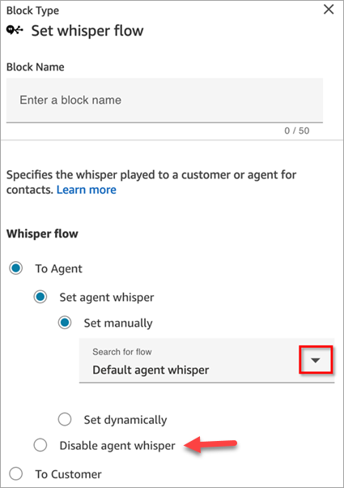
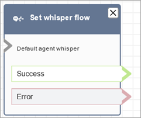

# Flow block in Amazon Connect: Set whisper flow

This topic defines the flow block for a message, or whisper, that displays in chat or
told in a call when a conversation begins. The whisper provides the participants with
pertinent information, such as telling an agent a customer's name, or telling the
customer that the call is being recorded for training purposes.

## Description

A _whisper flow_ is what a customer or agent experiences when
they are joined in a voice or chat conversation. For example:

- An agent and customer are joined in a **chat**. An agent whisper might display text to the agent
  telling them the name of the customer, for example, which queue the customer
  was in, or let the agent know they're talking to a club member.
- An agent and customer are joined in a **call**. A customer whisper might tell the customer that the
  call is being recorded for training purposes, for example, or thank them for
  being a club member.
- An agent and customer are joined in a **chat**. Using a contact attribute, an agent whisper flow
  records which agent is being connected to the conversation. This attribute
  is then used in a disconnect flow to route the contact back to the same
  agent if the customer has a follow-up question after the agent
  disconnects.

A whisper flow has the following characteristics:

- It's a one-sided interaction: either the customer hears or sees it, or the
  agent does.

###### Tip

For chat contacts, when an outbound flow runs, you can use a [Play prompt](play.md "play.md") block and the message
will be displayed to both the agent and customer in the chat
conversation.

- It can be used to create personalized and automated interactions.
- It runs when a customer and agent are being connected.

For voice conversations, the **Set whisper flow** block overrides
the [default agent whisper flow](default-agent-whisper.md "default-agent-whisper.md") or the
[customer whisper flow](default-customer-whisper.md "default-customer-whisper.md"). It does
this by:

- Linking to a different whisper flow that you create.

–OR–

- Disabling the whisper flow from running. You may want to disable the
  default whisper flow so customers do not perceive any connection latency,
  for example, as part of an outbound campaign.

###### Important

Chat conversations do not include a default whisper. You need to include a
**Set whisper flow** block for the default agent or
customer whispers to play. For instructions, see [Set the default whisper flow in
Amazon Connect for a chat conversation](set-default-whisper-flow-for-chat.md "set-default-whisper-flow-for-chat.md").

### How the Set whisper flow block

works

- For inbound conversations (voice or chat), the **Set whisper
  flow** block specifies the whisper to be played to the
  customer or agent when they are joined.
- For outbound voice calls, it specifies the whisper to be played to
  customer.
- A whisper is one direction, which means only the agent or customer
  hears or sees it, depending on the type of whisper you selected. For
  example, if a customer whisper says "This call is being recorded," the
  agent does not hear it.
- A whisper flow is triggered after the agent accepts the contact
  (either auto-accept or manual accept). The agent whisper flow runs
  first, before the customer is taken out of queue. After this is
  completed, the customer is taken out of queue and the customer whisper
  flow runs. Both flows run to completion before the agent and customer
  can talk or chat with each other.
- If an agent disconnects while the agent whisper is running, the
  customer remains in queue in order to be re-routed to another
  agent.
- If a customer disconnects while the customer whisper is running, the
  contact ends.
- If an agent whisper flow or customer whisper flow includes a block
  that chat does not support, such as [Start](start-media-streaming.md "start-media-streaming.md")/[Stop](stop-media-streaming.md "stop-media-streaming.md") media streaming or [Set voice](set-voice.md "set-voice.md"), chat skips
  these blocks and triggers an error branch. However, it doesn't prevent
  the flow from progressing.
- Whisper flows don't appear in transcripts.
- Whispers can be a maximum of 2 minutes long. After that point, the
  contact or agent is disconnected.

## Supported channels

The following table lists how this block routes a contact who is using the
specified channel.

| Channel | Supported? |
| ------- | ---------- |
| Voice   | Yes        |
| Chat    | Yes        |
| Task    | Yes        |
| Email   | Yes        |

## Flow types

You can use this block in the following [flow
types](create-contact-flow.md#contact-flow-types "create-contact-flow.md#contact-flow-types"):

- Inbound flow
- Customer Queue flow
- Transfer to Agent flow
- Transfer to Queue flow

## Properties

The following image shows the **Properties** page of the
**Set whisper flow** block. It shows the whisper to the agent
is set manually to **Default agent whisper**. Use the dropdown box
to choose a different whisper flow.

If you choose to set a flow manually, in the **Search for flow**
box, you can only select from flows that are type **Agent Whisper**
or **Customer Whisper**.

For information about using attributes, see [Use Amazon Connect contact attributes](connect-contact-attributes.md "connect-contact-attributes.md").

To disable a previously set agent or customer whisper, choose the
**Disable agent whisper** or **Disable customer
whisper** option.

## Configuration tips

- In a single block, you can set either a customer whisper or an agent
  whisper, but not both. Instead, use multiple **Set whisper
  flow** blocks in your flow.
- A maximum of one agent whisper and one customer whisper can be played. If
  you use multiple **Set whisper flow** blocks, the most
  recently specified one for each type (agent and customer) is played.
- Make sure your whispers are able to complete within two minutes.
  Otherwise, calls will be disconnected before being established.
- If agents appear to be stuck in the "Connecting..." state before being
  forcefully disconnected from calls, make sure that your configured whisper
  flows meet the two minute maximum.

## Configured block

The following image shows an example of what this block looks like when it is
configured. It has the following branches: **Success** and
**Error**.

