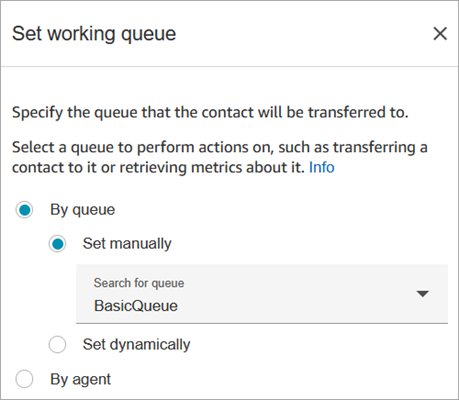
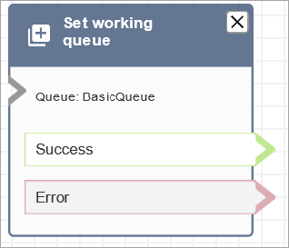

# Flow block in Amazon Connect: Set working queue

This topic defines the flow block for specifying the queue to transfer a contact when
**Transfer to queue** is invoked.

## Description

- This block specifies the queue to be used when **Transfer to
  queue** is invoked.
- A queue must be specified before invoking **Transfer to
  queue** except when used in a customer queue flow. It's also
  the default queue for checking attributes, such as staffing, queue status,
  and hours of operation.

## Supported channels

The following table lists how this block routes a contact who is using the
specified channel.

| Channel | Supported? |
| ------- | ---------- | ------------------------------------------------------------------------------------------------------------------------------------------------------------------------------------------------------------------------------------------------------------------------------------------------------------------------------------------------------------------------------------------------------------------------------------------------------------------------------------------------------------------------------------------------------------------------------------------------------------------------------------------------------------------------------------------------------------------------------------------------------------------------------------------------------------------------------------------------------------------------------------------------------------------------------------------------------------------------------------------------------------------------------------------------------------------------------------------------------------------------------------------------------------------------------------------------------------------------------------------------------------------------------------------------------------------------------------------------------------------------------------------------------------------------------------------------------------------------------------------------------------------------------------------------------------------------------------------------------------------------------------------------------------------------------------------------------------------------------------------------------------------------------------------------------------------------------------------------------------------------------------------------------------------------------------------------------------------------------------------------------------------------ |
| Voice   | Yes        |
| Chat    | Yes        |
| Task    | Yes        |
| Email   | Yes        | ## Flow types You can use this block in the following [flow types](create-contact-flow.md#contact-flow-types "create-contact-flow.md#contact-flow-types"):  • Inbound flow  • Transfer to Agent flow  • Transfer to Queue flow ## Properties The following image shows the **Properties** page of the **Set working queue** block. It is set to the **BasicQueue**.  Note the following properties:  • **By queue > Set dynamically**. To set the queue dynamically, you must specify the queue ID for the queue rather than the queue name. To find the queue ID, open the queue in the queue editor. The queue ID is included as the last part of the URL displayed in the browser address bar after `/queue`. For example, `aaaaaaaa-bbbb-cccc-dddd-111111111111`. ## Configured block The following image shows an example of what this block looks like when it is configured. It has the following branches: **Success** and **Error**.  ## Sample flows Amazon Connect includes a set of sample flows. For instructions that explain how to access the sample flows in the flow designer, see [Sample flows in Amazon Connect](contact-flow-samples.md "contact-flow-samples.md"). Following are topics that describe the sample flows which include this block.  • [Sample queue customer flow in Amazon Connect](sample-queue-customer.md "sample-queue-customer.md")  • [Sample queue configurations flow in Amazon Connect](sample-queue-configurations.md "sample-queue-configurations.md") ## Scenarios See these topics for scenarios that use this block:  • [Set up agent-to-agent transfers in Amazon Connect](setup-agent-to-agent-transfers.md "setup-agent-to-agent-transfers.md")  • [Transfer contacts to a specific agent in Amazon Connect](transfer-to-agent.md "transfer-to-agent.md") |
