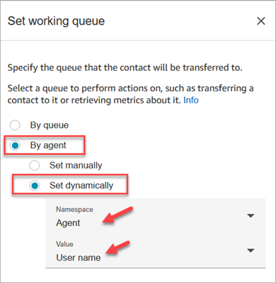
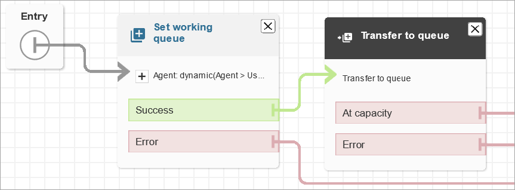

# Set up agent-to-agent transfers in

Amazon Connect

We recommend using these instructions to set up agent-to-agent voice, chat, and task
transfers. You use a [Set working queue](set-working-queue.md "set-working-queue.md") block to transfer the contact to the
agent's queue. The **Set working queue** block supports an omnichannel
experience, whereas the [Transfer to agent
(beta)](transfer-to-agent-block.md "transfer-to-agent-block.md") block does not.

## Step 1: Create the quick

connect

Following are the instructions to add quick connects manually using the Amazon Connect admin website. To
add quick connects programmatically, use the [CreateQuickConnect](../APIReference/API_CreateQuickConnect.md "../APIReference/API_CreateQuickConnect.md")
API.

###### Create a quick connect

1. On the navigation menu, choose **Routing**,
   **Quick connects**, **Add a new
   destination**.
2. Enter a name for the connect. Choose the type, and then specify the
   destination (such as a phone number or the name of an agent), flow (if
   applicable), and description.

###### Important

A description is required when you create a quick connect. If you
don't add one, you'll get an error when you try to save the quick
connect. 3. To add more quick connects, choose **Add new**. 4. Choose **Save**. 5. Go to the next procedure to enable your agents to see the quick connects
in the Contact Control Panel (CCP).

###### Enable your agents to see the quick connects in the CCP when they transfer a

contact

1. After you create the quick connect, go to **Routing**,
   **Queues** and then choose the appropriate queue for
   the contact to be routed to.
2. On the **Edit queue** page, in the **Quick
   connect** box, search for the quick connect you created.
3. Select the quick connect and then choose **Save**.

###### Tip

Agents see all of the quick connects for the queues in their routing
profile.

## Step 2: Set up the "Transfer to agent"

flow

In this step, you create a flow that's type **Transfer to agent**
and use a [Set working queue](set-working-queue.md "set-working-queue.md") block to transfer the contact to the agent.

1. On the navigation menu, choose **Routing**,
   **Flows**.
2. Use the drop-down to choose **Create transfer to agent
   flow**.
3. Type a name and a description for your flow.
4. In the left navigation menu, expand **Set**, and then
   drag the **Set working queue** block to the canvas.
5. Configure the **Set working queue** block as shown in the
   following image. Choose **By agent**, **Set
   dynamically**, **Namespace** =
   **Agent**, **Value** = **User
   name**.

    1. Choose **By agent**.
    2. Choose **Set dynamically**.
    3. For **Namespace**, use the dropdown box to select
     **Agent**.
    4. For **Value**, use the dropdown box to select
     **User name**.

6. Add a [Transfer to queue](transfer-to-queue.md "transfer-to-queue.md") block. You don't need to
   configure this block. The following image shows the
   **Success** branch of the **Set working
   queue** block connecting to the **Transfer to
   queue** block.

 7. Save and publish this flow. 8. To show your agents how to transfer chats to another agent, see [Transfer a chat to an agent's queue, with all
context preserved](transfer-chats.md "transfer-chats.md").

To show your agents how to transfer tasks to another agent, see [Transfer a task to another agent or queue in the
Amazon Connect Contact Control Panel (CCP)](transfer-task.md "transfer-task.md").
