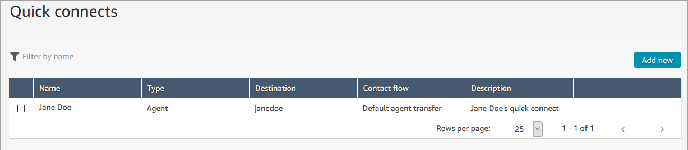

# Set up agents in Amazon Connect to assign

tasks to themselves

For an agent to be able receive a task, they need a quick connect created for them.
With this quick connect, agents will be able to assign tasks to themselves, and other
agents will be able to assign tasks to them.

## Step 1: Create a quick connect for

the agent

1. On the navigation menu, choose **Routing**,
   **Quick connects**, **Add a
   new**.
2. Enter a name for the quick connect, such as the name of the agent. For
   example, if you want Jane Doe to be able to assign tasks to herself, enter
   **Jane Doe**.
3. Under **Type**, use the dropdown list to choose
   **Agent**.
4. Under **Destination**, use the dropdown list to choose
   the user name for the agent.
5. Under **Flow**, choose **Default agent
   transfer**, or the appropriate flow for your contact
   center.
6. Under **Description**, enter a description, such as
   **Jane Doe's quick connect**.
7. Choose **Save**.

The following image shows a quick connect for Jane Doe on the
**Quick connects** page.

## Step 2: Create a queue for the agent and

associate the quick connect

1. After you create the quick connect, go to **Routing**,
   **Queues** and add a queue for the agent.
2. On the **Add new queue** page, in the **Quick
   connects** box, search for the quick connect you created for
   the agent.
3. Select the quick connect and then choose **Save**.

## Step 3: Add the queue to the agent's

routing profile

1. Go to **Users**, **Routing profiles**
   and choose the agent's routing profile.
2. Add the agent's queue to the routing profile, and choose
   **Task** for the channel.

If the agent can receive transfers through other channels, select them as
well. 3. Choose **Save**.
