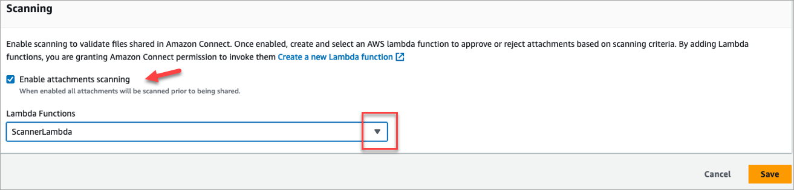

# Set up attachment scanning in Amazon Connect

###### Note

This topic is for developers who are familiar with Lambda. If you're new to Lambda,
see [Getting
started with Lambda](../../../lambda/latest/dg/getting-started.md "../../../lambda/latest/dg/getting-started.md") in the AWS
_Lambda Developer's Guide_.

You can configure Amazon Connect to scan attachments that are sent in email,
during a chat, or uploaded to a case. You can scan attachments by using your preferred
scanning application. For example, you can scan attachments for malware before they are
approved to be shared between participants of a chat.

To enable attachment scanning you perform two steps:

- [Configure a Lambda function that calls your
  preferred scanning application](#lambda-scanning "#lambda-scanning").
- [Add the scanner to your Amazon Connect instance](#add-attachment-scanner "#add-attachment-scanner").

## Step 1: Create a Lambda function that handles

scanning

Create a Lambda function, using any runtime, and configure it. This function must
be in the same AWS Region and account as your Amazon Connect instance.

For every attachment uploaded through Amazon Connect a request is sent with information
about the attachment.

Following is an example JSON request for scanning:

```
{
    "Version": "1.0",
    "InstanceId": "`your instance ID`",
    "File": {
        "FileId": "`your file ID`",
        "FileCreationTime": 1689291663582,
        "FileName": "example.txt",
        "FileSizeInBytes": 10,
        "FileLocation": {
            "S3Location": {
                "Key": "connect/`your-instance`/Attachments/chat/2023/07/13/`your file ID`_20230713T23:41_UTC.txt",
                "Bucket": "connect-example",
                "Arn": "arn:aws:s3:::connect-example/connect/`your-instance`/Attachments/chat/2023/07/13/`your file ID`_20230713T23:41_UTC.txt"
            }
        }
    }
}
```

### Required response

```
{
   "Status": "APPROVED" | "REJECTED"
}
```

### Invocation retry policy

If your Lambda invocation gets throttled, the request is retried. It is also
retried if a general service failure (500 error) happens. When a synchronous
invocation returns an error, Amazon Connect retries up to 3 times, for a maximum of 60
seconds. At that point, the attachment is marked rejected.

For more information about how Lambda retries, see [Error handling and automatic
retries in AWS Lambda](../../../lambda/latest/dg/invocation-retries.md "../../../lambda/latest/dg/invocation-retries.md").

### Rejection behavior

Amazon Connect marks the attachment `REJECTED` and automatically deletes
attachment files in S3 from both staging and final locations when one of the
following occurs:

- Your Lambda scanner returns a status of `REJECTED`.
- Amazon Connect is unable to parse the response from the Lambda scanner.
- Amazon Connect is unable to invoke the Lambda function.

## Step 2: Add an attachment scanner to your

Amazon Connect instance

After you create a Lambda for attachment scanning, you need to add the Lambda to
your Amazon Connect instance. Perform the following steps to add the Lambda.

1. Open the Amazon Connect console at
   [https://console.aws.amazon.com/connect/](https://console.aws.amazon.com/connect/ "https://console.aws.amazon.com/connect/").
2. On the instances page, choose the instance alias. The instance alias is also
   your **instance name**, which appears in your Amazon Connect
   URL. The following image shows the **Amazon Connect virtual contact center instances** page, with a box
   around the instance alias.

 3. In the navigation pane, choose **Data storage**. 4. On the **Data storage** page, in the
**Attachments** section, choose
**Edit**, and then select **Enable attachments
scanning**, as shown in the following image.

 5. Use the **Lambda Functions** drop-down box to select the
Lambda function that you added in [Step 1: Create a Lambda function that handles
scanning](#lambda-scanning "#lambda-scanning"). 6. Choose **Save**. Attachment scanning is now enabled for
your Amazon Connect instance.
