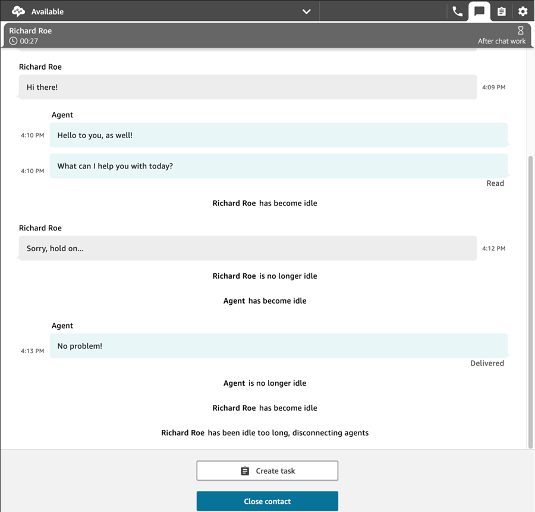

# Set up chat timeouts for chat participants

When a chat conversation between an agent and a customer has been inactive (no messages
sent) for a certain amount of time, you may want to consider a chat participant to be idle,
and you may even want to automatically disconnect an agent from the chat.

To do this you can configure both idle timeouts and auto-close timeouts using the [UpdateParticipantRoleConfig](../APIReference/API_UpdateParticipantRoleConfig.md "../APIReference/API_UpdateParticipantRoleConfig.md") action.

###### Tip

This topic is about setting up chat timeouts for customer-agent conversations. If you're looking for information about configuring chat timeouts for when customers are interacting with Lex, see the
[Configurable
time-outs for chat input during a Lex interaction](get-customer-input.md#get-customer-input-configurable-timeouts-chat "get-customer-input.md#get-customer-input-configurable-timeouts-chat") section of the [Flow block in Amazon Connect: Get customer input](get-customer-input.md "get-customer-input.md") block.

###### You can set four different types of timers.

- You specify the amount of time that has to elapse before an action is
  taken.
- Any combination of timers can be used.

| Timer                            | Action at end of timer                                                        |
| -------------------------------- | ----------------------------------------------------------------------------- |
| Customer idle timeout            | Mark the customer as idle.                                                    |
| Customer auto-disconnect timeout | Automatically disconnect the agent from the chat due to customer idleness. |
| Agent idle timeout               | Mark the agent as idle.                                                       |
| Agent auto-disconnect timeout    | Automatically disconnect the agent from the chat due to agent idleness.    |

###### Specify all timers in minutes.

- Minimum: 2 minutes
- Maximum: 480 minutes (8 hours)

###### Timers apply to participant roles, and apply for life of the chat.

- You configure timers for participant roles such as agent and customer, rather than
  individual participants.
- After you set the timers, they apply for the life of the chat. If a chat is
  transferred, the timers apply to the new agent/customer interaction.

## How chat timers work

Timers behave as follows:

- Timers run when both an agent and a customer are connected to the chat, or
  when a customer and a custom participant (such as a custom bot) are connected.
- Timers first start when an agent/custom participant joins the chat, and
  stop when the agent/custom participant leaves the chat.
- Idle timers run before auto-disconnect timers, if both are configured for a
  role. For example, if both timers are configured, then the auto-disconnect timer
  starts only after a participant is deemed idle.
- If only one type of timer is configured for a role, then that timer starts
  immediately.
- If at any time a participant sends a message, the timers for that participant
  are reset. If they were considered idle, they will no longer be considered idle.
- When an attachment is added to a message, the chat timer is reset.
- The configuration that was set when the agent/custom participant joined
  applies for as long as the agent/custom participant remains on the chat. If you
  update the timer configuration while an agent/custom participant and customer
  are already connected to each other, the new configuration is stored but not
  applied until and unless a new agent/custom participant connects to the
  chat.
- When an auto-disconnect event occurs, all participants other than the customer
  (such as the agent, any monitoring supervisor, or custom participants) are
  disconnected. If the agent is the one disconnected, and if a [Set disconnect flow](set-disconnect-flow.md "set-disconnect-flow.md")
  block has been configured, then the chat is routed to it.

### Idle timer expiry

Following is what happens when an idle timer expires during a customer-custom
participant interaction:

1. An idle event is fanned out to all websockets/streaming endpoints.
2. If an auto-disconnect timer is configured, it is started.
3. If the idle timer expires while the chat contact is in a
   **Wait** block, the contact is NOT routed down the
   **Time Expired** branch. No action is taken if this
   scenario occurs.

### Auto-disconnecting custom participants

When an auto-disconnect timer expires, the custom participant is disconnected from
the chat.

Amazon Connect performs one of the following steps when auto-disconnect timers
expire:

1. The chat currently resides in a [Wait](wait.md "wait.md") block that is configured for a custom
   participant.
   - The custom participant is disconnected from the chat, and the chat
     resumes the flow by taking the **Bot participant
     disconnected** branch.

2. The chat currently resides in a [Wait](wait.md "wait.md") block that is configured for the customer
   OR the chat is not in a **Wait** block.
   - The custom participant is disconnected from the chat and no other
     actions are taken.

## Messages displayed to participants

Messages are displayed to all participants when any one of the following events
happen:

- A participant becomes idle.
- An idle participant sends a message, and is no longer idle.
- An auto-disconnect occurs. Because the agent is disconnected, they won't be
  able to see the message.

These events are not persisted to the transcripts, nor billed.

Default messages (in all supported languages) are displayed to agents in the
Contact Control Panel (CCP) for each of these events.

The following image show examples of default idleness messages that the agent would
see in the CCP. For example, _Agent has become idle_.

## Recommended usage

To use the chat timeout feature, we recommend that you do the following:

1. Embed a call to the [UpdateParticipantRoleConfig](../APIReference/API_UpdateParticipantRoleConfig.md "../APIReference/API_UpdateParticipantRoleConfig.md") action in a Lambda in a contact
   flow.
2. Depending on your use case, place the Lambda either immediately after starting
   the chat (at the beginning of the flow) or right before routing the contact to a
   queue.

## Customize the customer's chat user interface for a

disconnect event

To customize your customer's chat user interface for a disconnect event, see the
following methods in the [ChatJS](https://github.com/amazon-connect/amazon-connect-chatjs "https://github.com/amazon-connect/amazon-connect-chatjs"):

- `onParticipantIdle(callback)`
- `onParticipantReturned(callback)`
- `onAutoDisconnection(callback)`

Use these methods to register callback handlers which are triggered when the new
events arrive.
