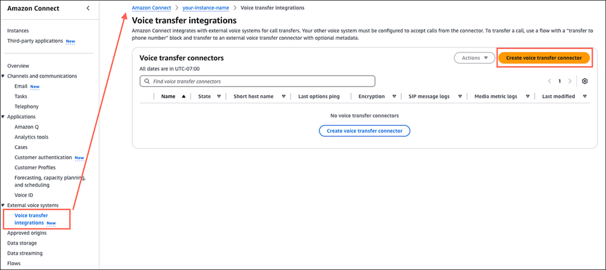
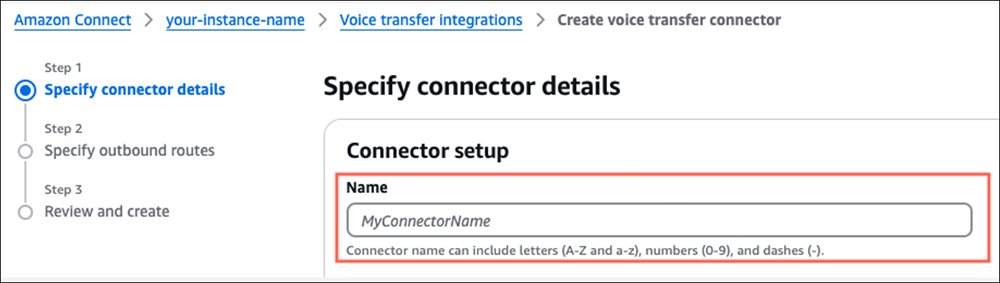
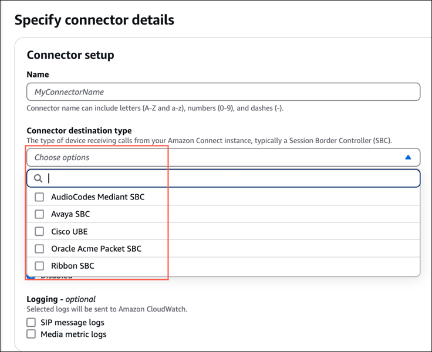
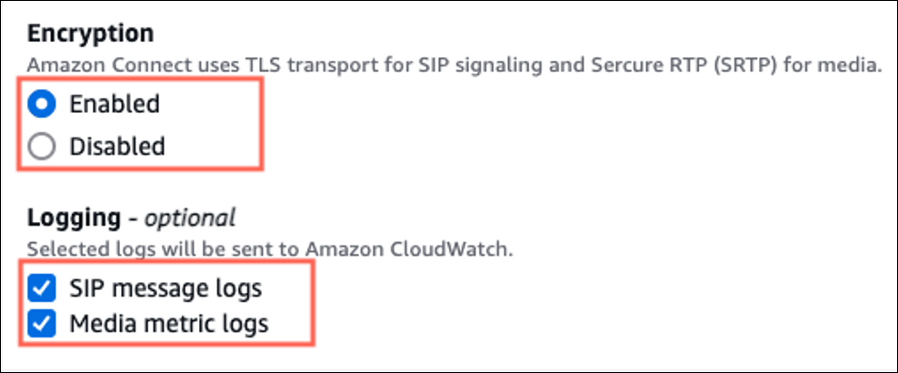
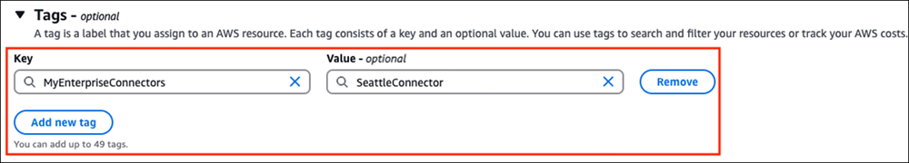
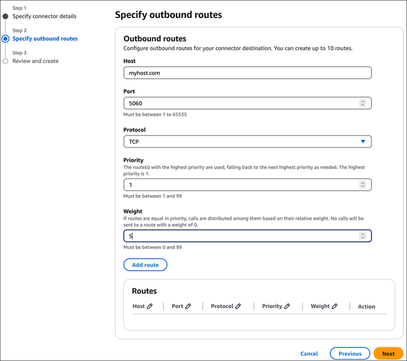
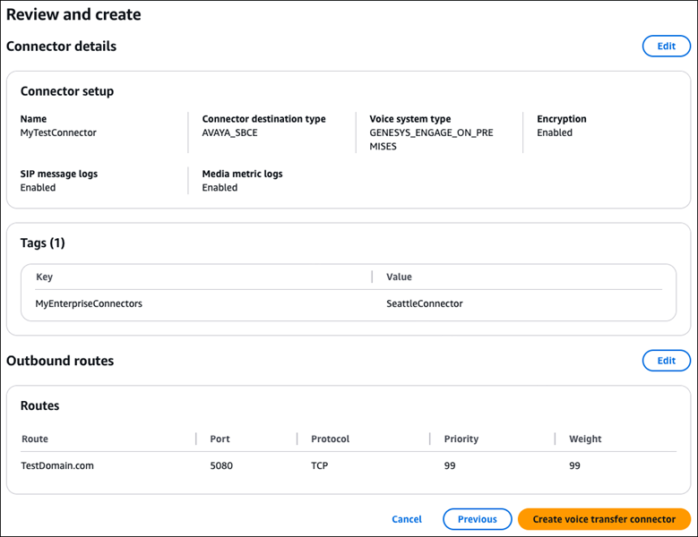

# Create external voice transfer

connectors for Amazon Connect

Complete the following steps to create an external voice transfer connector so you can
integrate Amazon Connect with an on-premise system.

1. If you have not yet created your Amazon Connect instance, do so now. For instructions,
   see [Create an Amazon Connect instance](amazon-connect-instances.md "amazon-connect-instances.md").
2. Request a service quota increase for **External voice transfer
   connectors per account**.

###### Important

You must have an Amazon Connect instance before you can request a quota
increase.

The option to enable external voice transfer integration in the Amazon Connect
console is not visible until the quota increase is approved. 3. Open the Amazon Connect console at
[https://console.aws.amazon.com/connect/](https://console.aws.amazon.com/connect/ "https://console.aws.amazon.com/connect/"). 4. On the instances page, choose the instance alias. The instance alias is also
your **instance name**, which appears in your Amazon Connect
URL. The following image shows the **Amazon Connect virtual contact center instances** page, with a box
around the instance alias.

 5. After the **External voice transfer connectors per account**
quota increase has been approved: In the Amazon Connect console navigation pane, choose
**External Voice Systems**, **Voice Transfer
Integrations**, and then choose **Create Voice transfer
Connector**, as shown in the following image.

 6. On the **Specify connector details** page, type a name for
your connector is that is meaningful to you.

 7. In the **Connector destination type** box, choose the type of
device receiving calls from your Amazon Connect instance, typically a Session Border
Controller. The following image shows the devices available in the dropdown
list.

 8. We recommend that you enable **Encryption** and
**Logging** of the SIP and Media metric messages to easily
debug integration issues. If you enable **Encryption**, import
the wildcard root certificate into your SIP infrastructure. You can download it
from [here](https://s3.amazonaws.com/voice-connector-certs/combined-ca-bundle.pem "https://s3.amazonaws.com/voice-connector-certs/combined-ca-bundle.pem").

The following image shows the **Encryption** and
**Logging** options.

 9. Optionally, add [tags](tagging.md "tagging.md") to identify, organize,
search for, filter, and control who can access this connector. For more
information, see [Add tags to resources in Amazon Connect](tagging.md "tagging.md").

 10. Choose **Next**. 11. In the **Outbound routes** section, configure the route
between your Amazon Connect instance and your enterprise voice system. 12. Specify the **Host**, **Port**,
**Protocol**, **Priority**, and
**Weight** to create an outbound route. You can add up to
10 routes, and specify the **Priority** and
**Weight** for each one.

The following image shows an example of a completed **Outbound
routes** section.

 13. Choose **Next**. 14. On the **Review and create** page, review the configuration
and make any edits as needed. Choose **Create voice transfer
connector**, as shown in the following image.

 15. After the voice transfer connector is saved you are returned to the
**Voice transfer integrations** page. The following image
shows the list of connectors with a typical success message.

 16. Continue to [Configure your external on-premise
voice system](configure-external-voice-system1.md "configure-external-voice-system1.md"), the next step in setting
up external voice transfer.
