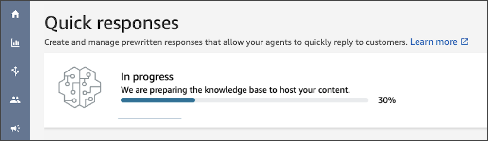

# Set up an Amazon Q in Connect knowledge base to store quick

responses

You must create an [Amazon Q in Connect knowledge base](amazon-q-connect.md "amazon-q-connect.md") to
store quick responses. You can use the Amazon Connect admin website to create the knowledge base with a single click.
The site uses AWS owned keys to encrypt data.

###### Note

You can create your own key by providing a custom [ServerSideEncryptionConfiguration](../../../amazon-q-connect/latest/APIReference/API_ServerSideEncryptionConfiguration.md#wisdom-Type-ServerSideEncryptionConfiguration-kmsKeyId "../../../amazon-q-connect/latest/APIReference/API_ServerSideEncryptionConfiguration.md#wisdom-Type-ServerSideEncryptionConfiguration-kmsKeyId") in an [CreateKnowledgeBase](../../../amazon-q-connect/latest/APIReference/API_CreateKnowledgeBase.md "../../../amazon-q-connect/latest/APIReference/API_CreateKnowledgeBase.md") API call. For more information, see [Enable Amazon Q in Connect for your instance](enable-q.md "enable-q.md"), in this guide.

The following steps explain how to use the Amazon Connect admin website to create an Amazon Q in Connect knowledge
base.

###### To create a knowledge base

1. Log in to the Amazon Connect admin website at https://_instance
   name_.my.connect.aws/. Use an admin account, or an account with
   **Content Management - Quick responses - Create** permission in its security
   profile.
2. On the navigation bar, choose **Content Management**, then
   **Quick responses**.
3. On the **Quick responses** page, choose **Get
   started**.

###### Note

If the **Get started** button isn't available, sign in with an account
that has the admin security profile, or ask another admin for help. 4. Remain on the page until the process ends. Do not refresh the page until the process ends.
An indicator shows the status.

The finished knowledge base provides two sample quick responses.

- The sample responses are associated with the [basic routing profile](concepts-routing.md "concepts-routing.md"), if that
  exists in your Amazon Connect instance.
- The sample responses are set to **Inactive**, meaning agents can't see or
  search for them. Activating a sample quick response makes it visible and searchable by agents
  assigned to the basic routing profile.
- If the basic routing profile is not present in your Amazon Connect instance, the sample quick
  responses are associated with **All** routing profiles. After you activate a
  sample quick response, all agents can see and search for that response, regardless of their
  assigned routing profiles.

###### Note

Quick responses are only available in the **Chat** and
**Email** channels.
