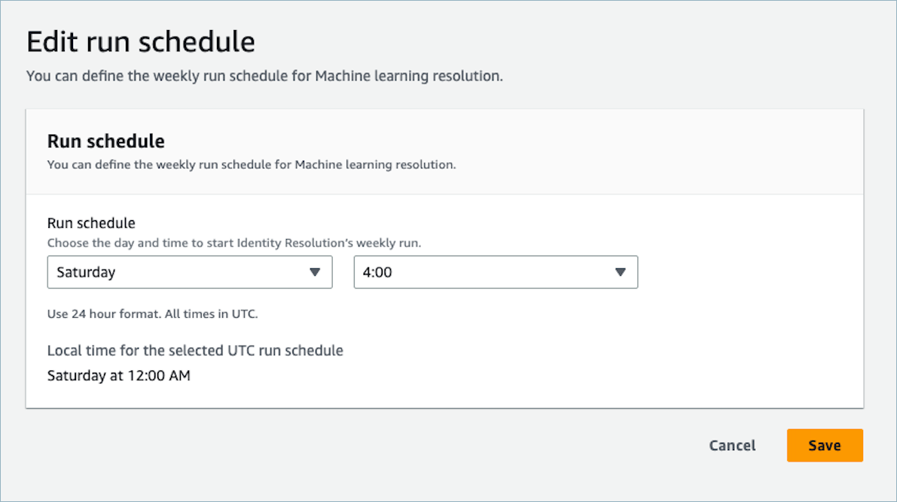
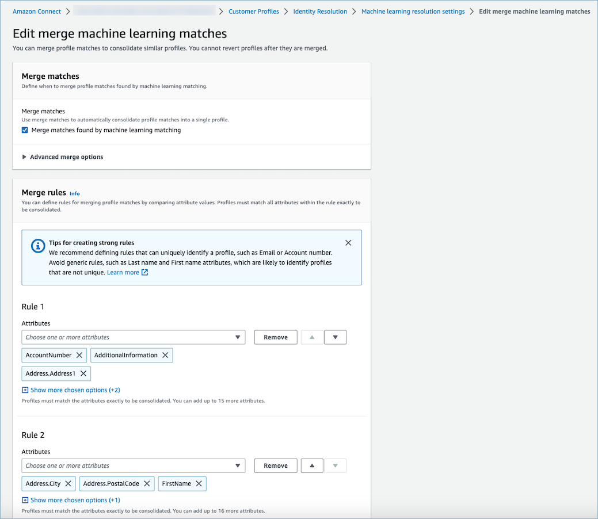
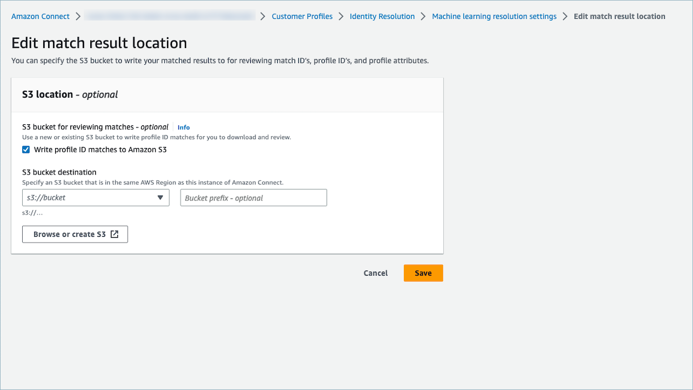

# Set up machine learning for

Identity Resolution in Amazon Connect

## Edit machine

learning matching run schedule

## Edit machine

learning merge matches

## Edit machine learning

match location

