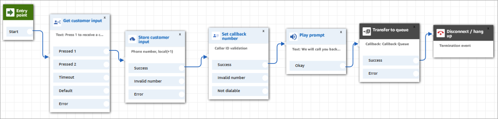
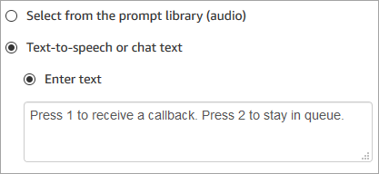
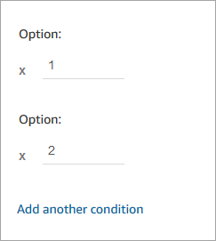
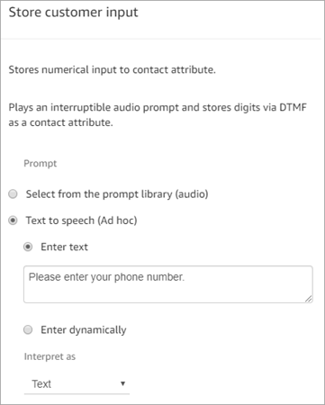
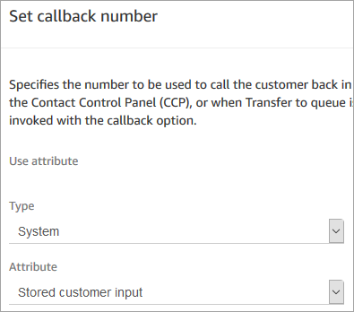
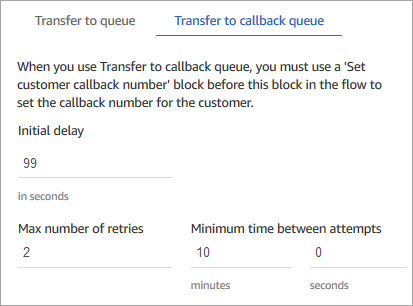
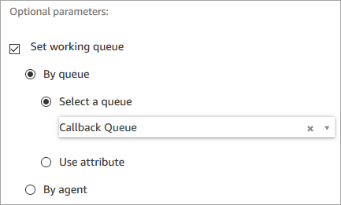
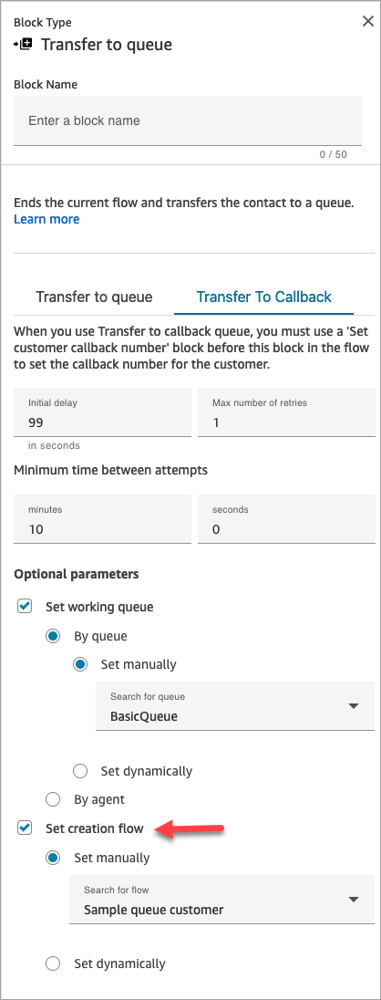
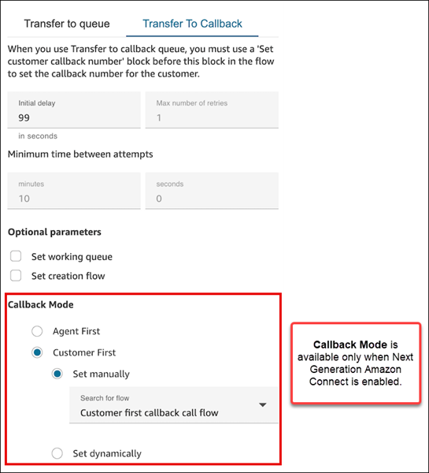

# Set up queued callback by creating flows, queues, and

routing profiles in Amazon Connect

You can allow your customers to maintain their position in queue without requiring them to
stay on the call during high wait times, and get a callback from an available agent when
it's their turn.

###### Contents

- [How callbacks keep their place in queue](#callback-how-it-works "#callback-how-it-works")
- [Steps to set up queued
  callbacks](#setup-queued-callback-overview "#setup-queued-callback-overview")
- [The routing process](#cb-routing "#cb-routing")
- [How queued callbacks affect
  queue limits](#queued-callback-limits "#queued-callback-limits")
- [Create a flow for queued
  callbacks](#queued-callback-contact-flow "#queued-callback-contact-flow")
- [Callbacks from a chat, task, or email
  contact](#queued-callback-chat-task "#queued-callback-chat-task")
- [Learn more about queued
  callbacks](#queued-callback-no-agents-available "#queued-callback-no-agents-available")

## How callbacks keep their place in queue

You can configure callbacks to remain in the same queue as the original inbound call
or to be placed in a separate dedicated queue that you create. This separate queue
enables you to get a clearer delineation between active inbound calls and callbacks in
real time reports.

You can ensure that the callback maintains its position in queue even when you place
it in a dedicated queue by configuring it at the same priority as the original inbound
queue in the routing profile. This configuration ensures that Amazon Connect continues to look at
the original start time of the inbound call to maintain order, regardless of whether the
customer opted for a callback or to stay on the call for the next available
agent.

Amazon Connect evaluates the routing profiles first so if the two queues have the same
priority, the oldest call is pushed first across all queues with the same priorities.
For example, if your original call arrived at 10:00 and left a callback request at
10:05, Amazon Connect looks for the call start time of 10:00, not 10:05.

## Steps to set up queued

callbacks

Use the steps provided in the following overview to set up queued callback.

- [Set up a queue](create-queue.md "create-queue.md") specifically for callbacks.
  In your real-time metrics reports, you can look at that queue and see how many
  customers are waiting for callbacks.
- [Set up caller ID](queues-callerid.md "queues-callerid.md"). When setting your
  callback queue, specify the caller ID name and phone number that appears to
  customers when you call back.
- [Add the callback queue to a routing
  profile](routing-profiles.md "routing-profiles.md"). Set this up so that contacts waiting for a call are routed
  to agents.
- [Create a flow for queued
  callbacks](#queued-callback-contact-flow "#queued-callback-contact-flow"). Set this up to offer the option for a callback to the
  customer.
- [Associate a
  phone number with the inbound flow](associate-claimed-ported-phone-number-to-flow.md "associate-claimed-ported-phone-number-to-flow.md").
- (Optional) Create a callback creation flow. When a callback is created, this
  flow is run. The contact is enqueued only when there is a [Transfer to queue](transfer-to-queue.md "transfer-to-queue.md") set on
  this flow. You can use the callback creation flow to [Check contact
  attributes](check-contact-attributes.md "check-contact-attributes.md") to see if the callback is a
  duplicate or if the customer issue is resolved before queuing the contact for an
  agent. This flow also allows you to set a customer queue flow by adding a [Set customer queue
  flow](set-customer-queue-flow.md "set-customer-queue-flow.md") block.
- (Optional) Create a customer queue flow for callback. This flow is run if you
  choose a [Set customer queue
  flow](set-customer-queue-flow.md "set-customer-queue-flow.md") block for the **Set
  creation flow** option. You can use a [Set customer queue
  flow](set-customer-queue-flow.md "set-customer-queue-flow.md") block to add logic to
  transfer a contact from one queue to another. Or, you can manually remove a
  callback from the queue by using the [StopContact](../APIReference/API_StopContact.md "../APIReference/API_StopContact.md")
  API.
- (Optional) Create an outbound whisper flow. When a queued call is placed, the
  customer hears this message after they pick up and before they connect to the
  agent. For example, "Hello, this is your scheduled callback..."
- (Optional) Create an agent whisper flow. This is what the agent hears right
  after they accept the contact, before they are joined to the customer. For
  example, "You're about to be connected to Customer John, who requested a refund
  for..."
- Choose a dial mode between agent first and customer first.

###### Important

    + This option is available only when Next Generation Amazon Connect is [enabled](enable-nextgeneration-amazonconnect.md "enable-nextgeneration-amazonconnect.md") for
     your Amazon Connect instance.
    + If you disable Next Generation Amazon Connect after you've already
     activated and started using customer first callback, customer first
     callback is also disabled. It is not available in the
     pay-per-feature pricing model.

## The routing process

1. When a customer leaves their number it's put in a queue and then routed to the
   next available agent.
2. After an agent accepts the callback in the CCP, Amazon Connect calls the
   customer.

If no agents are available to work on callbacks, the callbacks can stay in
queue for up to 7 days after they are created before Amazon Connect automatically removes
them.

###### Tip

To manually remove a callback from the queue, use the [StopContact](../APIReference/API_StopContact.md "../APIReference/API_StopContact.md") API. 3. If there is no answer when the Amazon Connect calls the customer, it retries based on
the number of times you've specified. 4. If the call goes to **voicemail**, it's
considered connected. 5. If the customer calls again while in the callback queue, it's treated as a new
call and will be handled as usual. To avoid duplicate callback requests in a
callback queue, see this blog: [Preventing duplicate callback requests in Amazon Connect](https://aws.amazon.com/blogs/contact-center/preventing-duplicate-callback-requests-in-amazon-connect/ "https://aws.amazon.com/blogs/contact-center/preventing-duplicate-callback-requests-in-amazon-connect/").

## How queued callbacks affect

queue limits

- Queued callbacks count towards the queue size limit, but they are routed to
  the error branch. For example, if you have a queue that handles callbacks and
  incoming calls, and that queue reaches the size limit:
  - The next callback is routed to the error branch.
  - The next incoming call gets a reorder tone (also known as a fast busy
    tone), which indicates no transmission path to the called number is
    available.

- Consider setting up your queued callbacks to be lower priority than your queue
  for incoming calls. This way, your agents only work on queued callbacks when the
  incoming call volume is low.

## Create a flow for queued

callbacks

To see what a flow looks like with queued callback, in new Amazon Connect instances see [Sample queue configurations flow in
Amazon Connect](sample-queue-configurations.md "sample-queue-configurations.md").
In previous instances, see [Sample queued callback flow in Amazon Connect](sample-queued-callback.md "sample-queued-callback.md").

The following procedure shows how to:

- Request a callback number from a customer.
- Store the callback number in an attribute.
- Reference the attribute in a **Set callback number** block to
  set the number to dial the customer.
- Transfer the customer to the callback queue.

At the basic level, here's what this queued callback flow looks like, without any of
the alternative branches or error handling configured. The following image shows a flow
with the following blocks: **Get customer input**, **Store
customer input**, **Set callback number**, **Play
prompt**, **Transfer to queue**, and
**Disconnect/hang up**.

Following are the steps to create this flow.

###### To create a flow for queued callbacks

1. In Amazon Connect, choose **Routing**, **Contact
   flows**.
2. Select an existing flow, or choose **Create flow** to create
   a new one.

###### Tip

You can create this flow using different flow types: Customer queue flow,
Transfer to agent, Transfer to queue. 3. Add a [Get customer input](get-customer-input.md "get-customer-input.md")
block. 4. Configure the block to prompt the customer for a callback. The following image
shows a message in the **Text-to-speech** box: **Press
1 to receive a callback. Press 2 to stay in queue**.

 5. At the bottom of the block, choose **Add another condition**,
and add options 1 and 2, as shown in the following image.

 6. Add a [Store customer input](store-customer-input.md "store-customer-input.md")
block. 7. Configure the block to prompt customers for their callback number, such as
"Please enter your phone number." The following image shows the
**Properties** page of the **Store customer input** block.

 8. In the **Customer input** section, select **Phone
number**, and then choose one of the following:

    * **Local format**: Your customers are calling from
     phone numbers that are in the same country as the AWS Region where you
     created your Amazon Connect instance.
    * **International format/Enforce E.164**: Your
     customers are calling from phone numbers in countries or regions other
     than the one where you created your instance.

9. Add a [Set callback number](set-callback-number.md "set-callback-number.md") block to
   your flow.
10. Configure the block to set **Type** to
    **System**, as shown in the following image. For
    **Attribute**, choose **Store customer
    input**. This attribute stores the customer's phone number.

 11. Add a [Transfer to queue](transfer-to-queue.md "transfer-to-queue.md") block. 12. In the **Transfer to queue** block, configure the
**Transfer to callback queue** tab as shown in the
following image. Set **Initial delay** to 99. Set **Max
number of retries** to 2. Set **Minimum time between
attempts** to 10 minutes.

The following properties are available:

    * **Initial delay**: Specify how much time has to pass
     between a callback contact being initiated in the flow, and the customer
     is put in queue for the next available agent. In the previous example,
     the time is 99 seconds.
    * **Maximum number of retries**: If this is set to 2,
     then Amazon Connect tries to call back the customer a maximum of three times: the
     initial callback, and two retries.

    A retry only happens if it rings but there's no answer. If the
     callback goes to voicemail, it's considered connected and Amazon Connect does not
     retry again.

    ###### Tip

    We strongly recommend that you double-check the number entered in
     **Maximum number of retries**. If you
     accidentally enter a high number, such as 20, it's going to result
     in unnecessary work for the agent and too many calls for the
     customer.
    * **Minimum time between attempts**: If the customer
     doesn't answer the phone, this is how long to wait until trying again.
     In the previous example, we wait 10 minutes between attempts.

13. In the **Optional parameters** section, choose **Set
    working queue** if you want to transfer the contact to a queue that
    you set up specifically for callbacks. This option is shown in the following
    image.

Creating a queue just for callbacks lets you view in your real-time metrics
reports how many customers are waiting for callbacks.

If you don't set a working queue, Amazon Connect uses the queue that was set previously
in the flow. 14. The callback contact is a new contact separate from the inbound voice contact.
You can optionally control the experience of this callback contact when it is
created by configuring the **Set creation flow** option in the
[Transfer to queue](transfer-to-queue.md "transfer-to-queue.md")
block, as shown in the following image.

    * If Next Generation Amazon Connect is enabled for your Amazon Connect instance (learn how
     to [check whether it's enabled](enable-nextgeneration-amazonconnect.md#how-to-enable-ac "enable-nextgeneration-amazonconnect.md#how-to-enable-ac")),
     you can choose either agent first callback mode (the default) or
     customer first callback mode. For more information about these options,
     see [Use customer first callback
     mode](customer-first-cb.md "customer-first-cb.md").

    
    * (Optional) Create a callback creation flow. Use the **Set
     creation flow** dropdown menu to select the flow to be run
     when a callback contact is created.

    The callback creation flow that you select must meet the following
     requirements:

    	+ The flow type must be the default flow type, **Contact
    	 flow (inbound)**. For information about flow types,
    	 see [Choose a flow type](create-contact-flow.md#contact-flow-types "create-contact-flow.md#contact-flow-types").
    	+ You need to configure a [Transfer to queue](transfer-to-queue.md "transfer-to-queue.md") block to queue the
    	 contact in the queue of your choice.
    Following are additional options for how you can configure your
     callback creation flow:

    	+ You can evaluate contact attributes (including customer
    	 profiles) by using a [Check contact
    	 attributes](check-contact-attributes.md "check-contact-attributes.md") block to
    	 see if the callback should be terminated because it is a
    	 duplicate or the customer issue has already been
    	 resolved.
    	+ You can add a [Set customer queue
    	 flow](set-customer-queue-flow.md "set-customer-queue-flow.md") block and
    	 use it to specify the flow to run when a customer is transferred
    	 to a queue. This flow is called a customer queue flow.

    		- In the customer queue flow, you can evaluate the
    		 contact's wait time in queue by using a combination of
    		 the [Get queue metrics](get-queue-metrics.md "get-queue-metrics.md") block and
    		 [GetCurrentMetricData](../APIReference/API_GetCurrentMetricData.md "../APIReference/API_GetCurrentMetricData.md") to send an advance SMS
    		 to customers, notifying them to expect a callback in the
    		 near future from the specific contact center
    		 number.

15. To save and test this flow, configure the other branches and add error
    handling. To see an example of how this is done, see [Sample queue configurations flow in
    Amazon Connect](sample-queue-configurations.md "sample-queue-configurations.md"). For previous instances, see
    [Sample queued callback flow in Amazon Connect](sample-queued-callback.md "sample-queued-callback.md").
16. For information about how callbacks appear in real-time metrics reports and
    contact records, see [Queued callbacks in real-time metrics in
    Amazon Connect](about-queued-callbacks.md "about-queued-callbacks.md").

## Callbacks from a chat, task, or email

contact

You can also configure the **Transfer to Callback** option in the
[Transfer to queue](transfer-to-queue.md "transfer-to-queue.md") block to
support callbacks when a customer contacts you from a chat, task, or email contact. For
example, if a customer reaches out after hours when no agent is available, they can
request a voice callback by sending a chat message or completing a webform request
(which uses tasks).

The following video shows how to use Contact Lens to allow customers who
contact you through Amazon Connect chat to request a callback. This creates a more personalized
customer experience. It shows how to configure this capability that allows customers to
request callbacks from any channel, not just voice calls.

## Learn more about queued

callbacks

See the following topics to learn more about queued callbacks:

- [Queued callbacks in real-time metrics in
  Amazon Connect](about-queued-callbacks.md "about-queued-callbacks.md")
- [How Initial delay affects Scheduled and In
  queue metrics in Amazon Connect](scheduled-vs-inqueue.md "scheduled-vs-inqueue.md")
- [Failed callback attempts in Amazon Connect](failed-callback-attempt.md "failed-callback-attempt.md")
- [Amazon Connect real-time metrics example for a
  queued callback flow](queued-callback-example.md "queued-callback-example.md")
