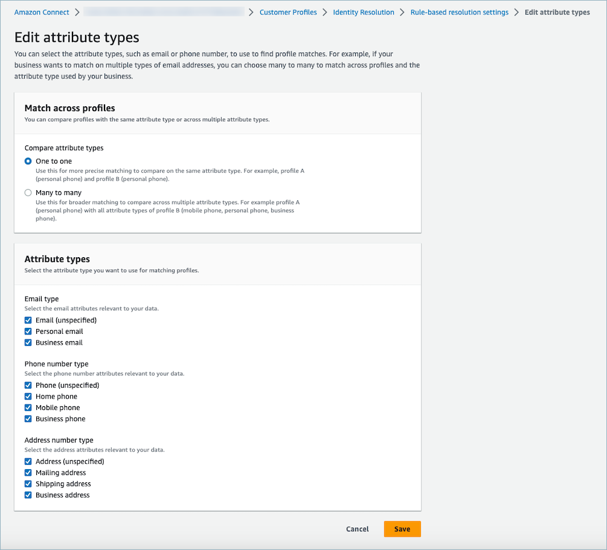
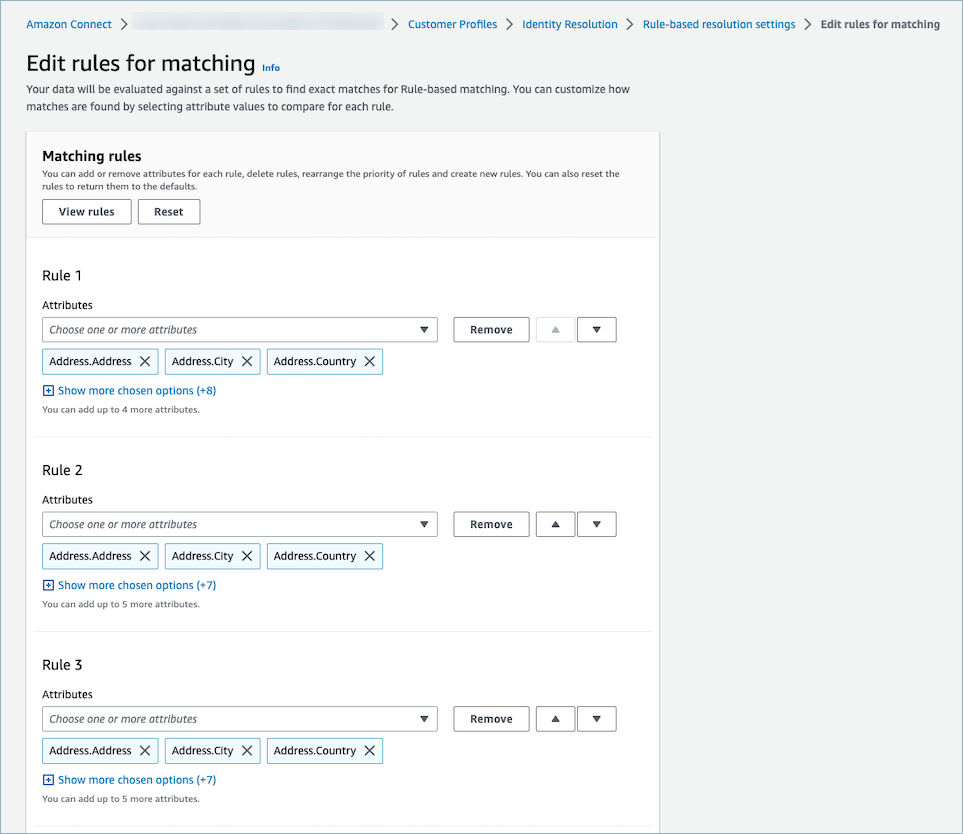
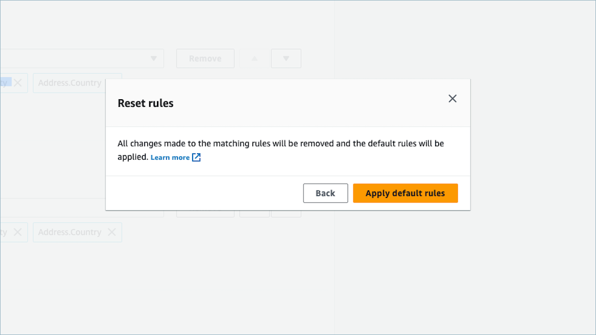
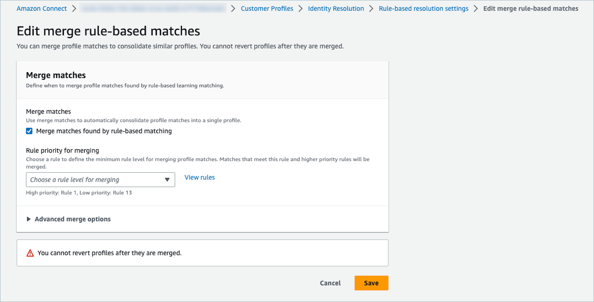
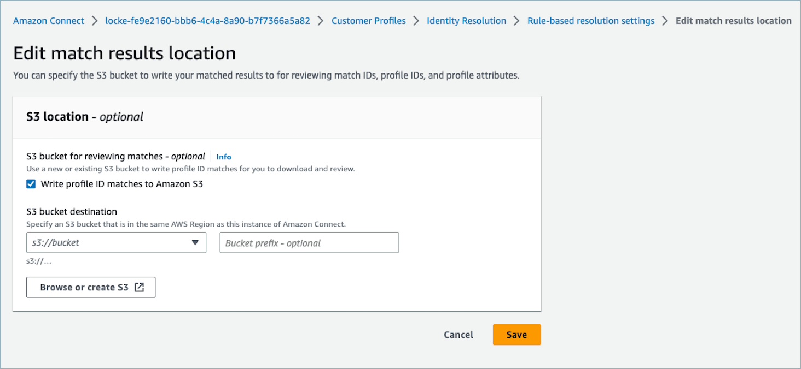

# Set up rule-based matching for Identity Resolution in

Amazon Connect

This topic provides an illustrative walkthrough of the steps that you use to
edit rule-based matching attribute types, rule-based matching rules, rule-based
matching merge rules, and rule-based match locations. It also shows how to reset
rule-based matching rules.

## Edit rule-based matching

attribute types

## Edit rule-based matching

rules

## Reset rule-based matching

rules

## Edit rule-based matching

merge rules

## Edit rule-based match

location

