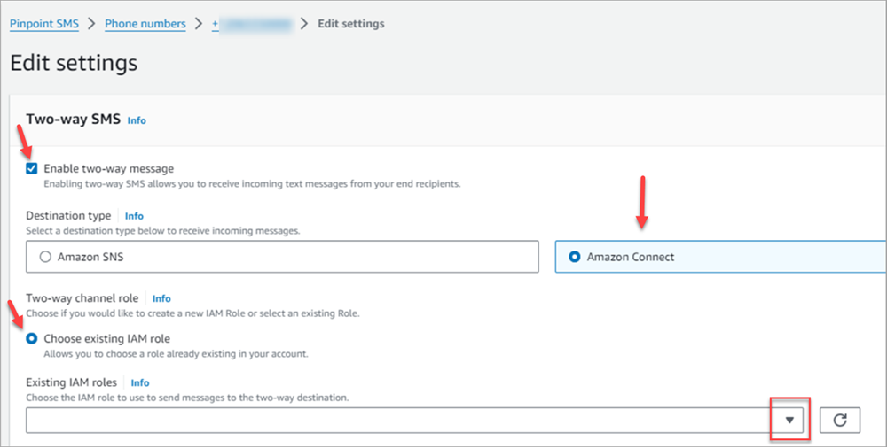
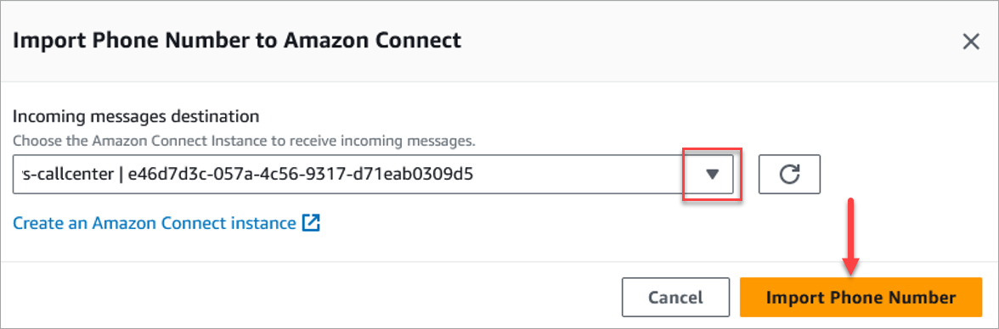
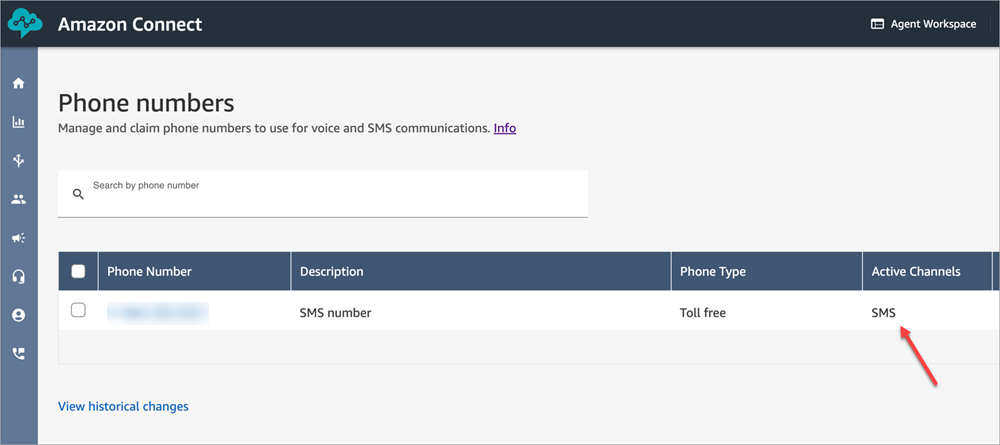
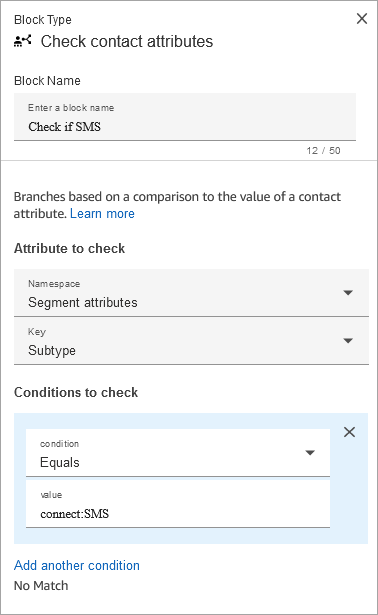
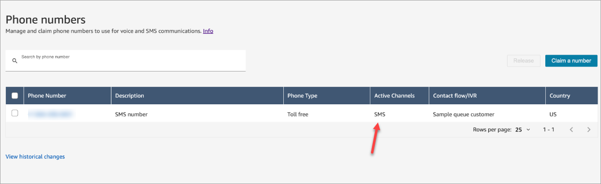
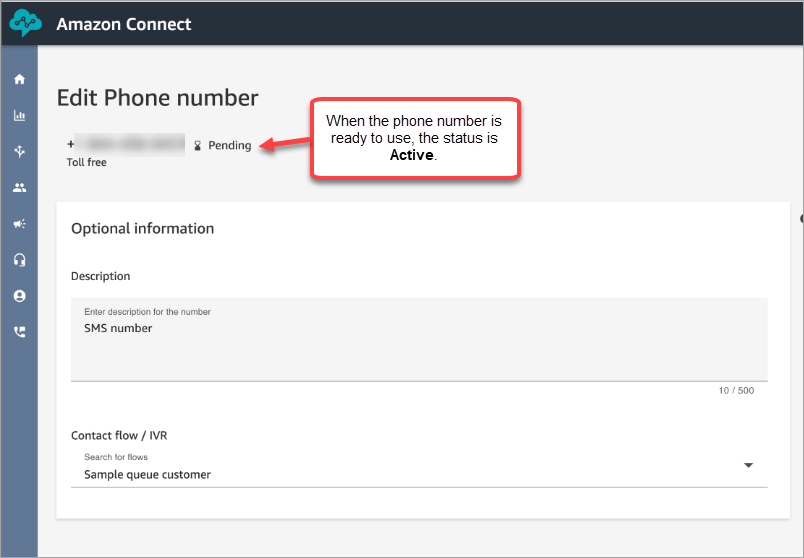
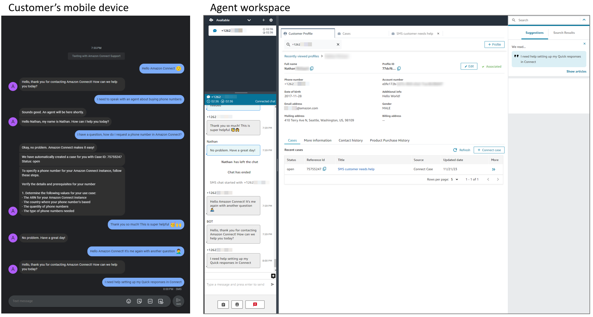

# Set up SMS messaging in Amazon Connect

You can enable SMS messaging on Amazon Connect so your customers can text you from
their mobile device. With Amazon Lex, you can automate responses to their questions, saving
agents valuable time and effort.

This topic explains how to set up and test SMS messaging for Amazon Connect. You use
AWS End User Messaging SMS to procure an SMS-enabled phone number, enable two-way SMS on the number, and then
import it into Amazon Connect.

Using one phone number that is shared for both voice and SMS isn't supported.

###### Contents

- [Step 1: Request a number in
  AWS End User Messaging SMS](#get-sms-number "#get-sms-number")
- [Step 2: Enable two-way SMS on the phone
  number](#enable-twoway-sms "#enable-twoway-sms")
- [Step 3: Update flows to branch on
  SMS contacts](#branch-on-sms-contacts "#branch-on-sms-contacts")
- [Step 4: Test sending and receiving SMS
  messages](#test-sms "#test-sms")
- [Step 5: Prerequisites for going into
  production](#verify-sms-config "#verify-sms-config")
- [Customers not receiving SMS
  messages?](#ts-sms-config "#ts-sms-config")
- [Next steps](#sms-nextsteps "#sms-nextsteps")

## Step 1: Request a number in AWS End User Messaging SMS

###### Important

Some countries require phone numbers to be registered for use in the country. It
can take up to 15 business days to process a registration request after it is
submitted. We strongly recommend you begin this process early. For more information
about registering, see [Registrations](../../../sms-voice/latest/userguide/registrations.md "../../../sms-voice/latest/userguide/registrations.md").

We also strongly recommend reviewing [Best practices for requesting SMS
numbers](sms-number.md#bp-request-sms-number "sms-number.md#bp-request-sms-number") before requesting a number.

For instructions for using the CLI to perform this step, see [Request a phone number](../../../sms-voice/latest/userguide/phone-numbers-request.md "../../../sms-voice/latest/userguide/phone-numbers-request.md") in the _AWS End User Messaging SMS User
Guide_.

1.  Open the AWS SMS console at
    [https://console.aws.amazon.com/sms-voice/](https://console.aws.amazon.com/sms-voice/ "https://console.aws.amazon.com/sms-voice/").
2.  In the navigation pane, under **Configurations**, choose
    **Phone numbers** and then **Request
    originator**.
3.  On the **Select country** page you must choose the
    **Message destination country** from the drop down that
    messages will be sent to. Choose **Next**.
4.  On the **Messaging use case** section, enter the
    following:
    - Under **Number capabilities** choose either
      **SMS** or **Voice**, depending on
      your requirements.

    ###### Important

    Capabilities for SMS and Voice can't be changed after the phone
    number has been purchased.

        + **SMS** – Choose if you need SMS
         capabilities.
        + **Voice (text to audio)** – Choose if
         you need voice capabilities.

    - Under **Estimated monthly SMS message volume per month –
      optional** choose the estimated number of SMS messages you
      will send each month.
    - For **Company headquarters - optional** choose either
      of the following:
      - **Local** – Choose this if your company
        headquarters is in the same country as your customers who will
        receive SMS messages. For example, you would choose this option
        if your headquarters is in the United States and your users who
        will receive messages are also in the United States.
      - **International** – Choose this if your
        company headquarters is not in the same country as your
        customers who will receive SMS messages.

    - For **Two-way messaging** choose
      **Yes** if you require two-way messaging.

5.  Choose **Next**.
6.  Under **Select originator type** choose one of the
    recommended phone number type or one of the available number types. The
    available options are based on the use case information you filled out in the
    previous steps.
    - If you choose 10DLC and already have a registered campaign, you can
      choose the campaign from the **Associate to registered
      campaign**.
    - If the number type you want isn't available, you can choose
      **Previous** to go back and modify your use case.
      Also check the [Supported countries and regions (SMS channel)](../../../sms-voice/latest/userguide/phone-numbers-sms-by-country.md "../../../sms-voice/latest/userguide/phone-numbers-sms-by-country.md") to make sure
      the originator type you want is supported in the destination
      country.
    - If you want to request a short code or long code, you need to open a
      case with Support. For more information, see [Requesting short codes for SMS messaging with Amazon Pinpoint
      SMS](../../../sms-voice/latest/userguide/phone-numbers-request-short-code.md "../../../sms-voice/latest/userguide/phone-numbers-request-short-code.md") and [Requesting dedicated long codes for SMS messaging with Amazon
      Pinpoint SMS](../../../sms-voice/latest/userguide/phone-numbers-long-code.md "../../../sms-voice/latest/userguide/phone-numbers-long-code.md").

7.  Choose **Next**.
8.  On **Review and request** you can verify and edit your
    request before submitting it. Choose **Request**.
9.  A **Registration Required** window may appear depending on
    the type of phone number you requested. Your phone number is associated with
    this registration and can't send messages until your registration has been
    approved. For more information about registrations requirements, see [Registrations](../../../sms-voice/latest/userguide/registrations.md "../../../sms-voice/latest/userguide/registrations.md").
    1. For **Registration form name** enter a friendly
       name.
    2. Choose **Begin registration** to finish registering
       the phone number or **Register later**.

    ###### Important

    Your phone number can't send messages until your registration has
    been approved.

    You are still billed the recurring monthly lease fee for the
    phone number regardless of registration status.

## Step 2: Enable two-way SMS on the phone

number

After you have successfully procured a phone number from AWS End User Messaging SMS, you enable two-way
SMS on the phone number with Amazon Connect as the message destination. You can
enable two-way SMS messaging for individual phone numbers. When one of your customers
sends a message to your phone number, the message body is sent to Amazon Connect.

For instructions for using the CLI to perform this step, see [Two-way SMS messaging](../../../sms-voice/latest/userguide/phone-numbers-two-way-sms.md "../../../sms-voice/latest/userguide/phone-numbers-two-way-sms.md") in the _AWS End User Messaging SMS User
Guide_.

###### Note

Amazon Connect for two-way SMS is available in the AWS Regions listed in [Messaging integrations](regions.md#messaging-integrations_region "regions.md#messaging-integrations_region").

1. Open the AWS SMS console at
   [https://console.aws.amazon.com/sms-voice/](https://console.aws.amazon.com/sms-voice/ "https://console.aws.amazon.com/sms-voice/").
2. In the navigation pane, under **Configurations**, choose
   **Phone numbers**.
3. On the **Phone numbers** page choose a phone number.
4. On the **Two-way SMS** tab choose the **Edit
   settings** button.
5. On the **Edit settings** page choose **Enable two-way
   message**, as shown in following image.

 6. For **Destination type** choose
**Amazon Connect**. 7. For Amazon Connect in **Two-way channel role** choose **Choose
existing IAM roles**. 8. In the **Existing IAM roles** drop down choose an existing
IAM role as the message destination. For example IAM policies, see [IAM policies for Amazon Connect](../../../sms-voice/latest/userguide/phone-numbers-two-way-sms.md#phone-number-two-way-connect-iam-policy "../../../sms-voice/latest/userguide/phone-numbers-two-way-sms.md#phone-number-two-way-connect-iam-policy") in the _AWS End User Messaging SMS User
Guide_.

###### Tip

If you can't create a policy or role, double-check that your Amazon Connect
instance is in a [Region supported by
Amazon Connect SMS](regions.md#messaging-integrations_region "regions.md#messaging-integrations_region"). 9. Choose **Save changes**. 10. In the **Import Phone Number to Amazon Connect** window:

    1. For the **Incoming messages destination** drop down
     choose the Amazon Connect instance that will receive incoming messages.

    
    2. Choose **Import Phone Number**.

11. After the number is successfully imported to Amazon Connect, you can view
    it in the Amazon Connect admin website: In the left navigation, choose **Channels**,
    **Phone numbers**. The SMS number appears on the
    **Phone numbers** page, as shown in the following
    image.

## Step 3: Update flows to branch on SMS

contacts

If you have existing flows that you want to branch when a contact uses SMS, add a
[Check contact
attributes](check-contact-attributes.md "check-contact-attributes.md") block to your flows. This block
enables you to send SMS contacts to a specific queue, or take another action.

1. Add a [Check contact
   attributes](check-contact-attributes.md "check-contact-attributes.md") block to your flow, and
   open the **Properties** page.
2. In **Attribute to check** section, set
   **Namespace** to **Segment attributes**
   and **key** to **Subtype**.

For more information about Segment attributes, see [SegmentAttributes](ctr-data-model.md#segmentattributes "ctr-data-model.md#segmentattributes") in the
_ContactTraceRecord_ topic. 3. In the **Conditions to check** section, set
**condition** to **Equals** and
**value** to **connect:SMS**.

The following image of a **Properties** page shows it's
configured to branch when the contact comes in on the SMS channel.

 4. Associate the SMS phone number with the flow: In the left navigation, choose
**Channels**, **Phone numbers**, choose
the SMS number, and then choose **Edit**.

 5. Under **Flow/IVR**, choose the flow you updated, and then
choose **Save**.

###### Tip

When you first purchase a phone number, the phone number's status is
**Pending**. When the phone number is ready to use, the phone
number's status is **Active**. If the phone number requires [registration](../../../sms-voice/latest/userguide/registrations.md "../../../sms-voice/latest/userguide/registrations.md"), then you must complete that step before the phone
number's status changes to **Active**.

## Step 4: Test sending and receiving SMS messages

In this step you use the Contact Control Panel (CCP) and a mobile phone to test
sending and receiving SMS messages.

1. In your CCP, set your status to **Available**.
2. Using a mobile device, send an SMS to the phone number that you requested in
   [Step 1: Request a number in AWS End User Messaging SMS](#get-sms-number "#get-sms-number").

###### Tip

If your AWS End User Messaging SMS phone number is still in the SMS sandbox, you can only
test sending and receiving SMS messages with verified destination numbers
that you have configured. For move instructions, see [Moving from the SMS sandbox to production](../../../sms-voice/latest/userguide/registrations.md "../../../sms-voice/latest/userguide/registrations.md").

## Step 5: Prerequisites for going into

production

Before you use SMS in production mode, make sure you've completed the following
prerequisites for AWS End User Messaging SMS.

1. [Move
   your account out of SMS/MMS sandbox mode](../../../sms-voice/latest/userguide/sandbox.md "../../../sms-voice/latest/userguide/sandbox.md")
2. [Set up your registration
   for SMS/MMS](../../../sms-voice/latest/userguide/registrations.md "../../../sms-voice/latest/userguide/registrations.md")
3. [Confirm
   that your spend quota matches your usage requirements](../../../sms-voice/latest/userguide/awssupport-spend-threshold.md "../../../sms-voice/latest/userguide/awssupport-spend-threshold.md")
4. [Check your opt-out lists](../../../sms-voice/latest/userguide/opt-out-list.md "../../../sms-voice/latest/userguide/opt-out-list.md")

## Customers not receiving SMS messages?

Before opening an AWS Support ticket, please verify that you've completed [Step 5: Prerequisites for going into
production](#verify-sms-config "#verify-sms-config").

## Next steps

We recommend the following steps to provide the best experience for your agents and
customers.

- [Enable customers to resume chat conversations in
  Amazon Connect](chat-persistence.md "chat-persistence.md"): Customers
  can resume previous conversations with the context, metadata, and transcripts
  carried forward. They don't need to repeat themselves when they return to a
  chat, and agents have access to the entire conversation history.
- [Create quick responses for use with chat and email
  contacts in Amazon Connect](create-quick-responses.md "create-quick-responses.md"): Provide agents with pre-written responses to common customer inquiries that
  they can use while they chat with customers. Quick responses make it faster for
  agents to respond to customers.
