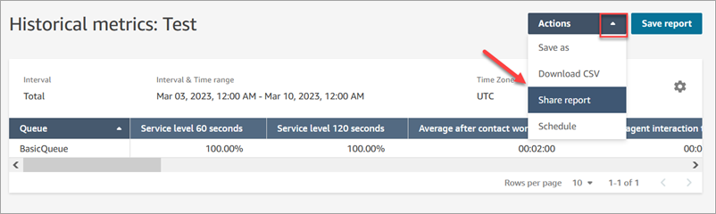
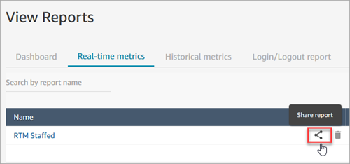
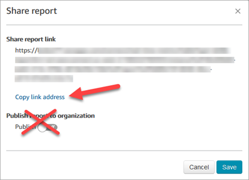

# Share saved reports in Amazon Connect

You can only share reports that you create and save. To share reports, you need the
**Saved reports - Publish** permission on your security profile.

###### To share reports

1. On the page of the report you want to share, choose the
   **Actions** dropdown menu and then choose **Share
   report**. The following image shows an example report named
   **Historical metrics: Test**, and the location of the
   **Share report** option in the **Actions**
   dropdown menu.

Or, from your list of saved reports, choose the **Share
report** icon, as shown in the following image.

 2. Choose **Copy link address** and choose
**Save**, as shown in the following image. This saves the
link to your clipboard. Paste this link into an email or other location to share
the report.

You don't need to publish the report to your organization in order to share
the link with specific people.

###### Important

Anyone who has the link and the appropriate permissions can access the
report. For a list of required permissions, see [View a shared report in Amazon Connect](view-a-shared-report.md "view-a-shared-report.md").
