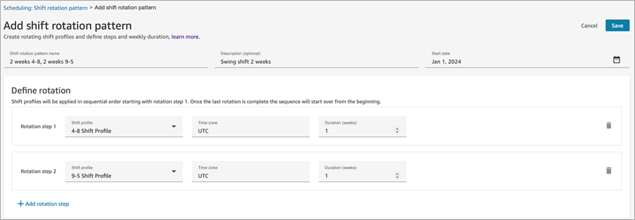
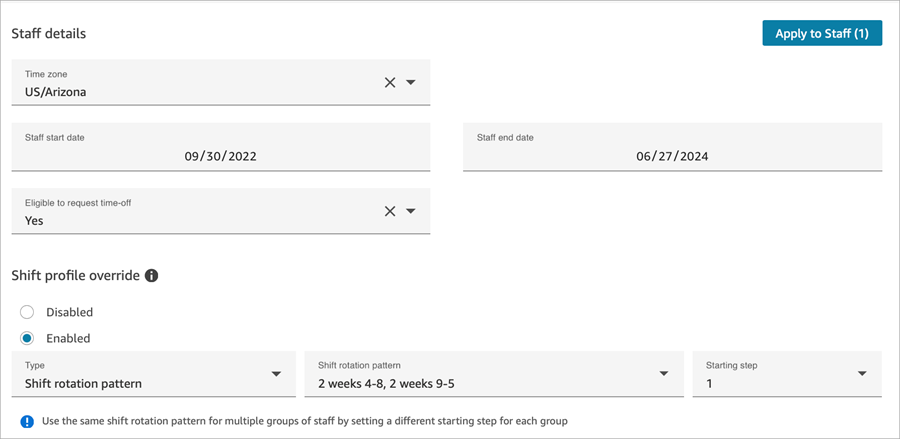
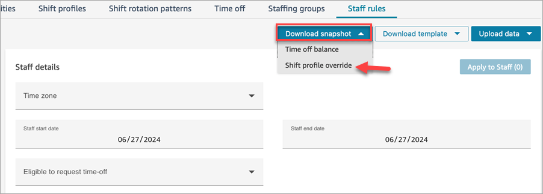
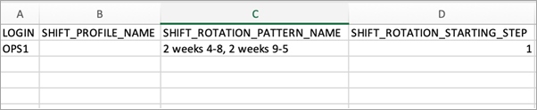
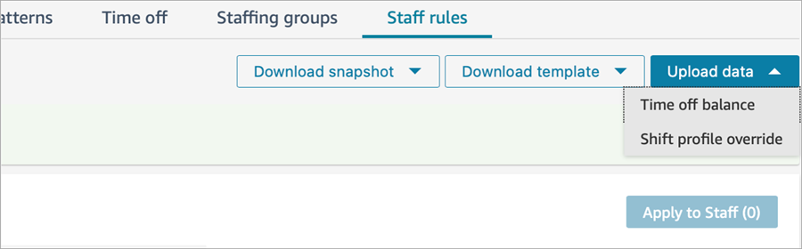
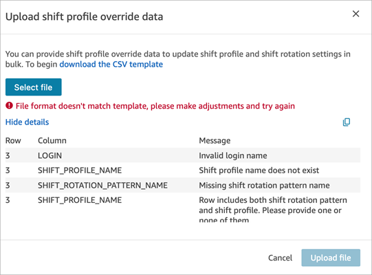
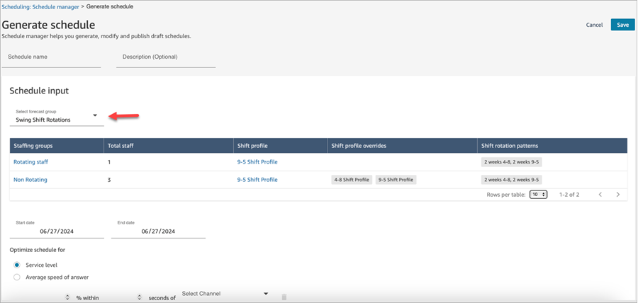

# Set up shift rotation patterns in Amazon Connect

Use shift rotation patterns to create a set of shift profiles that are rotated
based on sequential order and a defined set of weeks. The shift rotation pattern
includes the rotation step, shift profile, the time zone assigned to the shift
profile, and a duration defined in weeks.

This topic explains how to:

- Set up a shift rotation pattern. In our example, the pattern contains at
  least 2 shift profiles, a start date, and a duration in weeks.
- Assign agents to those shift rotations and to a starting step.
- Generate schedules that use the shift rotation patterns assigned to
  agents.

###### Tip

For the maximum number of shift rotation patterns per instance and other
feature specifications, see [Forecasting, capacity
planning, and scheduling feature specifications](feature-limits.md#forecasting-cap-planning-scheduling-specs "feature-limits.md#forecasting-cap-planning-scheduling-specs").

## Set up shift rotation patterns

1.  Log in to the Amazon Connect admin website with an account that has security profile
    permissions for **Scheduling, Schedule manager -
    Edit**.
2.  On the Amazon Connect navigation menu, select **Analytics and
    Optimization**, **Scheduling**.
3.  On the **Scheduling** page, choose the
    **Shift rotations patterns** tab, and then choose
    **Create shift rotation pattern**.
4.  On the **Add shift rotation pattern** page, complete
    the following boxes:

        * **Name** and **Description
         (optional)**
        * **Start date**: The start date will be used
         as the reference point to rotate to the next shift in the
         pattern.
        * **Define rotation**: In this section, choose
         the shift profile from the dropdown menu, timezone, and
         duration.

    The following image shows an **Add shift rotation
    pattern** page. This pattern has two rotation steps, each 1
    week long.

For example, if you set the start date to January 1, and the first
rotation step is 1 week, the next shift rotation - **Rotation
step 2** - will take place on January 7. You can add up to
51 additional steps and each step can be up to 51 weeks. 5. Choose **Save**.

## Assign agents to shift rotation

patterns

You assign agents to shift rotation patterns on the
**Scheduling**, **Staff rules** page.
There are two ways you can update the shift rotation pattern of an agent:

- Individually, on the **Staff rules** page. This is a
  simple way to apply shift rotation patterns or staff rules overrides to
  up to 50 agents at the same time.
- In bulk, by uploading a .csv file.

These options are discussed next.

### Assign individual agents

to shift rotation patterns

1. On the **Staff rules** page, choose
   **Shift Profile override**,
   **Enabled**, and then select the shift rotation
   pattern.
2. Define the agents shift rotation pattern and starting step. The
   following image shows a pattern of **2 weeks 4-8, 2 weeks
   9-5**.

 3. When complete, choose **Apply to Staff**.

### Bulk upload shift rotation

pattern assignments

When managing a larger number of agents, use the bulk upload option to set
the shift profile override, shift rotation pattern, and starting step in a
.csv file.

###### Note

Ensure that your pop-up blocker is off so you can download the .csv
file template.

- On the **Staff rules** page, choose one of the
  following options:

      + **Download snapshot**, **Shift
       profile override** to download a snapshot of
       existing shift rotation pattern assignments for your
       agents.
      + **Download template**, **Shift
       profile override** to download a blank .csv
       file.

  The following image shows the an example **Staff
  rules** page, and the option to download a snapshot of
  existing shift rotation pattern assignments for your agents.

The .csv templates contain key fields that you can update:

    + Login name
    + Shift profile name
    + Shift rotation pattern name
    + Shift rotation starting step

###### Note

In the .csv template, you can't populate column B and column C in the
same row. That is, you can't set both the SHIFT_PROFILE_NAME and
SHIFT_ROTATION_PATTERN_NAME for an agent in the same .csv file. You can
set only one.

- To set the shift profile name for the agent, add it to column
  B and leave columns C and D blank.
- To set the shift rotation pattern for an agent, set columns C
  and D, and leave column B blank, as shown in the following
  image.

### Upload shift rotation and

shift profiles

To upload a .csv file that contains shift rotation overrides, on the
**Staff rules** page, choose **Upload
data**, **Shift profile override**, as shown
in the following image.

If there is a problem with your .csv file, Amazon Connect displays an error message
that indicates which fields have mismatches. This makes it easier for you to
troubleshoot your file uploads. The following image shows example error
messages.

After the .csv file is uploaded, a banner is displayed indicating that the
data is being loaded into agent scheduling. That process can take up to 10
minutes for thousands of agents. The banner automatically refreshes when the
shift profile override data has been successfully processed. This means the
data has been loaded into agent scheduling.

## Generate schedules that use

shift rotation patterns

1. On the **Scheduling** page, choose **Schedule
   manager**, **Generate schedule**.
2. Enter a name of the schedule, and an optional description.
3. In the **Schedule input** section select the forecast
   group that you want to schedule.

The **Generate schedule** page is automatically
updated with the data for that forecast group. It displays the number of
agents, the associated shift profiles, and the shift rotation patterns,
as shown in the following image.

## Remove a shift rotation

pattern

Before you can remove a shift rotation pattern, you must first remove all
agents linked to the shift rotation pattern. You can unset up to 50 agents by
using the **Staff rules** page.

You can also use the bulk upload and download to quickly unset hundreds or
even thousands of agents.
