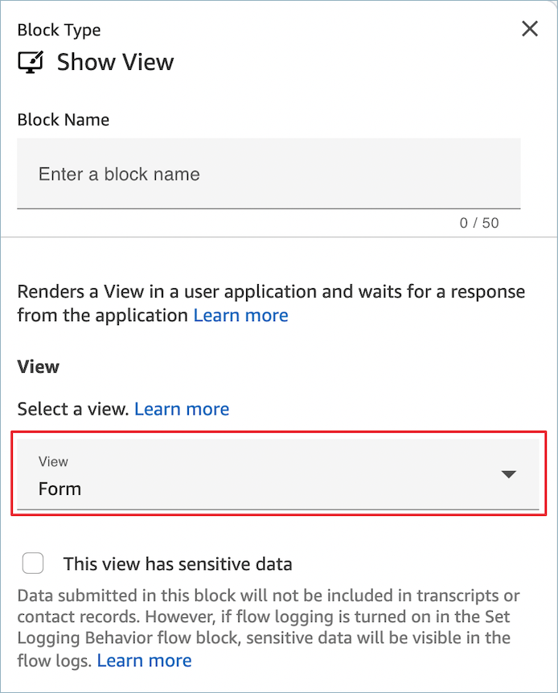
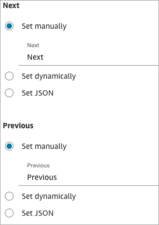
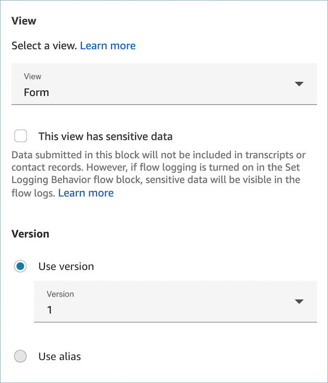
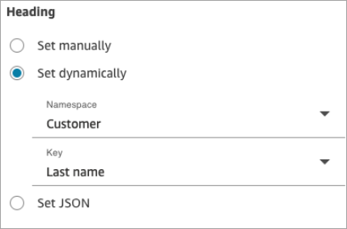
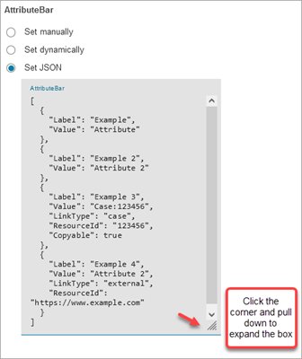
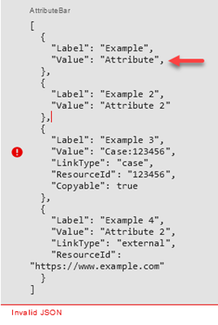
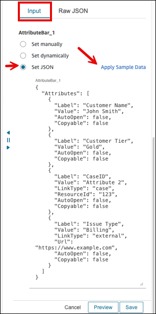
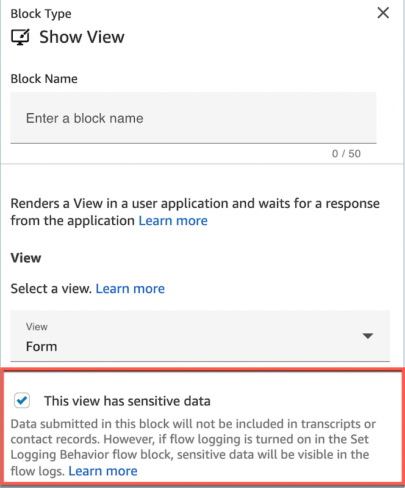
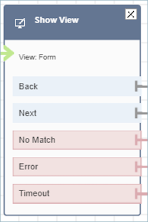

# Flow block in Amazon Connect: Show view

This topic defines the flow block to create step-by-step workflow guides to help
agents provide consistent customer experiences, as well as guides to enable interactive
customer experiences.

## Description

- Use this flow block to:
  - Create [step-by-step guides](step-by-step-guided-experiences.md "step-by-step-guided-experiences.md") for agents who are using the Amazon Connect
    agent workspace. These guides are workflows that provide your agents
    with instructions to help them interact consistently with your
    customers.
  - Create forms to collect information from customers within a chat
    experience.

- When a contact is routed to a flow that includes a **Show
  view** block, a UI page called a [View](view-resources-sg.md "view-resources-sg.md") renders on the agent workspace
  or within the customer's chat UI.

## Use cases for this block

This flow block is designed to guide agents through the steps to:

- Perform common tasks for customers, such as making reservations, managing
  payments, and submitting new orders.
- Send emails based on a template that notifies a customer about a submitted
  refund request. The email structure is always the same, but specific values
  can vary, such as order number, refund amount, and payment account. You can
  configure the Show view block for the agent to provide these types of
  information.
- Create new CRM entries in the existing agent workspace. Use contact
  attributes to pre-populate the form with relevant information, such as the
  customer's name and phone number.

And to guide customers through steps within a chat conversation to:

- Make payments by providing their credit card information.
- Provide PII information, such as a home address to update their
  profile.
- Receive account information by providing their customer account ID.

## Contact types

You can use the **Show view** block in a guide flow that is
initiated—by the [Set event flow](set-event-flow.md "set-event-flow.md") block—from any contact type
including voice, chat, email or task. If you plan to surface a guide to a customer,
you can use the **Show view** block in the main chat flow
directly.

| Contact type | Supported? |
| ------------ | ---------- |
| Voice        | Yes        |
| Chat         | Yes        |
| Task         | Yes        |
| Email        | Yes        |

## Flow types

You can use this block in the following [flow
types](create-contact-flow.md#contact-flow-types "create-contact-flow.md#contact-flow-types"):

| Flow type              | Supported? |
| ---------------------- | ---------- |
| Inbound flow           | Yes        |
| Customer hold flow     | No         |
| Customer whisper flow  | No         |
| Outbound whisper flow  | No         |
| Agent hold flow        | No         |
| Agent whisper flow     | No         |
| Transfer to agent flow | No         |
| Transfer to queue flow | No         |

## How to configure this block

You can configure the **Show view** block by using the Amazon Connect admin website or
by using the [ShowView](../APIReference/participant-actions-showview.md "../APIReference/participant-actions-showview.md") action in the Amazon Connect Flow language.

###### Configuration sections

- [Choose the view resource](#choose-viewresource "#choose-viewresource")
- [How to use the Set manually option](#view-setmanually "#view-setmanually")
- [How to use the Set dynamically
  option](#view-setdynamically "#view-setdynamically")
- [How to use the Set JSON
  option](#show-view-block-example-json "#show-view-block-example-json")
- [This view has sensitive data](#showview-sensitive-data "#showview-sensitive-data")
- [Flow block branches](#showview-branches "#showview-branches")
- [Additional configuration tips](#showview-tips "#showview-tips")
- [Data generated by this block](#showview-data "#showview-data")

### Choose the view resource

Amazon Connect includes a set of views that you can add your agent's workspace. You
specify the view in the **View** box, as shown in the following
image:



Following is a brief description of these AWS managed views. For detailed
information about each one, see [Set up AWS managed
views for an agent's workspace in Amazon Connect](view-resources-managed-view.md "view-resources-managed-view.md"). Customer-managed views are
also supported. For more information, see the [Customer-managed views](https://d3irlmavjxd3d8.cloudfront.net/?path=/docs/customer-managed-views-customer-managed-views--page "https://d3irlmavjxd3d8.cloudfront.net/?path=/docs/customer-managed-views-customer-managed-views--page") documentation.

- **Detail view**: Display information to agents and
  provide them with a list of actions that they can take. A common use
  case of the Detail view is to surface a screen-pop to the agent at the
  start of a call.
- **List view**: Display information as a list of items
  with titles and descriptions. Items can act as links with actions
  attached. It also optionally supports the standard back navigation and
  persistent context header.
- **Form view**: Provide customers and agents with
  input fields to gather required data and submit data to backend systems.
  This view consists of multiple Sections with a predefined Section style
  with a header. The body consists of various input fields arranged in a
  column or a grid layout format.
- **Confirmation view**: A page to show customers and
  agents after a form has been submitted or an action has been completed.
  In this pre-built template you can provide a summary of what has
  happened, any next steps, and prompts. The Confirmation view supports a
  persistent attribute bar, an icon or image, headline, and sub-headline,
  along with a back to home navigation button.
- **Cards view**: Allows you to guide your customers
  and agents by presenting them with a list of topics to choose from when
  the contact is presented to the agent.

The properties of the **Show view** block are dynamically
populated depending on which **View** resource you choose. For
example, if you choose **Form**, you would configure
**Next** and **Previous** actions, which
are displayed. These are just a couple of the actions on the view.



The following sections explain how to configure the **Form**
actions manually, dynamically, or by using the JSON option.

### How to use the Set manually option

1. On the **Properties** page, in the
   **View** section, choose **Form**
   from the dropdown menu, and set **Use version** to 1,
   the default. The following image shows a **Properties**
   page configured with these options.

 2. The **Properties** page displays a set of fields
based on the Form view. Choose **Set manually** and
enter text to be rendered on the View UI components. The following image
shows the **Next** and **Previous** UI
components. The display name of the components have been set manually to
**Next** and **Previous**. That's
what will appear on the agent workspace when the step-by-step guide is
rendered.


### How to use the Set dynamically

option

1. On the **Properties** page, in the
   **View** section, choose **Form**
   from the dropdown menu, and set **Use version** to 1,
   the default. The following image shows a **Properties**
   page configured with these options.

 2. The **Properties** page displays a set of fields
based on the Form view. Choose **Set dynamically**. In
the **Namespace** dropdown menu, choose the contact
attribute, and then choose the key. The following image shows a
**Heading** that will be rendered dynamically in
the step-by-step guide to show the customer's last name.



### How to use the Set JSON

option

This section walks through an example of how to use the **Set
JSON** option.

1. In the **View** section of the
   **Properties** page of the Show view block, choose
   **Form** from the dropdown menu and set
   **Version** to **1**, the default.
   These options are shown in the following image.

 2. When you choose the **Form** view, the input schema
of the view is displayed on the **Properties** page.
The schema has the following sections where you can add information:
**Sections**, **AttributeBar**,
**Back**, **Cancel**,
**Edit**, **ErrorText**, and
more. 3. The following image shows the **AttributeBar**
parameter, and the **Set using JSON** option. To view
all of the JSON you pasted in, click the corner of the box and pull
down.



###### Tip

Fix any errors if the JSON is invalid. The following image shows
an example error message because there's an extra comma.

 4. When selecting a custom view, you will likely want to set the values
of dynamic inputs through the **Set JSON** option. When
doing this, you can choose **Apply Sample Data** to
pre-populate the input with a JSON schema that contains sample data.

Ensure you [configure
dynamic references](no-code-ui-builder-properties-dynamic-fields.md "no-code-ui-builder-properties-dynamic-fields.md") for dynamic data (for example, $.Channel)
in the No-code UI builder to be populated at run time.

The following image shows the **Apply Sample Data**
option.

 5. Choose **Save** and publish when you are
ready.

The following code sample shows how this same configuration would be
represented by the [ShowView](../APIReference/participant-actions-showview.md "../APIReference/participant-actions-showview.md") action in the Flow language:

```
{
      "Parameters": {
        "ViewResource": {
          "Id": "arn:aws:connect:us-west-2:aws:view/form:1"
        },
        "InvocationTimeLimitSeconds": "2",
        "ViewData": {
          "Sections": "Sections",
          "AttributeBar": [
            {
              "Label": "Example",
              "Value": "Attribute"
            },
            {
              "Label": "Example 2",
              "Value": "Attribute 2"
            },
            {
              "Label": "Example 3",
              "Value": "Case 123456",
              "LinkType": "case",
              "ResourceId": "123456",
              "Copyable":true
            },
            {
              "Label": "Example 3",
              "Value": "Case 123456",
              "LinkType": "case",
              "ResourceId": "https:example.com"
            }
          ],
          "Back": {
            "Label": "Back"
          },
          "Cancel": {
            "Label": "Cancel"
          },
          "Edit": "Edit",
          "ErrorText": "ErrotText",
          "Heading": "$.Customer.LastName",
          "Next": "Next",
          "Previous": "Previous",
          "SubHeading": "$.Customer.FirstName",
          "Wizard": {
            "Heading": "Progress tracker",
            "Selected": "Step Selected"
          }
        }
      },
      "Identifier": "53c6be8a-d01f-4dd4-97a5-a001174f7f66",
      "Type": "ShowView",
      "Transitions": {
        "NextAction": "7c5ef809-544e-4b5f-894f-52f214d8d412",
        "Conditions": [
          {
            "NextAction": "7c5ef809-544e-4b5f-894f-52f214d8d412",
            "Condition": {
              "Operator": "Equals",
              "Operands": [
                "Back"
              ]
            }
          },
          {
            "NextAction": "7c5ef809-544e-4b5f-894f-52f214d8d412",
            "Condition": {
              "Operator": "Equals",
              "Operands": [
                "Next"
              ]
            }
          },
          {
            "NextAction": "7c5ef809-544e-4b5f-894f-52f214d8d412",
            "Condition": {
              "Operator": "Equals",
              "Operands": [
                "Step"
              ]
            }
          }
        ],
        "Errors": [
          {
            "NextAction": "b88349e3-3c54-4915-8ea0-818601cd2d03",
            "ErrorType": "NoMatchingCondition"
          },
          {
            "NextAction": "7c5ef809-544e-4b5f-894f-52f214d8d412",
            "ErrorType": "NoMatchingError"
          },
          {
            "NextAction": "b88349e3-3c54-4915-8ea0-818601cd2d03",
            "ErrorType": "TimeLimitExceeded"
          }
        ]
      }
    }
```

### This view has sensitive data

It’s recommended that you enable **This view has sensitive
data** when collecting credit card data, home addresses, or any
other type of sensitive data from customers. By enabling this option, the data
submitted by a customer will not be recorded in transcripts or contact records,
or be visible to agents (by default). Remember to turn off logging if
**Set Logging Behavior** is turned on in your contact flow,
to ensure sensitive customer data is not included in your flow logs.



###### Tip

Build a [Flow module](contact-flow-modules.md "contact-flow-modules.md") with a
Show view block that has **This view has sensitive data**
enabled, a Lambda function, and prompts to create a re-usable payment
experience module that can be placed in an existing inbound contact
flow.

### Flow block branches

The following image shows an example of a configured **Show
view** block. This block supports conditional branches—that
is, the branches depend on which view is selected. It also supports
**Error** and **Timeout** branches.



- Conditional branches: These branches are based on which view is
  selected on the **Show view** block. The previous image
  shows the block is configured for the **Form** view,
  and the following actions: **Back**,
  **Next**, and **No Match**.
  - For this particular configuration, at runtime, the chat
    contact is routed down the **Back** or
    **Next** branches depending on what the
    agent clicks on the view. **No match** is only
    possible if the user has an action component with a custom
    Action value.

- **Error**: Failure to run (that is, failure to render
  the view on agent workspace or to capture the view output action)
  results in taking the **Error** branch.
- **Timeout**: Specifies how long this step in the
  step-by-step guide should take the agent to complete. If it takes longer
  than Timeout for agent to complete the step (for example, the agent
  didn't provide required information in the specified amount of time)
  then that step takes the Timeout branch.

When a step times out, the step-by-step guide can follow logic defined
in the flow to determine next step. For example, the next step could be
to retry asking for information, or stop guide experience.

The customer is connected to the agent at this point, so there is no
change in the customer's experience because of Timeout.

### Additional configuration tips

Build a flow module with this logging setting, this block, and Lambda to
create a re-usable payment experience module that keeps logging off and can be
placed in any existing inbound flow.

Assign the following security profile permission to agents so they can use the
step-by-step guides:

- **Agent Applications - Custom views - All**: This
  permission enables agents to see step-by-step guides in their agent
  workspace.

Assign the following security profile permission to managers and business
analysts so they can create the step-by-step guides:

- **Channels and flows - Views**: This permission
  enables managers to create step-by-step guides.

For information about how to add more permissions to an existing security profile,
see [Update security profiles in Amazon Connect](update-security-profiles.md "update-security-profiles.md").

### Data generated by this block

At runtime, the **Show view** block generates data that is
the output when the View resource runs. Views generate two main pieces of
data:

- `Action` taken on the rendered View-UI (on agent workspace)
  and the `ViewResultData` which is the `Output`
  data.

When using a **Show view** block,
**Action** represents a branch and set to
`$.Views.Action` contact attribute under Views
namespace.

- `Output` data is set to `$.Views.ViewResultData`
  contact attribute under Views namespace.

The values of `Action` and the `Output` data are
determined by which the component(s) the agent interacted with during
their use of the view resource.

#### How to use this data in different parts

of flow

- When the block receives a response back from the client
  application, to reference the output data in flows use ``$.Views.Action` and
  `$.Views.ViewResultData`.
- When using a view with the **Show view** block,
  `Action` represents a branch that is captured in the
  contact attribute under the Views namespace as
  `$.Views.Action`, and View Output data is set to the
  `$.Views.ViewResultData` contact attribute.
- You can refer to the data generated by the **Show
  view** block by using the JSON path in contact
  attributes (you can specify contact attributes in the Set manually
  or Set JSON options) or by using the attribute selector dropdown
  when you choose **Set dynamically**.

## Error scenarios

###### Note

When the `ShowView` block takes an error branch (no match, timeout,
or error), you might want to route your flow back to a previous point in the
flow. If you create a loop in the flow like this, the contact flow can execute
endlessly until the chat contact times out. We recommend using the
`Loop` contact flow block to limit the number of retries for a
particular `ShowView` block.

A contact is routed down the **Error** branch in the following
situations:

- Amazon Connect is unable to capture the user action on a View UI
  component in the agent workspace. This might be due to an intermittent
  network issue or an issue on the media-service side.

## Flow log entry

Amazon Connect flow logs provide you with real-time details about events in your flow as
customers interact with it. For more information, see [Use flow logs to track events in Amazon Connect
flows](about-contact-flow-logs.md "about-contact-flow-logs.md").

Following sample ShowView input (ingress log)

```
{
  "ContactId": "string",
  "ContactFlowId": "string",
  "ContactFlowName": "string",
  "ContactFlowModuleType": "ShowView",
  "Timestamp": "2023-06-06T16:08:26.945Z",
  "Parameters": {
    "Parameters": {
      "Cards": [
        {
          "Summary": {
            "Id": "See",
            "Heading": "See cancel options"
          }
        },
        {
          "Summary": {
            "Id": "Change",
            "Heading": "Change Booking"
          }
        },
        {
          "Summary": {
            "Id": "Get",
            "Heading": "Get Refund Status"
          }
        },
        {
          "Summary": {
            "Id": "Manage",
            "Heading": "Manage rewards"
          }
        }
      ],
      "NoMatchFound": {
        "Label": "Do Something Else",
        "type": "bubble"
      }
    },
    "TimeLimit": "300",
    "ViewResourceId": "cards"
  }
}
```

Following sample ShowView output (egress log)

```
{
  "Results": "string",
  "ContactId": "string",
  "ContactFlowId": "string",
  "ContactFlowName": "string",
  "ContactFlowModuleType": "ShowView",
  "Timestamp": "2023-06-06T16:08:35.201Z"
}
```

## Sample flows

You can download a sample flow from Step 2 in the following blog: [Getting started with step-by-step guides](https://aws.amazon.com/blogs/contact-center/getting-started-with-step-by-step-guides-for-the-amazon-connect-agent-workspace/ "https://aws.amazon.com/blogs/contact-center/getting-started-with-step-by-step-guides-for-the-amazon-connect-agent-workspace/"). We recommend performing the
steps in the blog to learn how to create flows that are configured with
AWS-managed Views and how to run these flows for inbound media contacts.

## More resources

See the following topics to learn more about step-by-step guides and Views.

- [Step-by-step Guides to set up your
  Amazon Connect agent workspace](step-by-step-guided-experiences.md "step-by-step-guided-experiences.md")
- Explore [how to implement sensitive data collection in Amazon Connect
  Chat](https://aws.amazon.com/blogs/contact-center/collecting-sensitive-information-with-amazon-connect-chat/ "https://aws.amazon.com/blogs/contact-center/collecting-sensitive-information-with-amazon-connect-chat/").
- For step-by-step instructions about how to set up a customer-managed
  Views, see [Customer-managed Views](https://d3irlmavjxd3d8.cloudfront.net/?path=/docs/customer-managed-views-customer-managed-views--page "https://d3irlmavjxd3d8.cloudfront.net/?path=/docs/customer-managed-views-customer-managed-views--page").
- For setting up a plug-and-play step-by-step guide experience in your
  instance, see [Getting started with step-by-step guides](https://aws.amazon.com/blogs/contact-center/getting-started-with-step-by-step-guides-for-the-amazon-connect-agent-workspace/ "https://aws.amazon.com/blogs/contact-center/getting-started-with-step-by-step-guides-for-the-amazon-connect-agent-workspace/").
- [AWS-managed Views - Common Configuration](https://d3irlmavjxd3d8.cloudfront.net/?path=/story/aws-managed-views-common-configuration--page "https://d3irlmavjxd3d8.cloudfront.net/?path=/story/aws-managed-views-common-configuration--page")
- [Views - UI Components](https://d3irlmavjxd3d8.cloudfront.net/?path=/story/ui-component-ui-components--page "https://d3irlmavjxd3d8.cloudfront.net/?path=/story/ui-component-ui-components--page")
- [View actions](../APIReference/view-api.md "../APIReference/view-api.md") in
  the _Amazon Connect API Reference_.
