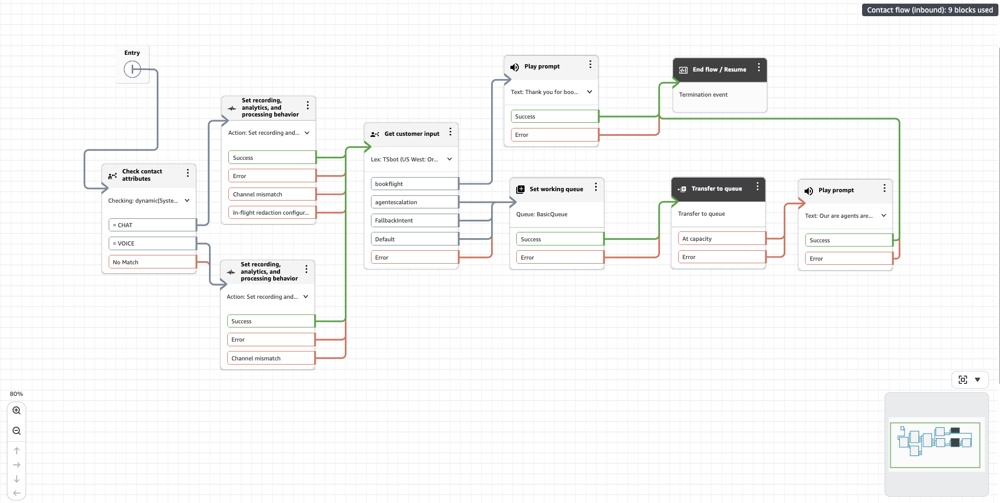
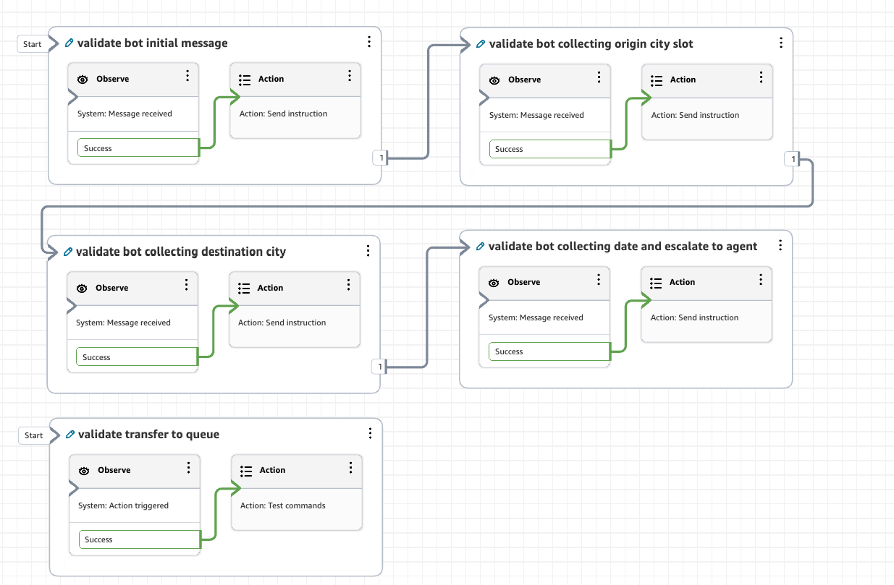
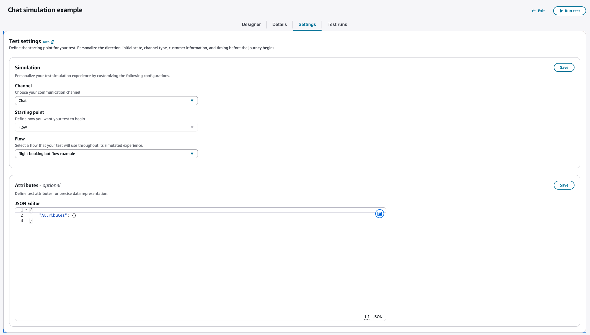
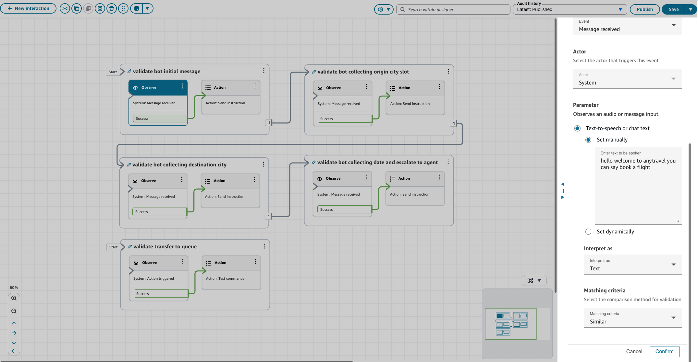
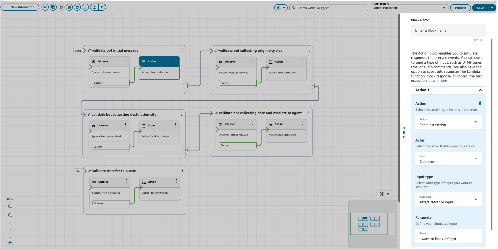
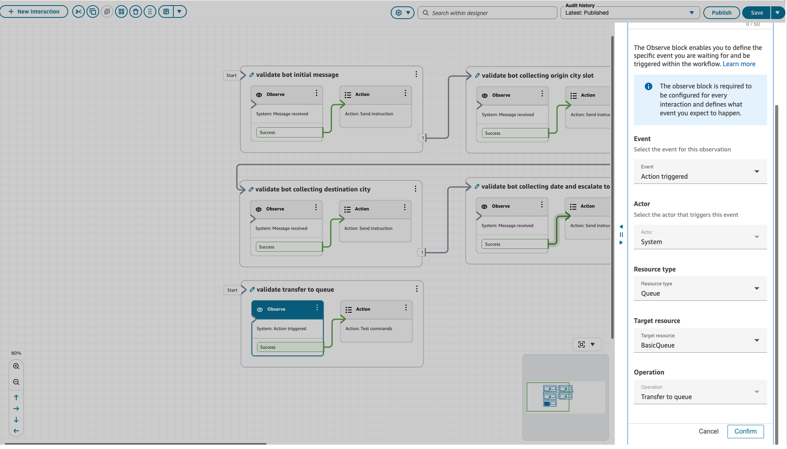
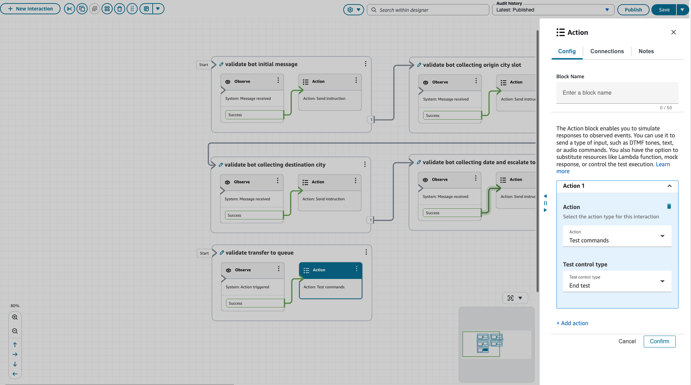
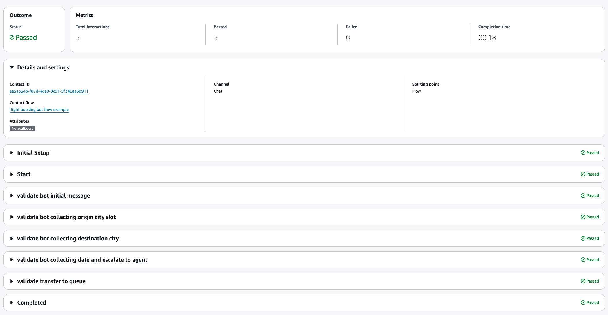
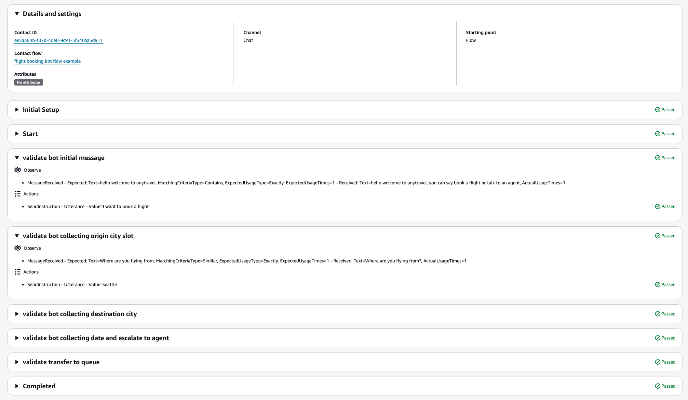
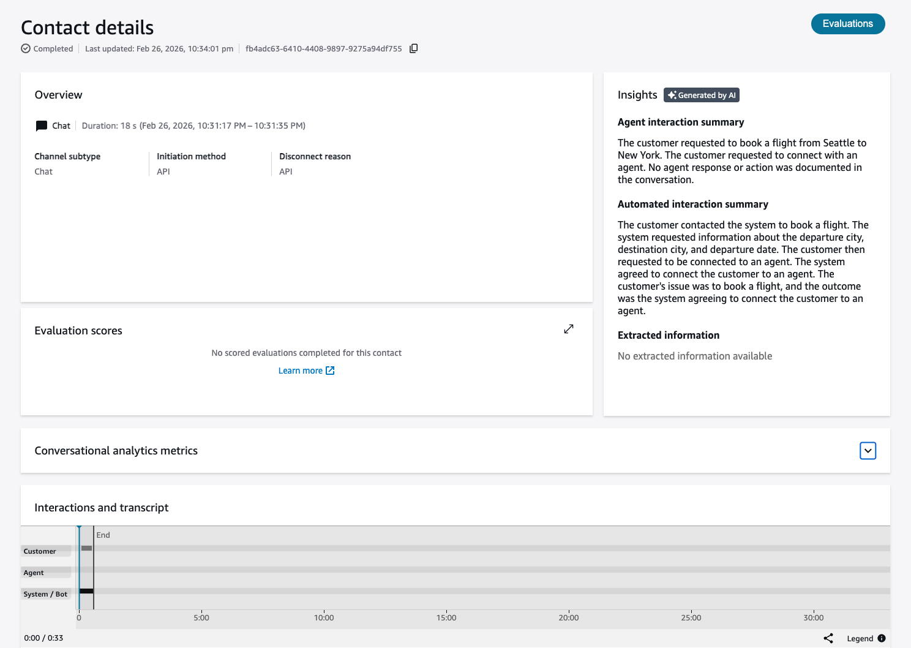

# Simulation example

**Contact flow example**

In this example, the contact flow handles flight booking intents using an
Amazon Lex bot configured to detect two intents:
**book flight** and
**agent escalation**.
When the Lex bot successfully handles the book flight intent, the contact flow
is terminated. If the Lex bot detects an agent escalation intent or fails to
capture any intent, the contact is transferred to a queue to be connected to
an agent.

**Building a test case for the contact flow**

In this test case, we validate two scenarios:

1. The book flight intent to confirm that the Lex bot collects the correct slots.
2. The agent escalation intent to verify that the contact is transferred to a queue after escalation.
   In the test case designer, create five interaction groups. Connect the first
   four in sequence to validate the conversation flow with the Lex bot. Add a fifth,
   open interaction group to validate the transfer-to-queue action.

The open interaction group runs independently of the others, ensuring that
queue transfer is validated even if an intent is not matched or the Lex bot
encounters an error. This is because the Lex bot default and error branches in
the contact flow are both connected to the queue transfer block.

**Configure the test setting**

Under **Channel**, select **Chat**, then
select the contact flow you want to simulate. This test case supports both
**Voice call** and **Chat** channels. Depending on your selection, the simulation will
initiate a call or a chat session. The following steps use Chat simulation for
demonstration purposes.

**Configure interaction groups**

**Interaction group 1: Validate bot initial message**

This group validates the initial welcome message and simulates a customer
intent to book a flight.

**Observe block configuration:**

- **Event type** – Message received
- **Actor** – System
- **Expected prompt** – "hello welcome to anytravel you can say book a flight"
- **Matching criteria** – Similar

**Action block configuration:**

- **Action** – Send instruction
- **Actor** – Customer
- **Input type** – Text/Utterance
- **Input Parameter** – "I want to book a flight"

**Interaction group 2: Validate bot collecting origin city**

This group validates that the bot collects the correct slot for the
departure city and simulates a customer response.

Use the same configuration as interaction group 1 with the observe prompt
set to "Where are you flying from?" and the simulate prompt set to
"Seattle."

**Interaction group 3: Validate bot collecting destination city**

This group validates that the bot collects the correct slot for the
destination city and simulates a customer response.

Use the same configuration as interaction group 1 with the observe prompt
set to "Where is your destination?" and the simulate prompt set to
"New York."

**Interaction group 4: Validate bot collecting date and simulate agent escalation**

This group validates that the bot collects the correct slot for the
departure date and simulates a customer response that triggers agent
escalation.

Use the same configuration as interaction group 1 with the observe prompt
set to "What is your departure date?" and the simulate prompt set to
"I need to connect to an agent."

**Interaction group 5: Validate transfer to queue**

This group validates that the contact is transferred to a queue and sends
a test command to end the test.

**Observe block configuration:**

- **Event type** – Action triggered
- **Actor** – System
- **Resource type** – Queue
- **Target resource** – BasicQueue (select the Queue resource you want to observe)
- **Operation** – Transfer to Queue

**Action block configuration:**

- **Action** – Test commands
- **Test control type** – End test

**Run test and analyze results**

After configuring all interaction groups and blocks, publish the test case
and click **Run test** to open the test results page and
monitor results in real time.

Once the test is complete, the results for each interaction group are
displayed in execution order. Note that **Initial Setup**,
**Start**, and **Completed**
entries are added to the execution trace to provide visibility into the system
steps for initiating and completing the test.

Click on each interaction group trace to view detailed results for each
observe and action block.

Click the **Contact ID** link to navigate to the Contact
detail page. If the contact flow has automated agent interaction and automated
interaction summary enabled, the simulation chat or voice call will be analyzed
accordingly.

