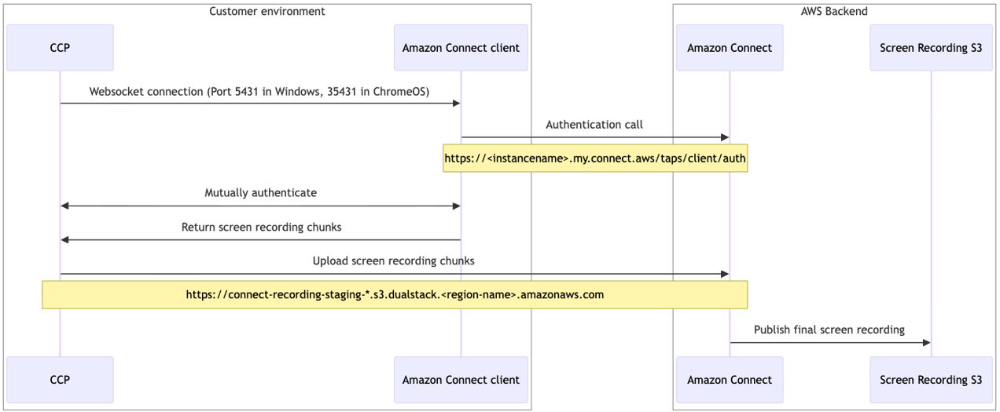

# System and network requirements for screen recording in Connect Customer

This topic provides the system requirements for using screen recording, and describes
the detailed dataflow it uses in each platform.

## System requirements

Here are the minimum system requirements for agent devices to perform screen
recording. You'll need to scope additional memory, bandwidth, and CPU for the
operating system and anything else running on the device to avoid resource
contention.

- CPU: 2.0 GHz (4 cores or 4 vCPU recommended)
- Memory: 4 GB
- Network: 600 Kbps

### Supported operating systems

- 64-bit Windows 10 and 11 based on the x86-64 architecture
- Chrome OS version 140 or higher enrolled in a Google Enterprise
  Domain

###### Note

When Windows multi-session configuration is enabled allowing multiple agents
to use a single Windows host, ensure that the agent's workstation has the
recommended resource availability for each concurrent session.

## Network requirements

- **Port used for screen recording**: The
  Connect Customer Client Application communicates with the CCP through a local websocket on port 5431
  (on Windows) and 25431 (on Chrome OS).
- **URLs to add to your firewall allowlist**:
  To ensure smooth screen recording functionality, add the following URL
  patterns to your allowlist:

  - From CCP:
    `connect-recording-staging-*.s3.dualstack.your-region-name.amazonaws.com`.
    If you prefer to not use wild cards, the list of endpoints is
    available at
    https://screenrecording.connect.aws/config/connect-recording-endpoint-allowlist.json.
    This list may be updated in the future. Refer to the
    `createDate` at the top of the file to check for
    updates.
  - From screen recording client application:
    `https://your-connect-instance-alias.my.connect.aws/taps/client/auth`

- **Sequence diagram**: The following sequence
  diagram shows the network calls between different components involved in
  screen recording.



    + In Windows, the Connect Customer Client is the combination of the
     Amazon.Connect.Client.Service background process and
     Amazon.Connect.Client.RecordingSession.
    + In ChromeOS, the Connect Customer Client is the combination of Isolated Web
     App and Browser extension.

## Browser enterprise policy for local network access

Starting with Google Chrome version 147 (released April 7, 2026) and
Microsoft Edge version 147 (released April 10, 2026), Chromium-based browsers
enforce Local Network Access (LNA) restrictions on WebSocket connections. This
restriction blocks the local WebSocket connection between the Contact Control
Panel and the Connect Customer Client Application, causing screen recordings to fail.

To ensure screen recording works on Chrome 147 or later and Edge 147 or
later, deploy the **LoopbackNetworkAllowedForUrls**
enterprise policy to your agents' workstations. This policy pre-grants
loopback network access permission for your Contact Control Panel domain, so
agents are not blocked or prompted. Configure this policy with your Connect Customer
Contact Control Panel URL. Example policy value:
`[*.]my.connect.aws`

- For Google Chrome, see [LoopbackNetworkAllowedForUrls](https://chromeenterprise.google/policies/#LoopbackNetworkAllowedForUrls "https://chromeenterprise.google/policies/#LoopbackNetworkAllowedForUrls") in the Chrome enterprise
  policy documentation.
- For Microsoft Edge, see [LoopbackNetworkAllowedForUrls](https://learn.microsoft.com/en-us/deployedge/microsoft-edge-browser-policies/loopbacknetworkallowedforurls "https://learn.microsoft.com/en-us/deployedge/microsoft-edge-browser-policies/loopbacknetworkallowedforurls") in the Edge enterprise
  policy documentation.

The following example commands set the registry policy for the domain
`[*.]my.connect.aws` on Windows:

```
reg add "HKLM\SOFTWARE\Policies\Google\Chrome\LoopbackNetworkAllowedForUrls" /v 1 /t REG_SZ /d "[*.]my.connect.aws"
reg add "HKLM\SOFTWARE\Policies\Microsoft\Edge\LoopbackNetworkAllowedForUrls" /v 1 /t REG_SZ /d "[*.]my.connect.aws"
```

For more details on this browser change, see [New permission
prompt for Local Network Access](https://developer.chrome.com/blog/local-network-access "https://developer.chrome.com/blog/local-network-access") in the Chrome developer
documentation.
