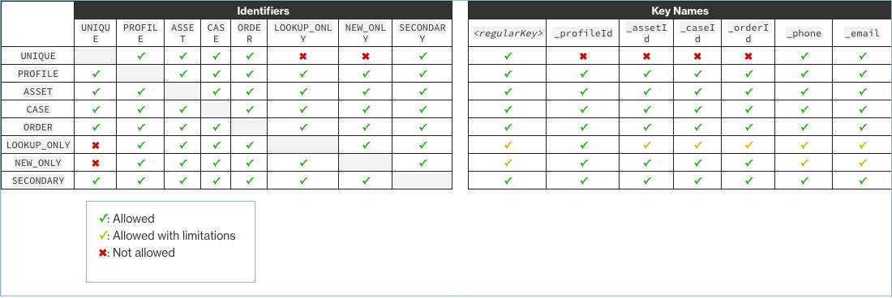

# Standard identifiers for setting

attributes on the key in Customer Profiles

Standard identifiers allow you to set attributes on the key. Decide which
identifiers to use based on how you want the data to be ingested in the
profiles. For example, you mark phone number with the identifier PROFILE. This
means phone number is to be treated as unique identifier. If Customer Profiles
gets two contacts with the same phone number, the contacts are going to be
merged into a single profile.

| Identifier name     | Description                                                                                                                                                                                                                                                                                                                                                                                                                                                                                                                                                                                                                                                                                                                                               |
| ------------------- | --------------------------------------------------------------------------------------------------------------------------------------------------------------------------------------------------------------------------------------------------------------------------------------------------------------------------------------------------------------------------------------------------------------------------------------------------------------------------------------------------------------------------------------------------------------------------------------------------------------------------------------------------------------------------------------------------------------------------------------------------------- | --------------------------------------------------------------------------------------------------------------------------------------------------------------------------- |
| AIR_PREFERENCE      | This identifier means that this key uniquely identifies an air preference. When this identifier is specified, it means that during ingestion, Customer Profiles looks for any air preference that has this key associated with it.  • If an air preference is found, then the object is assigned to that air preference.  • If more than one air preference is found when searching for this key, the match is rejected. (Only keys that uniquely identify an air preference should be used as unique keys except for special circumstances.)                                                                                                                                                                                                       |
| AIR_BOOKING         | This identifier means that this key uniquely identifies an air booking. When this identifier is specified, it means that during ingestion, Customer Profiles looks for any air booking that has this key associated with it.  • If an air booking is found, then the object is assigned to that air booking.  • If more than one air booking is found when searching for this key, the match is rejected. (Only keys that uniquely identify an air booking should be used as unique keys except for special circumstances.)                                                                                                                                                                                                                         |
| AIR_SEGMENT         | This identifier means that this key uniquely identifies an air segment. When this identifier is specified, it means that during ingestion, Customer Profiles looks for any air segment that has this key associated with it.  • If an air segment is found, then the object is assigned to that air segment.  • If more than one air segment is found when searching for this key, the match is rejected. (Only keys that uniquely identify an air segment should be used as unique keys except for special circumstances.)                                                                                                                                                                                                                         |
| HOTEL_PREFERENCE    | This identifier means that this key uniquely identifies a hotel preference. When this identifier is specified, it means that during ingestion, Customer Profiles looks for any hotel preference that has this key associated with it.  • If a hotel preference is found, then the object is assigned to that hotel preference.  • If more than one hotel preference is found when searching for this key, the match is rejected. (Only keys that uniquely identify a hotel preference should be used as unique keys except for special circumstances.)                                                                                                                                                                                              |
| HOTEL_STAY_REVENUE  | This identifier means that this key uniquely identifies a hotel stay revenue. When this identifier is specified, it means that during ingestion, Customer Profiles looks for any hotel stay revenue that has this key associated with it.  • If a hotel stay revenue is found, then the object is assigned to that hotel stay revenue.  • If more than one hotel stay revenue is found when searching for this key, the match is rejected. (Only keys that uniquely identify a hotel stay revenue should be used as unique keys except for special circumstances.)                                                                                                                                                                                  |
| HOTEL_RESERVATION   | This identifier means that this key uniquely identifies a hotel reservation. When this identifier is specified, it means that during ingestion, Customer Profiles looks for any hotel reservation that has this key associated with it.  • If a hotel reservation is found, then the object is assigned to that hotel reservation.  • If more than one hotel reservation is found when searching for this key, the match is rejected. (Only keys that uniquely identify a hotel reservation should be used as unique keys except for special circumstances.)                                                                                                                                                                                        |
| LOYALTY             | This identifier means that this key uniquely identifies a loyalty. When this identifier is specified, it means that during ingestion, Customer Profiles looks for any loyalty that has this key associated with it.  • If a loyalty is found, then the object is assigned to that loyalty.  • If more than one loyalty is found when searching for this key, the match is rejected. (Only keys that uniquely identify a loyalty should be used as unique keys except for special circumstances.)                                                                                                                                                                                                                                                    |
| LOYALTY_TRANSACTION | This identifier means that this key uniquely identifies a loyalty transaction. When this identifier is specified, it means that during ingestion, Customer Profiles looks for any loyalty transaction that has this key associated with it.  • If a loyalty transaction is found, then the object is assigned to that loyalty transaction.  • If more than one loyalty transaction is found when searching for this key, the match is rejected. (Only keys that uniquely identify a loyalty transaction should be used as unique keys except for special circumstances.)                                                                                                                                                                            |
| LOYALTY_PROMOTION   | This identifier means that this key uniquely identifies a loyalty promotion. When this identifier is specified, it means that during ingestion, Customer Profiles looks for any loyalty promotion that has this key associated with it.  • If a loyalty promotion is found, then the object is assigned to that loyalty promotion.  • If more than one loyalty promotion is found when searching for this key, the match is rejected. (Only keys that uniquely identify a loyalty promotion should be used as unique keys except for special circumstances.)                                                                                                                                                                                        |
| UNIQUE              | This identifier must be specified by exactly one index for each object type. This key is used to uniquely identify objects of the object type for either fetching them or if needed update a submitted object at a later date. All the fields that make up the UNIQUE keys are required to be specified when submitting a new object or it is rejected.                                                                                                                                                                                                                                                                                                                                                                                                   |
| PROFILE             | This identifier means that this key uniquely identifies a profile. When this identifier is specified, it means that during ingestion, Customer Profiles looks for any profile that has this key associated with it.  • If a profile is found, then the object is assigned to that profile.  • If more than one profile is found when searching for this key, the match is rejected. (Only keys that uniquely identify a profile should be used as unique keys except for special circumstances.)                                                                                                                                                                                                                                                    |
| LOOKUP_ONLY         | This identifier indicates the key is not stored after ingesting the object. The key is only to be used for determining the profile during ingestion. The key value is not associated with the profile during ingestion, which means it can't be used to allow searching for it or matching later ingested objects to the same key. Note  • You cannot specify a key as both a `UNIQUE` identifier and a `LOOKUP_ONLY` identifier.  • You can only use `PROFILE` together with `LOOKUP_ONLY` if there is at least one other key that has the `PROFILE` identifier without the `NEW_ONLY` or `LOOKUP_ONLY` identifiers. The only exception is the `_profileId` key, which can have the `PROFILE` and `LOOKUP_ONLY` identifier combination on its own. |
| NEW_ONLY            | If the profile does not already exist before the object is ingested, the key is associated with the profile. Otherwise the key is only used for matching objects to profiles. Note  • You cannot specify a key as both a `UNIQUE` identifier and a `NEW_ONLY` identifier.  • You can only use `PROFILE` together with `NEW_ONLY` if there is at least one other key that has the `PROFILE` identifier without the `NEW_ONLY` or `LOOKUP_ONLY` identifiers.                                                                                                                                                                                                                                                                                          |
| SECONDARY           | During the matching of an object to a profile, Customer Profiles first looks up all PROFILE keys that do not have the SECONDARY identifier. These are considered first. SECONDARY keys are only considered if no matching profile is found using these keys.                                                                                                                                                                                                                                                                                                                                                                                                                                                                                              |
| ASSET               | This identifier means that this key uniquely identifies an asset. When this identifier is specified, it means that during ingestion, Customer Profiles looks for any asset that has this key associated with it.  • If an asset is found, then the object is assigned to that asset.  • If more than one asset is found when searching for this key, the match is rejected. (Only keys that uniquely identify an asset should be used as unique keys except for special circumstances.)                                                                                                                                                                                                                                                             |
| ORDER               | This identifier means that this key uniquely identifies an order. When this identifier is specified, it means that during ingestion, Customer Profiles looks for any order that has this key associated with it.  • If an order is found, then the object is assigned to that order.  • If more than one order is found when searching for this key, the match is rejected. (Only keys that uniquely identify an order should be used as unique keys except for special circumstances.)                                                                                                                                                                                                                                                             |
| CASE                | This identifier means that this key uniquely identifies a case. When this identifier is specified, it means that during ingestion, Customer Profiles looks for any case that has this key associated with it.  • If a case is found, then the object is assigned to that case.  • If more than one case is found when searching for this key, the match is rejected. (Only keys that uniquely identify a case should be used as unique keys except for special circumstances.)                                                                                                                                                                                                                                                                      | ## Compatible identifiers  |
