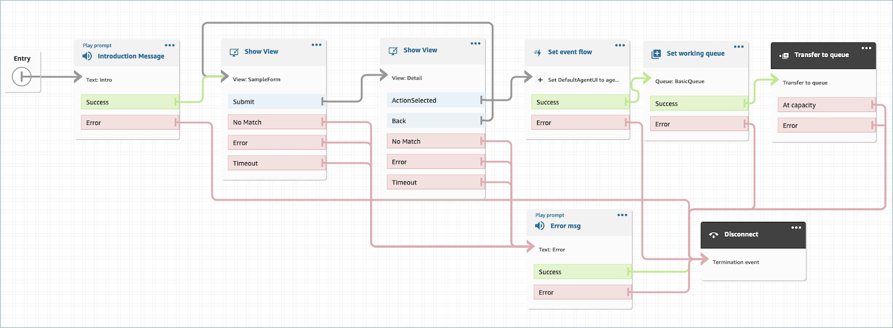
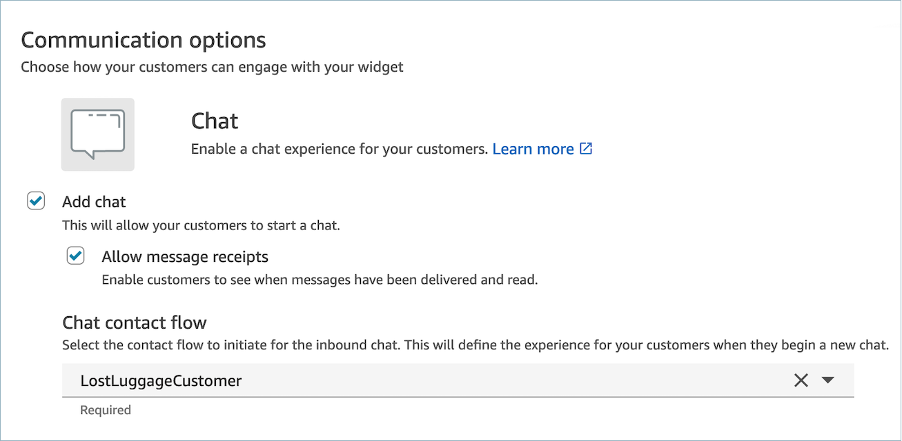

# Deploy step-by-step guides in Amazon Connect

chats

You can enable step-by-step Guides within Amazon Connect chats to create interactive,
self-service experiences. This feature helps you resolve customer issues faster by
gathering and transferring context to your agents. You can present the same guide that
you built for your agents to customers for better configuration management.

## Enable step-by-step Guides in

Amazon Connect chats

1. Ensure that you have enabled and configured [step-by-step Guides](step-by-step-guided-experiences.md "step-by-step-guided-experiences.md") for
   agents. After you configure the guides, confirm that they pop up when a
   contact is reserved for an agent to answer.
2. Set up your flow to invoke Views in the chat flow by using the Show View
   Block, in the same way that you would configure this for your agent. The
   following example will trigger the guide when the chat bubble is chosen by
   the customer. The flow will go through two views before transferring the
   chat to an agent.

 3. Create a hosted chat widget from the admin page. Set the chat flow to the
one you created.



This hosted chat will generate a script similar to the following:

```

<script type="text/javascript">
  (function(w, d, x, id){
    s=d.createElement('script');
    s.src='https://d38ij7tdo5kvz7.cloudfront.net/amazon-connect-chat-interface-client.js';
    s.async=1;
    s.id=id;
    d.getElementsByTagName('head')[0].appendChild(s);
    w[x] =  w[x] || function() { (w[x].ac = w[x].ac || []).push(arguments) };
  })(window, document, 'amazon_connect', '0b68a091-3538-4dcd-888e-f3b3ae64c5aa');
  amazon_connect('styles', { iconType: 'CHAT', openChat: { color: '#ffffff', backgroundColor: '#123456' }, closeChat: { color: '#ffffff', backgroundColor: '#123456'} });
  amazon_connect('snippetId', 'QVFJREFIZ3R0VzRTQkxzUnR6S1BPcXRseVBOUVlvWVlFclZwZmJ5bWZUc1hHVU1SM0FHM3BsdU4yaTZVTW9jeTRqQTRWMDJZQUFBQWJqQnNCZ2txaGtpRzl3MEJCd2FnWHpCZEFnRUFNRmdHQ1NxR1NJYjNEUUVIQVRBZUJnbGdoa2dCWlFNRUFTNHdFUVFNRFB0SmlxckgzenRMTjJ4cUFnRVFnQ3RxUHVQZm1Zd1F2ZjZVTzJ2ZTk5am1aUWEwZW53SHFzcmQ5bkdzRVdrNHJIbkJGTk81ekRBK0o4L1Q6OnBwUTZuLzRRKzVvdWdiUHhJRUU2MGM0TDlhcXEyZ0tramVmNkp3N2YvNXBIMTRwdDJSWmFVcjdzVTNzaXorc1BHTHhSOGd0b285dWpiemFrTU1tbWZoY0VCUEY4S3Z1ckdXNnZtV0ZjcVNFYnhrZlpuMVpsb1FGQjZ1SW5LMi9laHlmQVhXY3JXS1NDL1oxd29UejVkSUYwOFBoT3QvUT0=');
  amazon_connect('supportedMessagingContentTypes', [ 'text/plain', 'text/markdown' ]);
</script>

```

The last line contains an array of allowed messages. You can add
interactive messages to it to enable Guides within chat. For example:

```

amazon_connect('supportedMessagingContentTypes', ['text/plain', 'application/vnd.amazonaws.connect.message.interactive', 'application/vnd.amazonaws.connect.message.interactive.response']);

```

4.  Add the following to your allow list of URLs to allow step-by-step Guides
    to work within chat:

        * ``your-website-url`/views/renderer/`

    If you use a CSP for the chat widget to work on your website, you should
    already have a cloudfront url. For example:

        * `https://`unique-id`.cloudfront.net/amazon-connect-chat-interface.js`

###### Note

You can also use Guides in chat with a custom build communications widget. For
more information about adding step-by-step guides into your custom
communications widget, see the [Amazon Connect
chat interface](https://github.com/amazon-connect/amazon-connect-chat-interface "https://github.com/amazon-connect/amazon-connect-chat-interface") on Github.
